# iOS智能应用开发


Hello World


---


# Hello World


Hello, World是指在电脑屏幕显示“Hello, World!”（你好，世界！）字符串的计算机程序。相关的程序通常都是每种电脑编程语言最基本、最简单的程序，也会用作示范一个编程语言如何运作。同时它亦可以用来确认一个编程语言的编译器、程序开发环境及运行环境是否已经安装妥当。


---

# Xcode

- 安装
  
  - App Store[免费下载](https://apps.apple.com/cn/app/xcode/id497799835?mt=12)


---

# Hello World

年轻人的第一个iOS App


---
##### 1. 启动Xcode

<style>
img {
  display: block;
  margin: 0 auto;
}
</style>

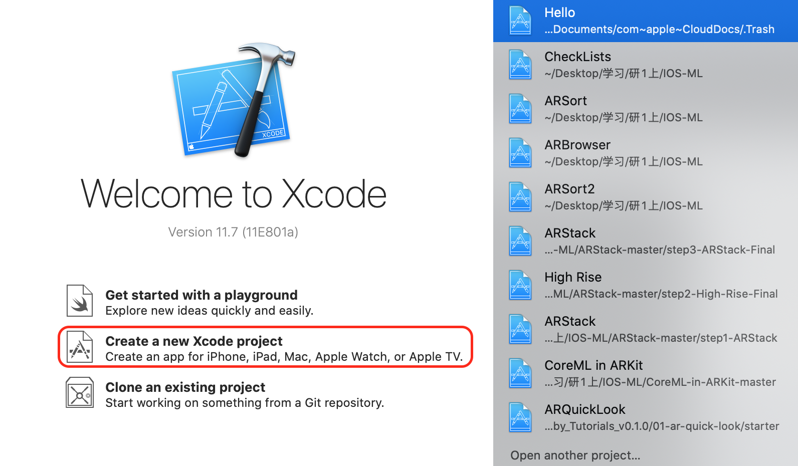


---

##### 2. 选择项目模板

<style>
img {
  display: block;
  margin: 0 auto;
}
</style>
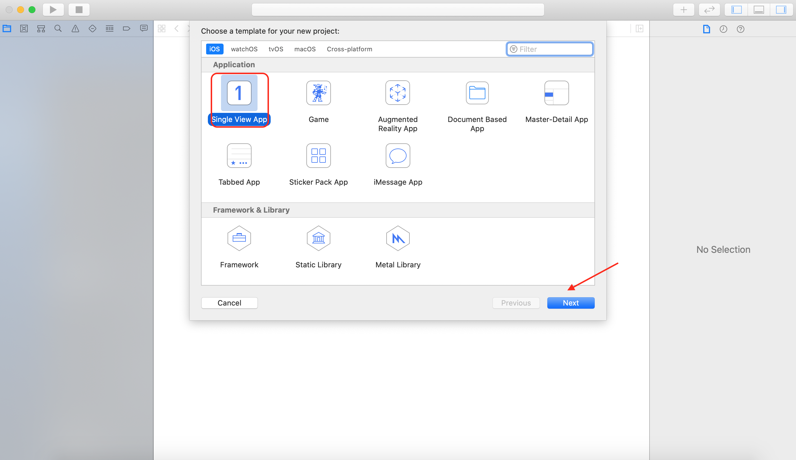


---

##### 3. 填写项目信息

<style>
img {
  display: block;
  margin: 0 auto;
}
</style>

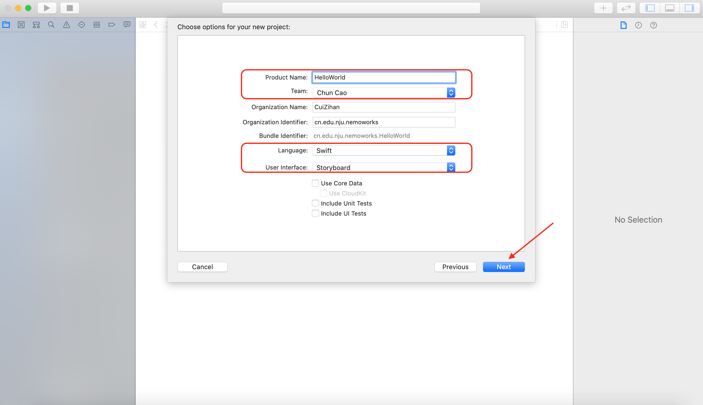


---

##### 4. 选择保存地址

<style>
img {
  display: block;
  margin: 0 auto;
}
</style>
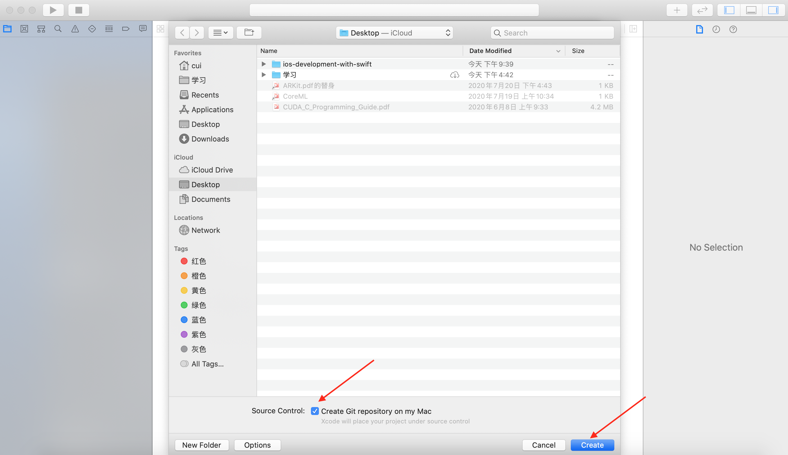


---

##### 5. 选择模拟器并启动

<style>
img {
  display: block;
  margin: 0 auto;
}
</style>

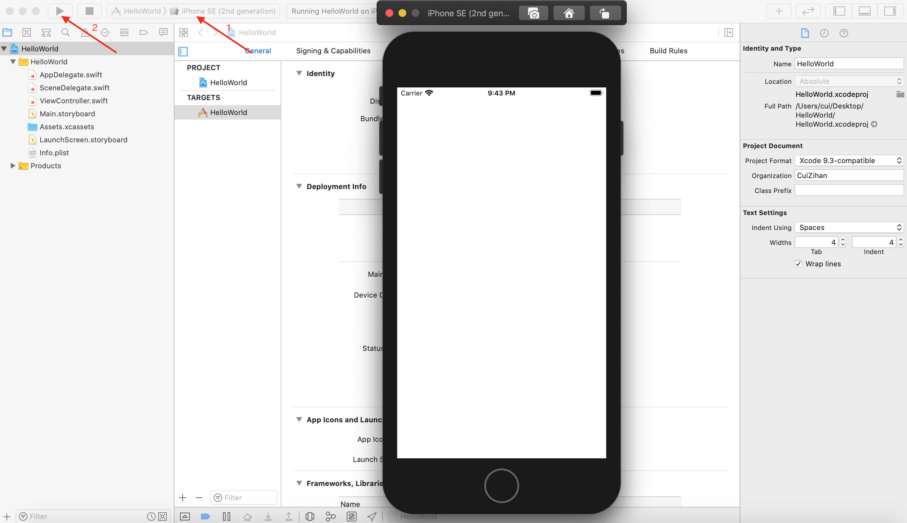


---

##### 6. 添加文字标签

<style>
img {
  display: block;
  margin: 0 auto;
}
</style>

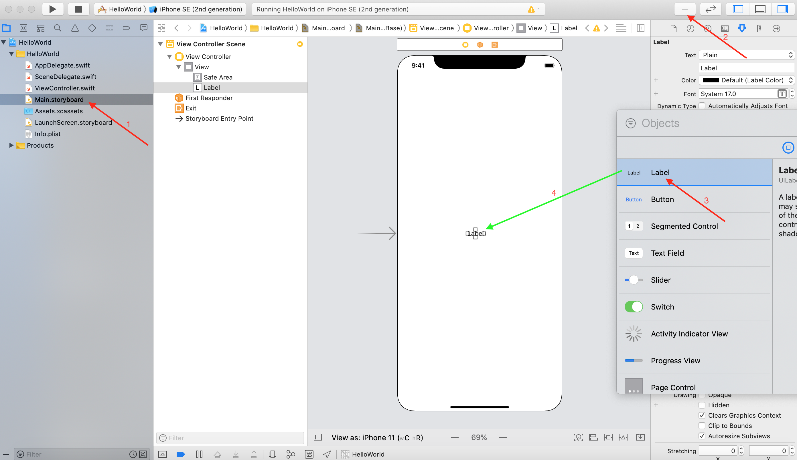


---

##### 7. 选择模拟器并启动

<style>
img {
  display: block;
  margin: 0 auto;
}
</style>

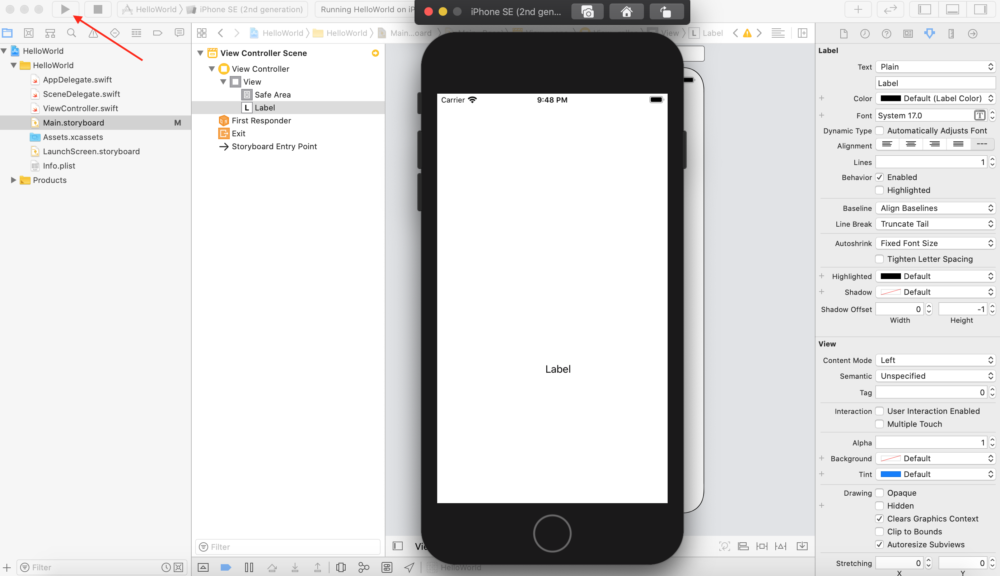


---

##### 8. 修改文字内容

<style>
img {
  display: block;
  margin: 0 auto;
}
</style>
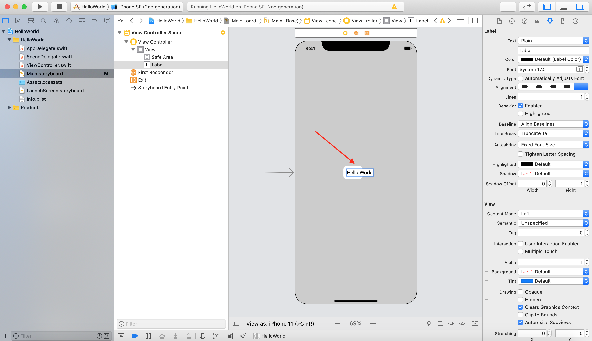


---

##### 9. 再次运行


---


# 为Hello World添加互动


---

##### 1. 在界面上添加能引起互动的元素

<style>
img {
  display: block;
  margin: 0 auto;
}
</style>
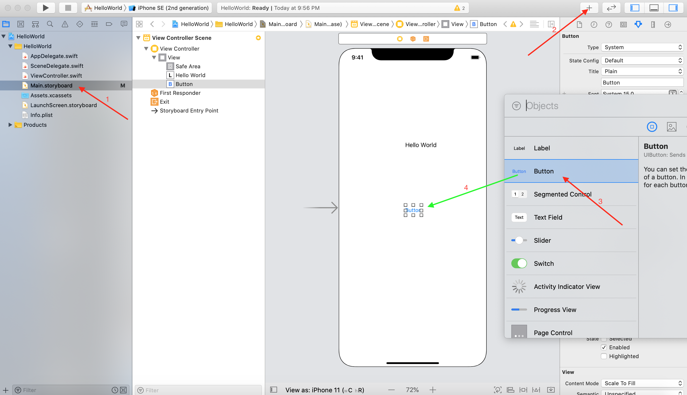

---

##### 2. 添加几行代码

在`ViewController.swift`文件中添加一个方法`func`

```swift
@IBAction func showAlert(){
    let alert = UIAlertController(title: "警告", message: "⚠️皇上，您的按钮被点啦！", preferredStyle: .alert)
    alert.addAction(UIAlertAction(title: "朕知道了", style: .default, handler: nil))
    self.present(alert, animated: true, completion: nil)
}
```

---
##### 3. 打开两个编辑器

<style>
img {
  display: block;
  margin: 0 auto;
}
</style>


---

###### 4. 选择编辑内容


---

###### 5. 建立关联
<style>
img {
  display: block;
  margin: 0 auto;
}
</style>


---

#####  5. 建立关联-再看一遍


<style>
img {
  display: block;
  margin: 0 auto;
}
</style>


---

##### 6. 运行


---

#### 看看代码

<style>
img {
  display: block;
  margin: 0 auto;
}
</style>


```swift
@IBAction func showAlert(){
    let alert = UIAlertController(title: "警告", message: "⚠️皇上，您的按钮被点啦！", preferredStyle: .alert)
    alert.addAction(UIAlertAction(title: "朕知道了", style: .default, handler: nil))
    self.present(alert, animated: true, completion: nil)
}
```

---


# Swift.org

<style>
img {
  display: block;
  margin: 0 auto;
}
</style>
</div>


---

# 命令行工具

```bash
> swift
Welcome to Apple Swift version 5.2.4 (swiftlang-1103.0.32.9 clang-1103.0.32.53).
Type :help for assistance.
  1> print("hello world")
hello world
  2>
```

---


# Playground (Xcode)

<style>
img {
  display: block;
  margin: 0 auto;
}
</style>


---

# 在Xcode中新建Playground

#### 1. 选择新建Playground
<style>
img {
  display: block;
  margin: 0 auto;
}
</style>
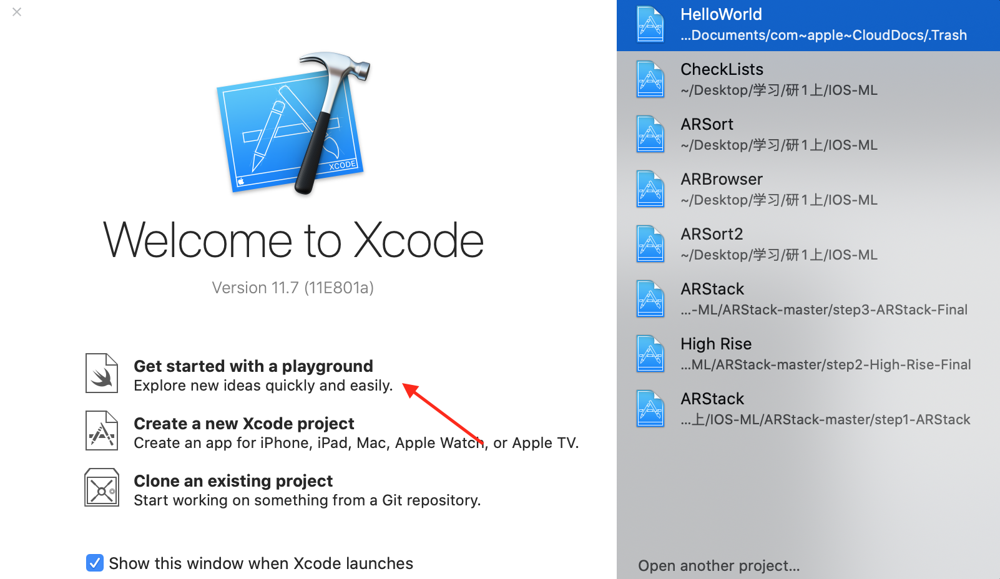


---

# 在Xcode中新建Playground

#### 2. 选择Playground的类型
<style>
img {
  display: block;
  margin: 0 auto;
}
</style>
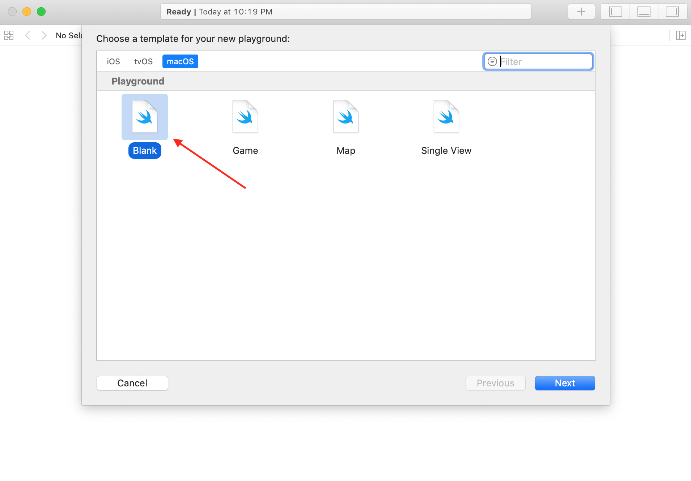


---

# 在Xcode中新建Playground

#### 3. 选择Playground的储存位置
<style>
img {
  display: block;
  margin: 0 auto;
}
</style>
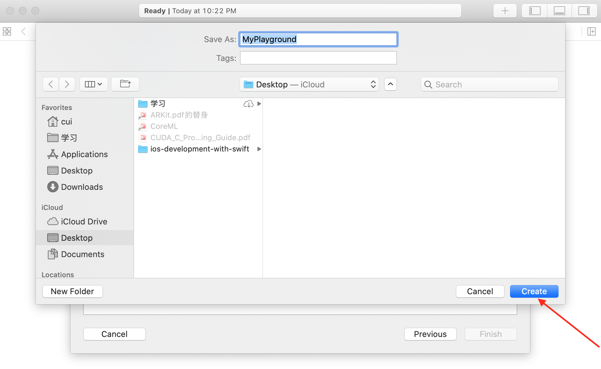


---

# 在Xcode中新建Playground

#### 4. 写一些代码
<style>
img {
  display: block;
  margin: 0 auto;
}
</style>
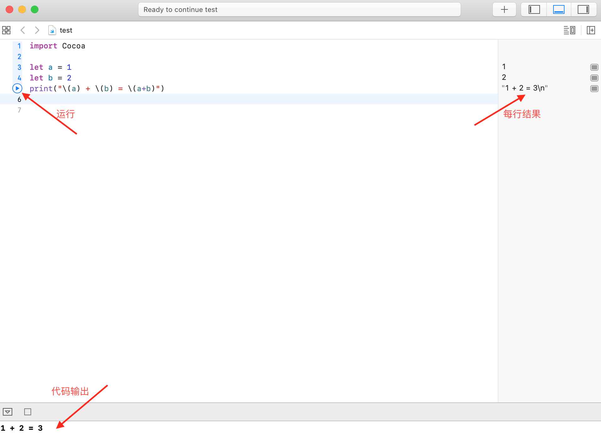


---


# A Swift Tour

官方指南
https://docs.swift.org/swift-book/GuidedTour/GuidedTour.html

Playground
https://docs.swift.org/swift-book/GuidedTour/GuidedTour.playground.zip

---

# 回顾小结


---

# 建立关联 Connection

&nbsp;&nbsp;&nbsp;&nbsp;&nbsp;&nbsp;&nbsp;&nbsp;&nbsp;&nbsp;&nbsp;&nbsp;&nbsp;&nbsp;&nbsp;&nbsp;&nbsp;&nbsp;&nbsp;&nbsp;&nbsp;&nbsp;&nbsp;&nbsp;&nbsp;

这个操作实际上是建立了一个关联关系

---

#### 查看关联


---

#### 两个部件间的关联关系

&nbsp;&nbsp;&nbsp;&nbsp;&nbsp;&nbsp;&nbsp;&nbsp;&nbsp;&nbsp;&nbsp;&nbsp;&nbsp;&nbsp;&nbsp;&nbsp;&nbsp;&nbsp;&nbsp;&nbsp;&nbsp;&nbsp;&nbsp;&nbsp;&nbsp;


---

#### 调整关联

&nbsp;&nbsp;&nbsp;&nbsp;&nbsp;&nbsp;&nbsp;&nbsp;&nbsp;&nbsp;&nbsp;&nbsp;&nbsp;&nbsp;&nbsp;&nbsp;&nbsp;&nbsp;&nbsp;&nbsp;&nbsp;&nbsp;&nbsp;&nbsp;&nbsp;

```swift
@IBAction func changeLabel(){}
```


---

#### 操作

&nbsp;&nbsp;&nbsp;&nbsp;&nbsp;&nbsp;&nbsp;&nbsp;&nbsp;&nbsp;&nbsp;&nbsp;&nbsp;&nbsp;&nbsp;&nbsp;&nbsp;&nbsp;&nbsp;


---

#### 删除多余关联

&nbsp;&nbsp;&nbsp;&nbsp;&nbsp;&nbsp;&nbsp;&nbsp;&nbsp;&nbsp;&nbsp;&nbsp;&nbsp;&nbsp;&nbsp;&nbsp;&nbsp;&nbsp;&nbsp;


---

#### 动画演示一下

&nbsp;&nbsp;&nbsp;&nbsp;&nbsp;&nbsp;&nbsp;&nbsp;&nbsp;&nbsp;&nbsp;&nbsp;&nbsp;&nbsp;&nbsp;&nbsp;&nbsp;&nbsp;&nbsp;


---

#### 新的代码

```swift
@IBAction func changeLabel(){
    print("changeLabel被执行")
}
```


---

#### 第二类关联

&nbsp;&nbsp;&nbsp;&nbsp;&nbsp;&nbsp;&nbsp;&nbsp;&nbsp;&nbsp;&nbsp;&nbsp;&nbsp;&nbsp;&nbsp;&nbsp;&nbsp;&nbsp;&nbsp;


---

#### 再操作


&nbsp;&nbsp;&nbsp;&nbsp;&nbsp;&nbsp;&nbsp;&nbsp;&nbsp;&nbsp;&nbsp;&nbsp;&nbsp;&nbsp;&nbsp;&nbsp;&nbsp;&nbsp;&nbsp;


---

#### 填上名字


```swift
@IBOutlet weak var myLabel: UILabel!
```

```swift
@IBAction func changeLabel(){
    print("changeLabel被执行")
    myLabel.text = "你好！"
}
```


---

# 运行


---

# 理解两类关联

- 把Button拖到changeLabel()函数上，让Button上发生的事件跟函数执行关联（一号关联）
- 把Label拖动到代码中生成了一个变量myLabel，这个变量关联（二号关联）到这个Label


---

#### 再改一下

```swift
@IBAction func changeLabel(){
    print("changeLabel被执行")
    myLabel.text = "你好！" + String(arc4random_uniform(10))
}
```


---

#### 小结

- App运行，用户看到屏幕上出现一个界面；
- 界面上某些地方用户是可以操作的，比如这个Button;
- 用户触碰这个Button，系统产生事件；
- 这个事件根据你开发App时定义的 一号关联 ，驱动一段代码运行；
- 代码运行中，将一些计算结果或者获得到的内容通过 二号关联 显示到界面上；
- 用户看到界面上发生变化，进行下一次操作，产生下一个事件；
- 新的事件可能又驱动另一段代码执行。如此往复。

&nbsp;&nbsp;&nbsp;&nbsp;&nbsp;&nbsp;事件驱动的图形化应用程序 ✌️✌️✌️

---

# 真机运行


---

##### 1. 注册Apple开发者账号


---

##### 2. 登陆账号


---

##### 3. 选择Team


---

##### 4. 选择真机运行


---

##### 5. 排除错误


---

##### 6. 再再次运行


---

# 作业

Hello 你的 World