<style>
img {
  display: block;
  margin: 0 auto;
}
</style>

# 基于Swift语言的iOS应用开发


 时间的信息：时序模型

---

## 本节概要
- 前情回顾：单一时刻的识别
    - 目标检测 (Object Detection)
    - 语义分割 (Semantic Segmentation)
- 本节内容：多时次的识别    

---

## 何为多时次识别？
基于最原始的数据直接进行表示学习
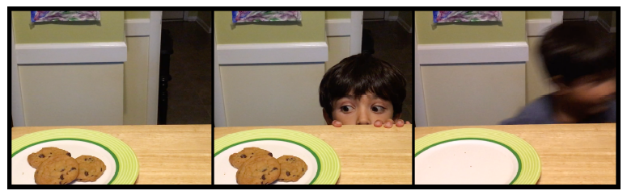
饼干去哪里了？
故事书、连环画剧情...
需要依赖前几帧图像来判断后面的内容


---

## 一些需考虑时序的任务


- 视频内容识别
- 语音识别：语音转文字，歌曲转曲谱
- 文本语义识别
- 其他：气象相关、股市相关等等

---

## 本堂课关注的内容：人体行为识别

- 利用传感器数据进行用户的行为识别
  - 和iOS相关密切：每日步数、Apple Watch的环...

-  如何收集传感器数据
-  利用TuriCreate训练人体行为识别模型
-  利用训练好的模型，识别用户动作

---

## 目标场景：节奏达人游戏

- App按节奏给出用户需完成的姿势提示，用户手持设备完成姿势
  - 挥砍
  - 抖动
  - 转动方向盘
- 可能所需的传感器
  - 加速度、陀螺仪、计步器、磁力计、气压高度计、G可能PS等..


---


## 构造数据集

如何构造？既然用传感器数据做识别，那自然需要通过传感器采集数据。
- 开发一个传感器数据采集的app
  - 收集、存储用户做动作时的传感器数据
  - 手动的为不同的动作打上标签


---

## Gesture Data Recorder

App功能
- 支持输入用户id
- 选择需录制的动作
- 选择录制的片段数
- 开始录制

基础功能我们都提供了..
需要大家完成: 动作采集(Core Motion)相关代码

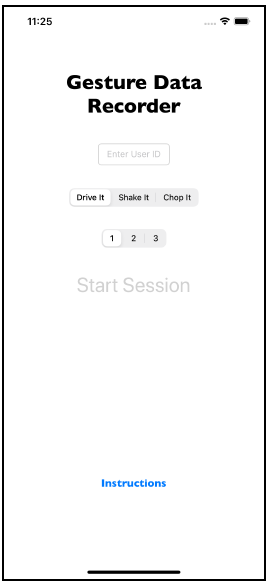

---
    
## 获取传感器数据的权限

通过Core Motion获取iPhone/iPod的传感器数据，在ViewController.swift内添加
```swift
import CoreMotion
```
还需在Info.plist中添加相关内容，允许App使用某些传感器
详见Privacy - Motion Usage Description


---

## 获取传感器数据

创建获取传感器数据的对象CMMotionManager
创建Queue，通过异步方式获取传感器数据
```swift
let motionManager = CMMotionManager()
let queue = OperationQueue()
```
设置每秒获取数据的数量
```swift
static let samplesPerSecond = 25.0
```

---

## 获取传感器数据

创建数据存储的变量
```swift
var activityData: [String] = []
```
存储数据到文件
```swift
do {
try self.activityData.appendLinesToURL(fileURL: dataURL)
print("Data appended to \(dataURL)")
} catch {
print("Error appending data: \(error)")
}
```
---
## 获取传感器数据

```swift
func process(data motionData: CMDeviceMotion) {
// 1
let activity = isRecording ? currendActivity : .none
// 2
let sample = """
\(sessionId!)-\(numberOfActionsRecorded),\
\(activity.rawValue),\
\(motionData.attitude.roll),\
\(motionData.attitude.pitch),\
\(motionData.attitude.yaw),\
\(motionData.rotationRate.x),\
\(motionData.rotationRate.y),\
\(motionData.rotationRate.z),\
\(motionData.gravity.x),\
\(motionData.gravity.y),\
\(motionData.gravity.z),\
\(motionData.userAcceleration.x),\
\(motionData.userAcceleration.y),\
\(motionData.userAcceleration.z)
"""
// 3
activityData.append(sample)
}
```

---

## 获取传感器数据

```swift
func enableMotionUpdates() {
// 1
motionManager.deviceMotionUpdateInterval = Config.samplesPerSecond
// 2
activityData = []
// 3
motionManager.startDeviceMotionUpdates(
using: .xArbitraryZVertical, 
to: queue,
withHandler: { [weak self] motionData, error in
// 4
guard let self = self, let motionData = motionData else {
let errorText = error?.localizedDescription ?? "Unknown"
print("Device motion update error: \(errorText)")
return
}
// 5
self.process(data: motionData)
})
}
```

---

## 开启、关闭session


```swift
case Utterances.sessionStart:
// TODO: enable Core Motion
enableMotionUpdates()
queueNextActivity()
```

```swift
func disableMotionUpdates() {
motionManager.stopDeviceMotionUpdates()
}
```

```swift
case Utterances.sessionComplete:
disableMotionUpdates()
```

---


## 构造数据集

通过App获取用户行为的传感器数据
- 数据存放在手机，可通过Files等app打开
  - Info.plist设置
    - Application supports iTunes file sharing: YES
    - Supports opening documents inplace: YES

手动构造训练集、验证集、测试集

---

## 数据分析和处理


```py
%matplotlib inline
import turicreate as tc
import activity_detector_utils as utils
```
读取数据集
```py
train_sf = utils.sframe_from_folder("data/train")
valid_sf = utils.sframe_from_folder("data/valid")
test_sf = utils.sframe_from_folder("data/test")
```

---

## 分析数据

总要看看数据集好不好
- 因此是手工标记，标记是否存在错误？
- 传感器放置错误，没有严格按照要求采集数据等
- 传感器数据有误，出现坏数据
- 三种行为以外的数据


---

## 数据可视化
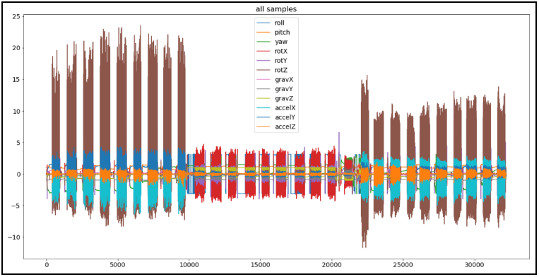
抖动
挥砍
转动方向盘

---

## 数据可视化


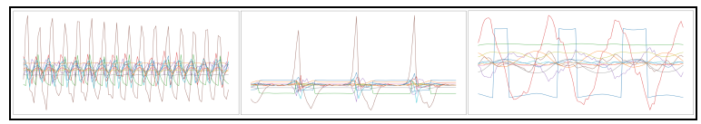
抖动，挥砍，转动方向盘

---

## 平衡类别
按类别统计数量

```py
utils.count_activities(train_sf)
utils.count_activities(valid_sf)
utils.count_activities(test_sf)
```
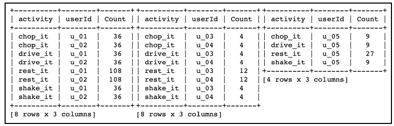


---


## 构造模型

模型的输入数据
- 一次采样？二次采用？四次？八次？
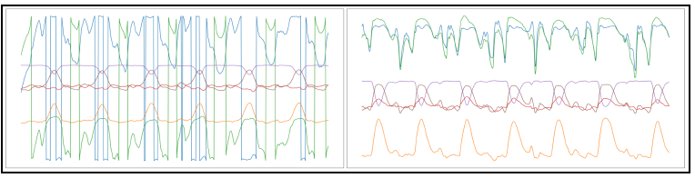

不同用户在同一行为下的数据大相径庭，需根据不同用户做不同的切分


---


## 构造模型

利用Ture Create创建模型
```py
model = tc.activity_classifier.create(
dataset=train_sf, session_id='sessionId', target='activity',
features=[
"rotX", "rotY", "rotZ", "accelX", "accelY", "accelZ"],
prediction_window=20, validation_set=valid_sf,
max_iterations=20)
```

---

## 模型训练结果
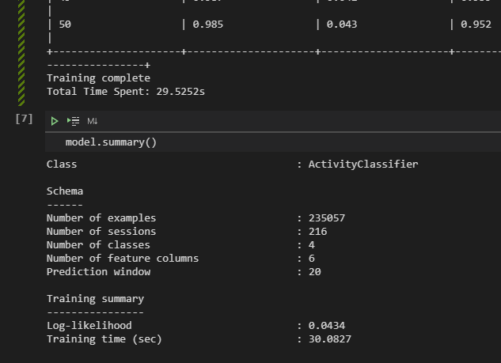


---

## 验证模型

```py
metrics = model.evaluate(test_sf)
print(metrics)
```
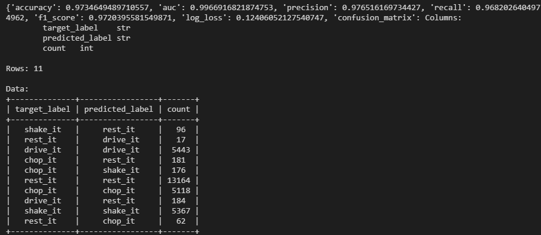

---

## 保存模型
```py
model.export_coreml("GestureClassifier.mlmodel")
model.save("GestureClassifier")
```
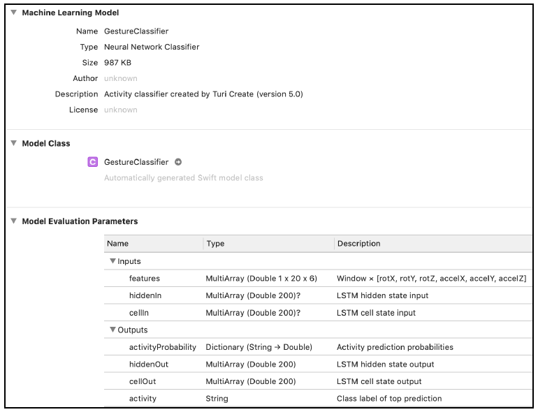

---

## 时序模型概览

RNN模型
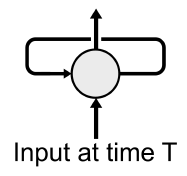
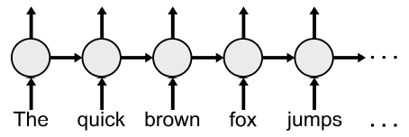


---

## 长短时记忆

Long short-term memory

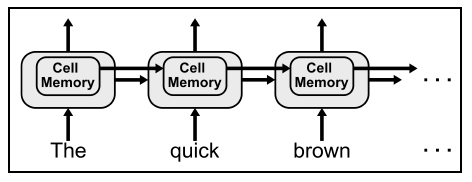


---

## Turi Create的行为识别模型

CNN和RNN的结合
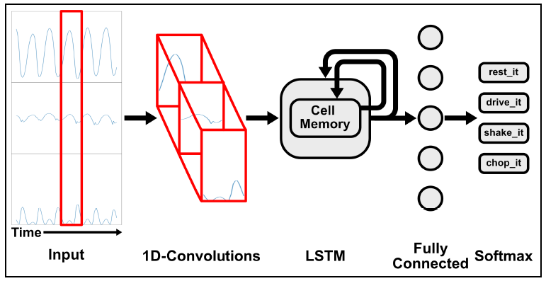

---

## 最终任务：节奏达人游戏

- App按节奏给出用户需完成的姿势提示，用户手持设备在规定时间内完成姿势
  - 挥砍
  - 抖动
  - 转动方向盘

---

## 行为识别模型的基本信息
```swift
static let samplesPerSecond = 25.0
static let numberOfFeatures = 6
static let windowSize = 20
```

---
## 获取传感器采样数据


```swift
static private func makeMLMultiArray(numberOfSamples: Int) ->
MLMultiArray? {
try? MLMultiArray(
shape: [1, numberOfSamples, Config.numberOfFeatures] as [NSNumber],
dataType: .double)
}
```

```swift
let modelInput: MLMultiArray! =
GameViewController.makeMLMultiArray(numberOfSamples:
Config.windowSize)
```

---

## 模型输入数据

窗口：20帧
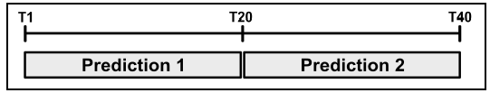

实际运动姿势和预测窗口的叠加
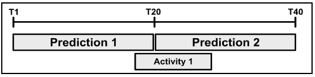

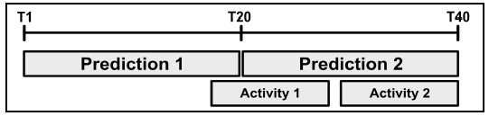

---

## 窗口的错位预测

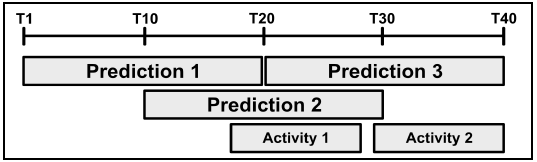

通过如下代码设置
```swift
static let windowOffset = 5
static let numberOfWindows = windowSize / windowOffset
```

---

## 窗口的错位预测
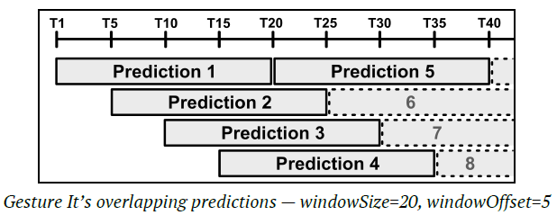

为了满足模型错位预测的需要，输入数据也需准备多份。通过buffer来实现(buffer长度35)
```swift
static let bufferSize =
windowSize + windowOffset * (numberOfWindows - 1)
```

---

## 窗口的错位预测

```swift
let dataBuffer: MLMultiArray! =
GameViewController.makeMLMultiArray(numberOfSamples:
Config.bufferSize)
var bufferIndex = 0
var isDataAvailable = false
```

模型输入buffer示意图
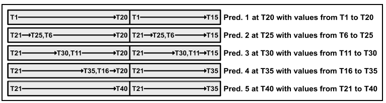

---

## buffer数据填充

```swift
// 1
func buffer(motionData: CMDeviceMotion) {
// 2
for offset in [0, Config.windowSize] {
let index = bufferIndex + offset
if index >= Config.bufferSize {
continue
}
// 3
addToBuffer(index, 0, motionData.rotationRate.x)
addToBuffer(index, 1, motionData.rotationRate.y)
addToBuffer(index, 2, motionData.rotationRate.z)
addToBuffer(index, 3, motionData.userAcceleration.x)
addToBuffer(index, 4, motionData.userAcceleration.y)
addToBuffer(index, 5, motionData.userAcceleration.z)
}
}
```

---


## 构建数据处理pipeline

- 向buffer存储传感器数据
```swift
buffer(motionData: motionData)
```
- 更新bufferIndex
```swift
bufferIndex = (bufferIndex + 1) % Config.windowSize
```
开始一次姿势的识别

---

## 开始一次姿势的识别


```swift
// 5
if isDataAvailable &&
bufferIndex % Config.windowOffset == 0 &&
bufferIndex + Config.windowOffset <= Config.windowSize {
// 6
let window = bufferIndex / Config.windowOffset
// 7
memcpy(modelInput.dataPointer,
dataBuffer.dataPointer.advanced(
by: window * Config.windowOffsetAsBytes),
Config.windowSizeAsBytes)
// 8
// TODO: predict the gesture
}
```