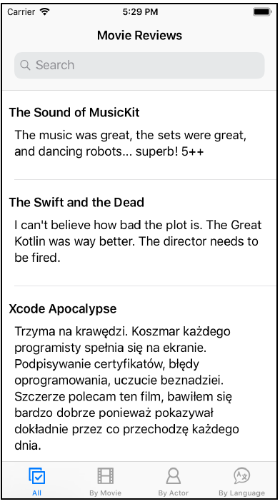
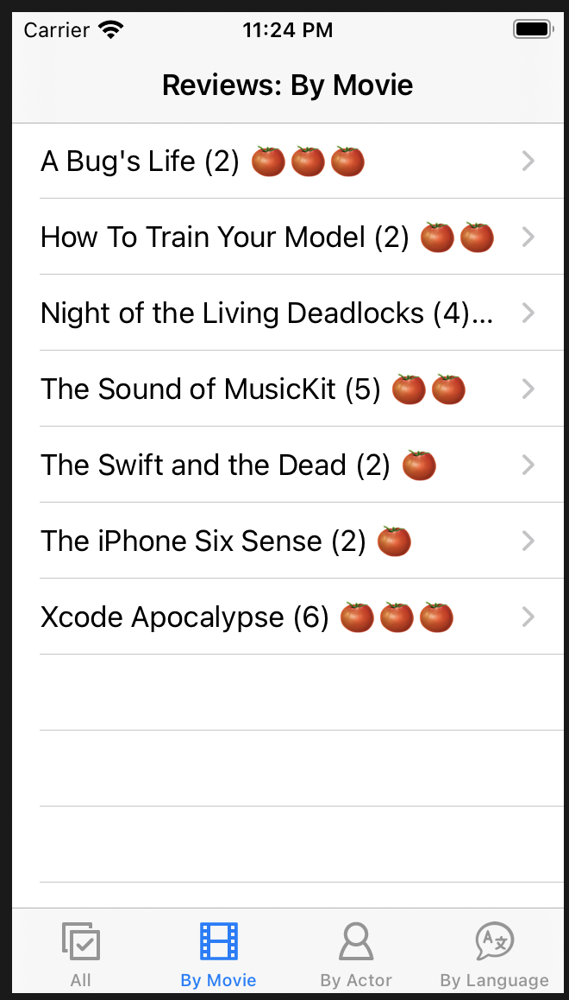
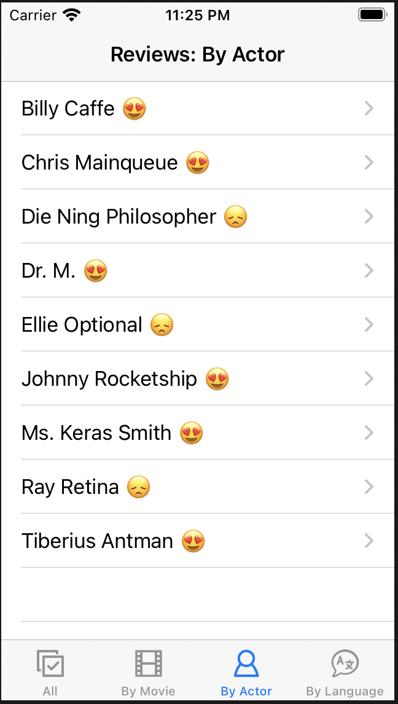
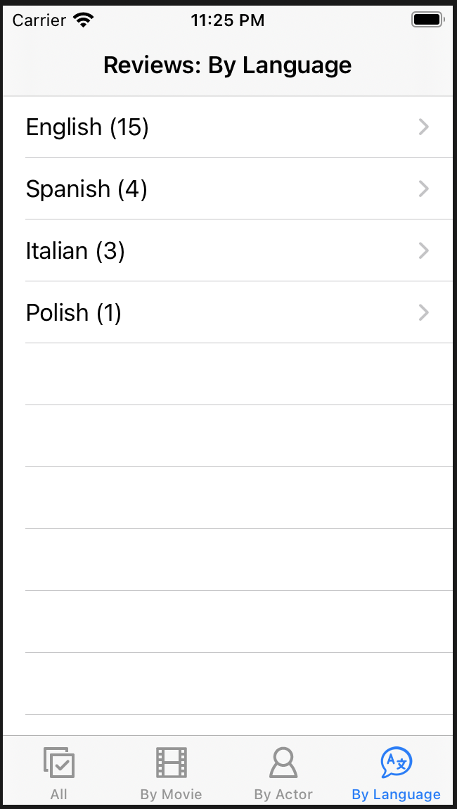
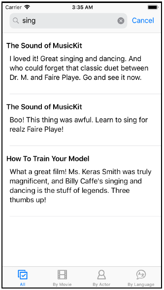
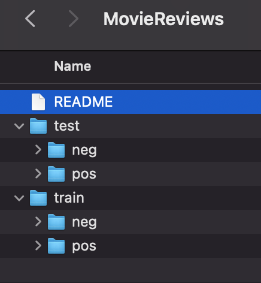
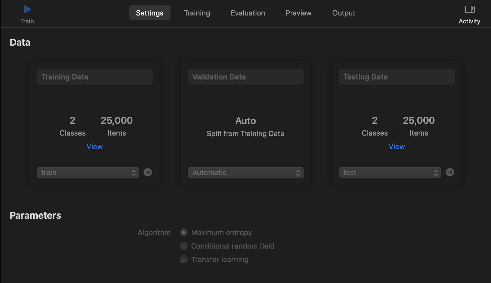
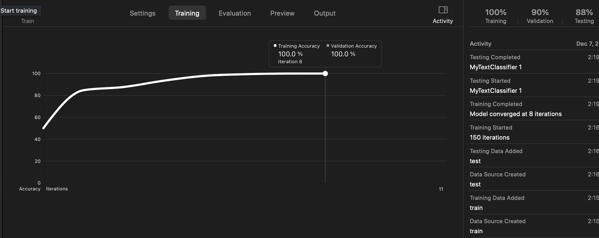
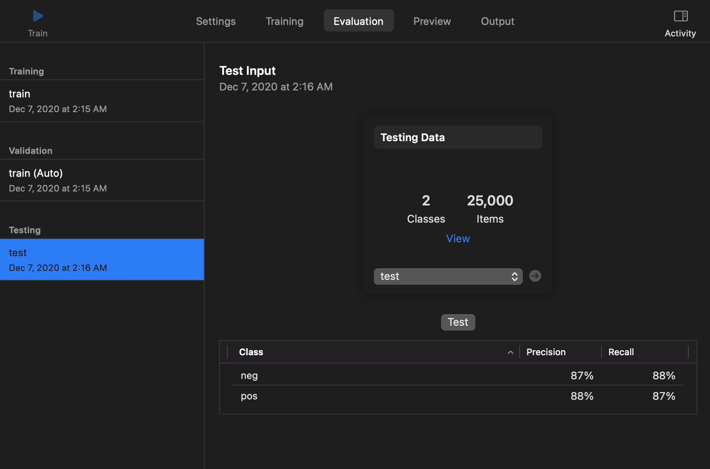
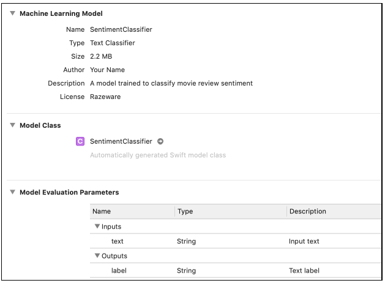

<style>
img {
  display: block;
  margin: 0 auto;
}
</style>

# 基于Swift语言的iOS应用开发


让iOS App理解自然语言

---

## 本节概要
- 前情回顾：人体姿态识别
    - 设计App采集人体姿态数据
    - 训练人体姿态识别模型
    - 设计App识别人体姿态
- 本节内容：自然语言/文本内容的识别   

---

## 自然语言处理

自然语言相关的任务
- 识别垃圾邮件
- 用户评论分析
- 文档主题识别

---

## 自然语言的识别

本节课，我们将利用iOS12的Natural Language framework，完成：
- 自然语言种类的识别
- 名称实体的识别
- 词形还原(Lemmatization)
- 情感分析

---

## 电影评论App

在一款提供了电影评论数据的App中，根据需求，完善搜索及部分未完成功能

目前已有功能：
- 内容展示
- All tab：通过JSON格式文件读取电影评论数据，展示其内容及评论的打分。正向评论利用夸张的笑脸表示，负面评论用哭脸表示。



---

## 电影评论App

目前已有功能：
- By Movie：只显示电影名称的列表，可点击某部电影名称，查看对应的评论内容。

需添加功能：
- By Movie：根据该电影评论的平均打分，给出“烂番茄指数”。



---

## 电影评论App


目前已有功能：
- By Actor：无

需添加功能：
- By Actor：通过评论，可自动以演员姓名构造列表，同时显示其参演影片的平均电影打分。支持点击演员姓名后显示其参演电影的所有评论。



---

## 电影评论App


目前已有功能：
- By Language：无

需添加功能：
- By Language：显示按语言分类的列表，支持点击后查看该语言下的所有评论。



---

## 语言种类的判别

不同语言的构成、结构、语法各不相同，因此分析自然语言的第一步是知道分析的文本对象是什么语种。

iOS提供了语种识别的内置类：NLLanguageRecognizer
调用其dominantLanguage方法完成输入文本语种的判别
```swift
func getLanguage(text: String) -> NLLanguage? {
NLLanguageRecognizer.dominantLanguage(for: text)
}
```
返回NLLanguage对象，可通过其rawValue获取具体编码值。

---

## 语种编码

语种编码是两个英文字母组成的ISO 639-1 code，如en: English，es：Spanish，de：German
  
编码值
```swift
NLLanguage.rawValue
```
语种文本
```swift
NSLocale.current.localizedString(forLanguageCode: language.rawValue)
```

---

## 语种判别进阶讨论

```dominantLanguage```给一段文本，返回判别结果。该结果给定一个语种

实际情况：“今天我们上了iOS开发课程，里面利用NLLanguageRecognizer的dominantLanguage function实现了NLP领域中语种的判别。”

```swift
NLLanguageRecognizer.processString()
```
返回top N语种，及其对应的概率。
```swift
NLLanguageRecognizer.languageHypotheses(withMaximum:)
```
---

## 名称匹配

自然语言处理一大任务：根据用户输入的名称，查询并显示与输入名称相关的结果。

- 输入某个人名，显示和该人名相关的文章
- 输入城市名，显示评论中出现过该城市的餐馆
...

简单模式：期望严格按照搜索的单词呈现相应内容
困难模式：模糊搜索，查找内容时无法给定具体明确的关键字

---

## 基于Natural Language Framework的names匹配

Natural Language Framework提供了已训练好的模型，有能力在文本中搜索诸如人名、地名、组织机构名等功能。

需添加功能：
- By Actor：通过评论，可自动以演员姓名构造列表，同时显示其参演影片的平均电影打分。支持点击演员姓名后显示其参演电影的所有评论。


---

## NLTagger及其实现

App本身无法事先知晓所有的演员人名，因此需检测出文本评论中的每个单词是否是人名。
Apple提供了NLTagger类能够处理以上任务。
实现``NLPHelper.swift``中``getPeopleNames``方法
```swift
// 1  
let tagger = NLTagger(tagSchemes: [.nameType])
tagger.string = text
// 2
let options: NLTagger.Options = [
.omitWhitespace, .omitPunctuation, .omitOther, .joinNames]
```

---

## NLTagger及其实现

```swift
// 3
tagger.enumerateTags(
in: text.startIndex..<text.endIndex, unit: .word,
scheme: .nameType, options: options) { tag, tokenRange in
// 4
if tag == .personalName {
block(String(text[tokenRange]))
}
return true
```

---

## 搜索功能的实现

针对语种：英语
搜索功能本身很简单，但仍然需要对文本做一些额外的预处理，比如词形还原：
"I am running"和"I was running"
car和cars
run, runs, running, ran

词干提取 vs 词形还原

---

## 词形还原预处理

搜索目标：支持关键词相关词形的模糊搜索。如搜索run，可返回包含ran，running等内容的评论。

完善``NLPHelper.swift``中``getSearchTerms``方法

创建NLTagger，Scheme选择lemma，设置好options
```swift
// 1
func getSearchTerms(text: String, language: String? = nil,
block: (String) -> Void) {
// 2 
let tagger = NLTagger(tagSchemes: [.lemma])
```

---

## 词形还原预处理

```swift
tagger.string = text
let options: NLTagger.Options = [
.omitWhitespace, .omitPunctuation, .omitOther, .joinNames]
tagger.enumerateTags(
in: text.startIndex..<text.endIndex, unit: .word,
scheme: .lemma, options: options) { tag, tokenRange in
if let tag = tag {
// 3
let lemma = tag.rawValue.lowercased()
block(lemma)
}
return true
}
}
```

---

## 搜索结果



---

## 一些问题

- 问题1：尝试搜索"sing"，返回的评论包含"singing"；但尝试搜索"singing"，返回内容空。


- 问题2：尝试搜索"dance"，返回的评论包含"dancing"；但尝试搜索"dancing"，返回两份一样的结果。

- 问题3：尝试搜索"bueno"，返回一个评论包含"buena"；但尝试搜索"buena"，返回内容空。

---

## 问题1

问题1原因：上述代码只“词形还原”了被搜索的评论内容，搜索关键字未作修改。因此在精确搜索时，因评论中的singing被还原为sing，搜索singing返回结果为空。

解决方案：针对搜索关键字也做词形还原。

完善```ReviewsTableViewController.swift```中的```findMatches```方法。

---

## findMatches实现
```swift
var matches: Set<Review> = []
// 1
getSearchTerms(
text: searchText,
language: Locale.current.languageCode) { word in
// 2
if let founds = ReviewsManager.instance.searchTerms[word] {
matches.formUnion(founds)
}
}
reviews = matches.filter { baseReviews.contains($0) }
```
getSearchTerms为前文实现的搜索方法

---

## 问题依旧存在

- 问题1：尝试搜索"sing"和"singing"，返回内容空。


- 问题2：尝试搜索"dance"，返回内容为空；但尝试搜索"dancing"，返回包含那"dance"的评论。

- 问题3：尝试搜索"bueno"，返回一个评论包含"buena"；但尝试搜索"buena"，返回内容空。
  
getSearchTerms方法中在```let options: ...```之前加入如下代码
```swift
if let language = language {
tagger.setLanguage(NLLanguage(rawValue: language),
range: text.startIndex..<text.endIndex)
}
```

---

## 最终修改
在``enumerateTags``block中if语句之前添加如下代码：
```swift
let token = String(text[tokenRange]).lowercased()
```

针对该if语句添加对应的```else```block
```swift
if let tag = tag {
...
} else {
block(token)
}
```

---

## 最终修改

在``enumerateTags``block中执行完```block(lemma)```后添加如下代码：

```swift
if lemma != token {
block(token)
}
```

---

## 情感分析

针对一段文本内容，给出对应的正向、负面情绪的打分。

继续利用```NLTagger```，将scheme设定为```.sentimentScore```，在```NLPHelper.swift```，完善```analyzeSentiment```方法，从而给评论进行情感分析。

可在```ReviewsTableViewController.swift```中的```tableView(_:cellForRowAt:)```方法进行情感分析结果的终端输出。
```swift
print("review text: \(review.text)\nscore: \(String(describing:
analyzeSentiment(text: review.text)))\n\n")
```

---

## analyzeSentiment方法实现

```swift
// 1
func analyzeSentiment(text: String) -> Double? {
// 2
let tagger = NLTagger(tagSchemes: [.sentimentScore])
tagger.string = text
// 3
let (tag, _) = tagger.tag(at: text.startIndex,
unit: .paragraph,
scheme: .sentimentScore)
// 4
guard let sentiment = tag,
let score = Double(sentiment.rawValue)
else { return nil }
return score
}
```

---

## 训练一个情感分析模型

利用Create ML Application进行情感分析模型训练，以达到给定一段文本，输出对该文本情感分析的判断(positive or negative)

数据集：25000条数据
- 包含12500条带pos情绪标记的文本
- 包含12500条带neg情绪标记的文本




---

## Create ML工程配置



---

## 训练模型



---

## 测试模型



---

## ML Model



---

## 使用模型

```NLPHelper.swift```的```getSentimentClassifier```方法中创建模型实例
```swift
func getSentimentClassifier() -> NLModel? {
try! NLModel(mlModel: SentimentClassifier().model)
}
```

实现```NLPHelper.swift```的```predictSentiment```方法
```swift
func predictSentiment(
text: String, sentimentClassifier: NLModel) -> String? {
sentimentClassifier.predictedLabel(for: text)
}
```