<style>
img {
  display: block;
  margin: 0 auto;
}
</style>

# 基于Swift语言的iOS应用开发


在iOS App中运用机器翻译模型

---

## 本节概要
- 前情回顾：自然语言/文本内容的识别
  - 自然语言种类的识别
  - 名称实体的识别
  - 词形还原(Lemmatization)
  - 情感分析
- 本节内容：基于seq2seq模型的机器翻译应用   

---

## 基于seq2seq模型的机器翻译应用

- 机器翻译数据集
- Model：Sequence-to-sequence模型
- Tensorflow, Keras, coremltools
- App：SMDB App

---

## 机器翻译数据集

机器翻译：监督学习
- 数据集必须带标记
  - Spa数据集：英语->西班牙语
  
数据集的映射关系问题

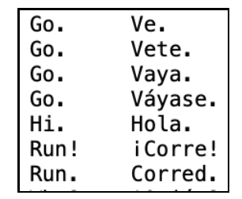


---

## Seq2seq模型

两个模型(encoder和decoder)的组合

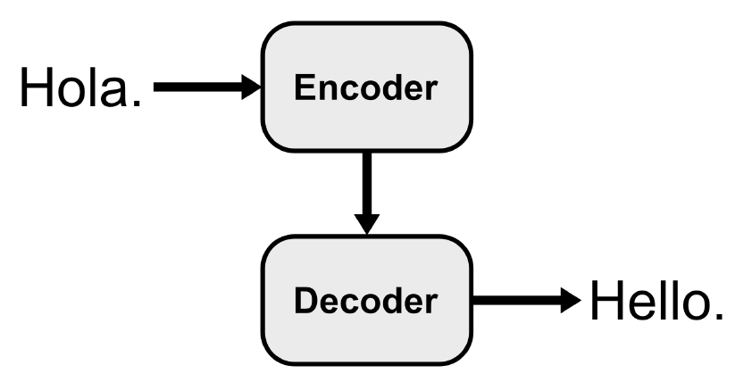

---

## Seq2seq模型

输入：西班牙语
输出：英语

encoder：获取输入西班牙语的某种向量形式的输出
decoder：将encoder输出的向量作为输入，自身输出对应encoder输入的英语版本

---

## seq2seq模型进阶理解

seq2seq：序列到序列的转换，那么，何为序列？

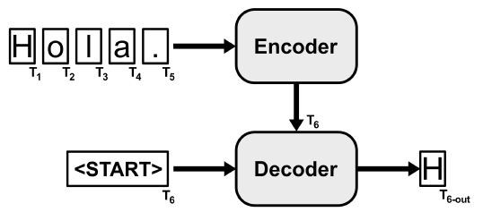


---

## seq2seq模型进阶理解

encoder和decoder内部基本结构为循环神经网络，如LSTM
单词以字母为粒度构建encoder的输入序列，decoder结合encoder的输出，以序列的形式输出预测的对应英文版单词


---

## decoder的推理过程

encoder和decoder内部基本结构为循环神经网络，如LSTM
单词以字母为粒度构建encoder的输入序列，decoder结合encoder的输出，以序列的形式输出预测的对应英文版单词

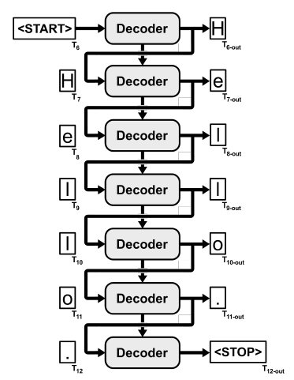

---

## seq2seq模型的训练

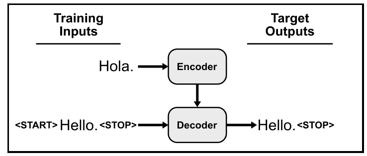

---

## 数据集准备

通过某种token，标记start和stop

```py
start_token = "\t"
stop_token = "\n"
```
---
## 数据集准备

构建单词标签数据

```py
# 2
with open("data/spa.txt", "r", encoding="utf-8") as f:
samples = f.read().split("\n")
samples = [sample.strip().split("\t")
for sample in samples if len(sample.strip()) > 0]
# 3
samples = [(es, start_token + en + stop_token)
for en, es in samples if len(es) < 45]
```

---

## 数据集准备

处理完毕后，数据集以如下形式呈现

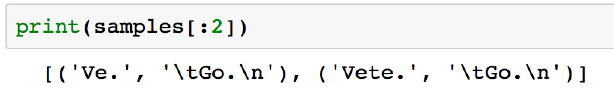

---

## 验证集的构造

根据字典的特性，不可如往常一般随机切分数据集

- 奇妙的42：验证集为训练集的一个副本
```py
from sklearn.model_selection import train_test_split
train_samples, valid_samples = train_test_split(
samples, train_size=.8, random_state=42)
```

---

## 构建模型

老生常谈的声明
```py
import keras
from keras.layers import Dense, Input, LSTM, Masking
from keras.models import Model
```

- 构建encoder和decoder
  - 数据维度、内部结构选取
- seq2seq：encoder和decoder的拼接

---

## 构建encoder

```py
# 1
latent_dim = 256
# 2
encoder_in = Input(
shape=(None, in_vocab_size), name="encoder_in")
# 3
encoder_mask = Masking(name="encoder_mask")(encoder_in)
# 4
encoder_lstm = LSTM(
latent_dim, return_state=True, recurrent_dropout=0.3,
name="encoder_lstm")
# 5
_, encoder_h, encoder_c = encoder_lstm(encoder_mask)
```

---

## 构建decoder

```py
# 1
decoder_in = Input(
shape=(None, out_vocab_size), name="decoder_in")
decoder_mask = Masking(name="decoder_mask")(decoder_in)
# 2
decoder_lstm = LSTM(
latent_dim, return_sequences=True, return_state=True,
dropout=0.2, recurrent_dropout=0.3, name="decoder_lstm")
# 3
decoder_lstm_out, _, _ = decoder_lstm(
decoder_mask, initial_state=[encoder_h, encoder_c])
# 4
decoder_dense = Dense(
out_vocab_size, activation="softmax", name="decoder_out")
decoder_out = decoder_dense(decoder_lstm_out)
```

---

## seq2seq模型构建

合二为一：拼接encoder和decoder

```py
# 1
seq2seq_model = Model([encoder_in, decoder_in], decoder_out)
# 2
seq2seq_model.compile(
optimizer="rmsprop", loss="categorical_crossentropy")
```

categorical crossentropy：类别分布的损失函数


---


## seq2seq模型实现的结构

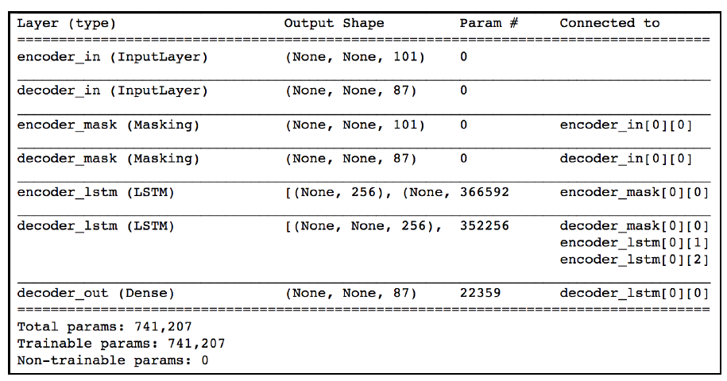

---

## 单词编码之模型视角

模型无法直接理解文本，因此需对文本中的单词进行数字编码
- 一种经典的编码方式
```py
# 1
in_token2int = {token : i
for i, token in enumerate(sorted(in_vocab))}
# 2
out_token2int = {token : i
for i, token in enumerate(sorted(out_vocab))}
out_int2token = {i : token
for token, i in out_token2int.items()}
```

---

## one-hot编码

文本中的单词本质是离散数据，直接用数值进行编码存在编号数值差异的问题

one-hot编码可有效解决数字之间本身的差值存在差异的问题

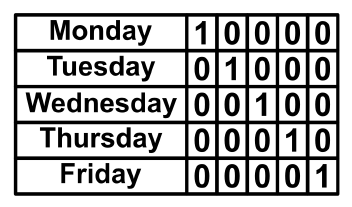

---

## 批操作和数据补全

```py
import numpy as np
def make_batch_storage(batch_size, in_seq_len, out_seq_len):
enc_in_seqs = np.zeros(
(batch_size, in_seq_len, in_vocab_size),
dtype=np.float32)
dec_in_seqs = np.zeros(
(batch_size, out_seq_len, out_vocab_size),
dtype=np.float32)
dec_out_seqs = np.zeros(
(batch_size, out_seq_len, out_vocab_size),
dtype=np.float32)
return enc_in_seqs, dec_in_seqs, dec_out_seqs
```


---

## 批操作结果示例

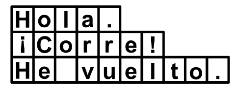

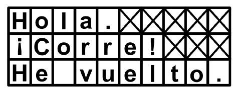

---

## 模型训练剩下的事情

- 模型训练
```py
seq2seq_model.fit_generator(
train_generator, validation_data=valid_generator,
epochs=500, callbacks=[early_stopping])
```
- 模型测试

---

## 一些技惊四座的结果

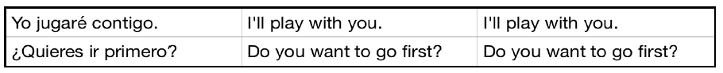

---

## 一些还不错的结果

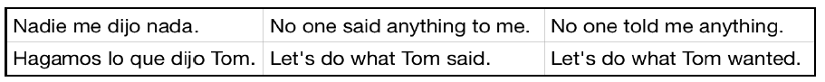

---

## 一些不知道在说啥的结果

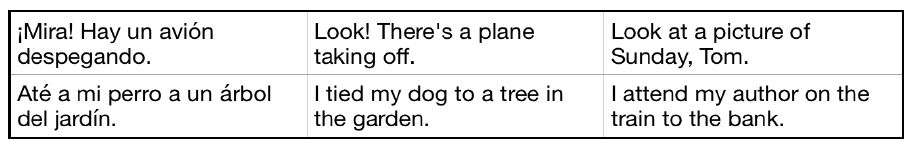

---

## 一些明显严重错误的结果

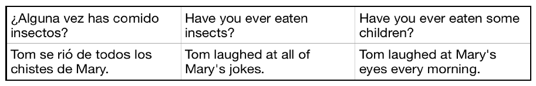

---

## seq2seq模型的coreML转换：encoder
利用coremltools对encoder进行coreML模型格式的转换
``` py
# 1
coreml_enc_in = Input(
shape=(None, in_vocab_size), name="encoder_in")
coreml_enc_lstm = LSTM(
latent_dim, return_state=True, name="encoder_lstm")
coreml_enc_out, _, _ = coreml_enc_lstm(coreml_enc_in)
coreml_encoder_model = Model(coreml_enc_in, coreml_enc_out)
# 2
coreml_encoder_model.output_layers = \
coreml_encoder_model._output_layers
# 3
inf_encoder.save_weights("Es2EnCharEncoderWeights.h5")
coreml_encoder_model.load_weights("Es2EnCharEncoderWeights.h5")
```

---

## seq2seq模型的coreML转换：encoder

```py
import coremltools
coreml_encoder = coremltools.converters.keras.convert(
coreml_encoder_model,
input_names="encodedSeq", output_names="ignored")
coreml_encoder.save("Es2EnCharEncoder.mlmodel")
```

---

## seq2seq模型的coreML转换：decoder
利用coremltools对encoder进行coreML模型格式的转换
``` py
coreml_dec_in = Input(shape=(None, out_vocab_size))
coreml_dec_lstm = LSTM(
latent_dim, return_sequences=True, return_state=True,
name="decoder_lstm")
coreml_dec_lstm_out, _, _ = coreml_dec_lstm(coreml_dec_in)
coreml_dec_dense = Dense(out_vocab_size, activation="softmax")
coreml_dec_out = coreml_dec_dense(coreml_dec_lstm_out)
coreml_decoder_model = Model(coreml_dec_in, coreml_dec_out)
coreml_decoder_model.output_layers = \
coreml_decoder_model._output_layers
inf_decoder.save_weights("Es2EnCharDecoderWeights.h5")
coreml_decoder_model.load_weights("Es2EnCharDecoderWeights.h5")
```

---

## seq2seq模型的coreML转换：decoder

```py
coreml_decoder = coremltools.converters.keras.convert(
coreml_decoder_model,
input_names="encodedChar", output_names="nextCharProbs")
coreml_decoder.save("Es2EnCharDecoder.mlmodel")
```

---

## 如何在SMDB App中使用seq2seq模型

在``NLPHelper.swift``完善以下函数的实现
- 编码encoder的输入 ``getEncoderInput``
- 编码decoder的输入 ``getDecoderInput``
- 西班牙语至英语的翻译过程 ``spanishToEnglish``


---

## getEncoderInput实现
过滤非西班牙语单词的输入
```py
let cleanedText = text
.filter { esCharToInt.keys.contains($0) }
if cleanedText.isEmpty {
return nil
```

---

## getEncoderInput实现


针对西班牙语单词进行one-hot编码转换
```py
// 2
let vocabSize = esCharToInt.count
let encoderIn = initMultiArray(
shape: [NSNumber(value: cleanedText.count),
1,
NSNumber(value: vocabSize)])
// 3
for (i, c) in cleanedText.enumerated() {
encoderIn[i * vocabSize + esCharToInt[c]!] = 1
}

return encoderIn
```


---

## getDecoderInput实现

执行encoder，获得输出，从而构建decoder输入
```py
// 1
let encoder = Es2EnCharEncoder16Bit()
let encoderOut = try! encoder.prediction(
encodedSeq: encoderInput,
encoder_lstm_h_in: nil,
encoder_lstm_c_in: nil)
// 2
let decoderIn = initMultiArray(
shape: [NSNumber(value: intToEnChar.count)])
// 3
return Es2EnCharDecoder16BitInput(
encodedChar: decoderIn,
decoder_lstm_h_in: encoderOut.encoder_lstm_h_out,
decoder_lstm_c_in: encoderOut.encoder_lstm_c_out)

```

---

## spaishToEnglish实现

获得模型输出
```py
// 1
guard let encoderIn = getEncoderInput(text) else {
return nil
}
// 2
let decoderIn = getDecoderInput(encoderInput: encoderIn)
// 3
let decoder = Es2EnCharDecoder16Bit()
var translatedText: [Character] = []
var doneDecoding = false
var decodedIndex = startTokenIndex
```

---

## spaishToEnglish实现

```py
while !doneDecoding {
// 1
decoderIn.encodedChar[decodedIndex] = 1
// 2
let decoderOut = try! decoder.prediction(input: decoderIn)
// 3
decoderIn.decoder_lstm_h_in = decoderOut.decoder_lstm_h_out
decoderIn.decoder_lstm_c_in = decoderOut.decoder_lstm_c_out
// 4
decoderIn.encodedChar[decodedIndex] = 0
}
```

---


## spaishToEnglish实现

```py
// 1
decodedIndex = argmax(array: decoderOut.nextCharProbs)
// 2
if decodedIndex == stopTokenIndex {
doneDecoding = true
} else {
translatedText.append(intToEnChar[decodedIndex]!)
}
// 3
if translatedText.count >= maxOutSequenceLength {
doneDecoding = true
}

```


---

## 显示翻译结果

在``ReviewsManager.swift``中实现翻译的显示功能


