<style>
img {
  display: block;
  margin: 0 auto;
}
</style>

# 基于Swift语言的iOS应用开发


增强现实初探

---

## 本节概要
- 前情回顾：基于seq2seq模型的机器翻译应用
  - 机器翻译数据集
  - Model：Sequence-to-sequence模型
  - Tensorflow, Keras, coremltools
  - App：SMDB App
- 本节内容：增强现实(AR)相关内容的初探

---

## 构建AR相关的App

- 可与真实世界交互的内容
- 将内容附着于实际物体
- 虚拟内容可影响真实世界内容的显示
- 与现实环境的匹配

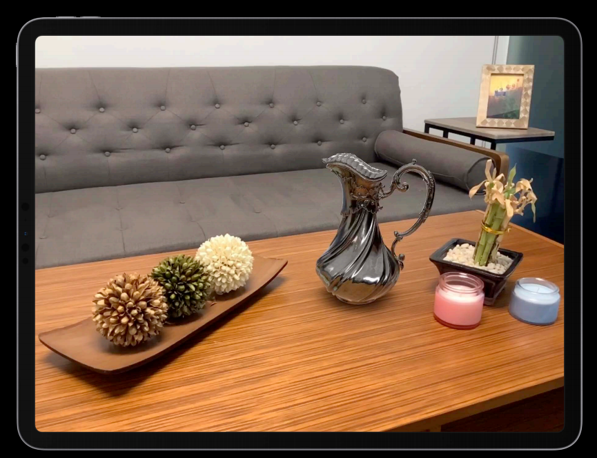


---

## RealityKit

在iOS13推出的AR框架RealityKit。
- 逼真的物理材质、环境反射、地面阴影、相机噪声和运动模糊等
- 基于swift语言设计
- 支持iOS和macOS


---

## RealityKit

可利用RealityKit实现高效的3D模拟和渲染，且RealityKit可以利用ARKit框架提供的信息将虚拟对象无缝集成到现实世界中。

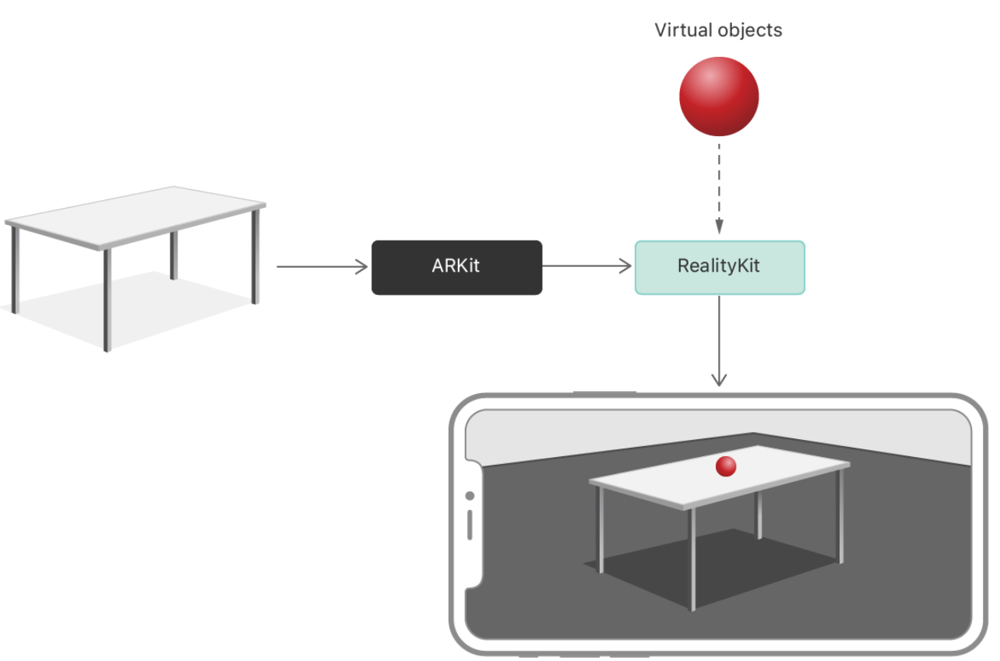


---

## RealityKit

可使用RealityKit来实现逼真的增强现实功能，功能概览如下：

- 导入特定的资源，包括使用Reality Composer制作的合成模型，或者从网格、材质和纹理构建。
- 在环境中设置声音相关内容
- 手动和物理模拟动画对象
- 响应用户输入和环境的变化
- 多设备同步

---

## RealityKit和Reality Composer
用来创建带动画效果的复杂的3D模型


---

## 显示AR的视图：AR View

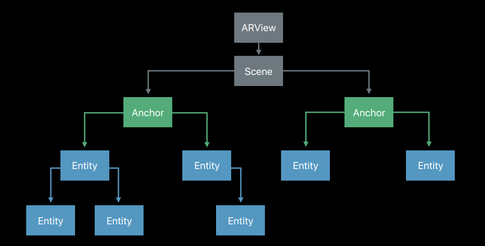


---

## AR View

- ARView具有一个Scene实例
- 向ARView的Scene实例添加一个或多个AnchorEntity实例，将模型绑定到现实世界中的某个物体

- 此外，ARView还可执行
  - 配置渲染选项、环境特征和相机模式。
  - 以鼠标、键盘或手势输入的形式处理适合平台的用户交互。
  - 在视图中的给定点查找Entity。
  - 可调试App的统计信息和可视化效果。


---
## ARKit


---

## ARKit

通过设备摄像头提供增强现实相关的用户体验，结合了：

- motion
- 摄像头场景捕捉
- 场景处理


---

## 一个简单的AR App

根据已有的坦克素材，利用RealityKit将其呈现在摄像头中，并可操作

- 支持坦克车身左右旋转和前进
- 支持坦克炮台左右旋转
- 开火！
- 要有音效

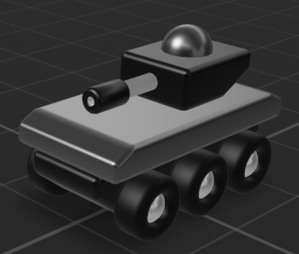

---

## 创建一个AR App

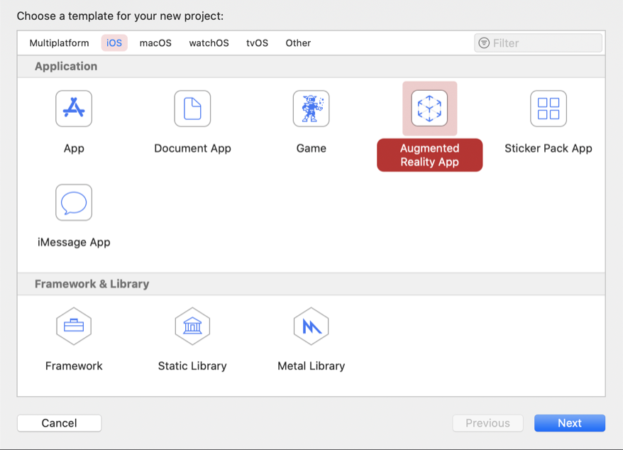

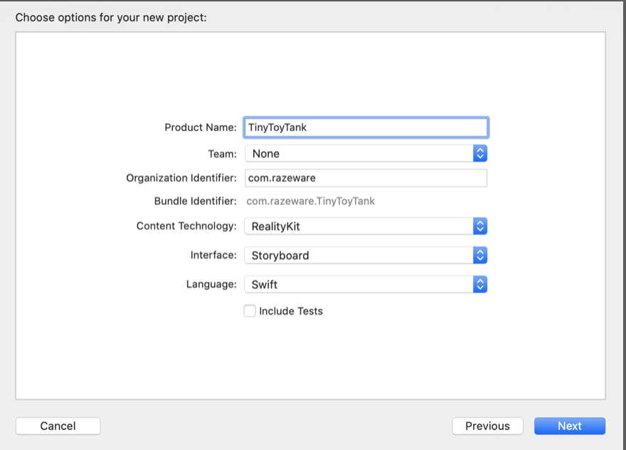

---

## AR App的缺省内容

- AppDelegate.swift: App的入口
- ViewController.swift：包含AR体验功能的代码
- Experience.rcproject：Reality composer工程
- Assets.xcassets
- Main.storyboard：UI相关
- Info.plist：配置相关

---

## 通过摄像头的增强现实

第一步：需要通过配置info.plist获得摄像头的授权

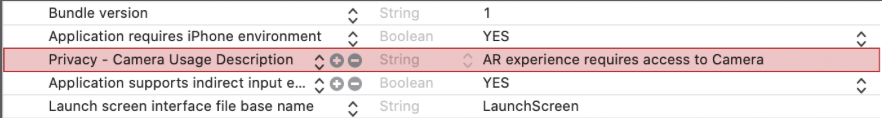

---

## 加入虚拟的坦克素材

将提供给大家的TinyToyTank.rcproject拖入xcode工程

可通过Reality Composer进行浏览和编辑


---


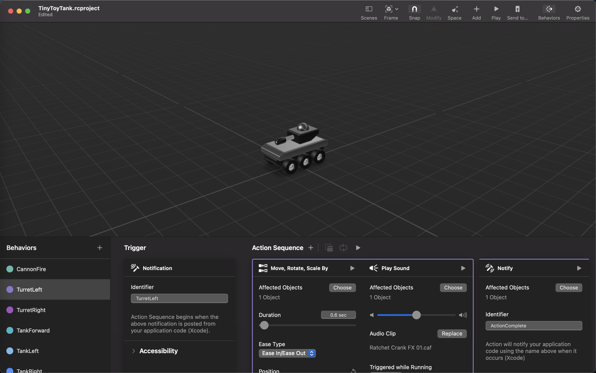


---

## 如何将坦克呈现在摄像头中

将坦克呈现在摄像头中需要若干步，首先打开ViewController,声明
```swift
var tankAnchor: TinyToyTank._TinyToyTank?
```
在viewDidLoad函数中载入坦克
```swift
// 1
super.viewDidLoad()
// 2
tankAnchor = try! TinyToyTank.load_TinyToyTank()
// 3
arView.scene.anchors.append(tankAnchor!)”
```

---


## 坦克载入的效果


---

## 增加坦克的控制功能

- 支持坦克车身左右旋转和前进
- 支持坦克炮台左右旋转
- 开火！
- 要有音效

添加UI图标至Assets.xcassets
删除默认的ARView Scene ▸ ARView ▸ Ar View，重新添加UIView

---

## 配置ARView

在UIView中添加RealityKit AR View

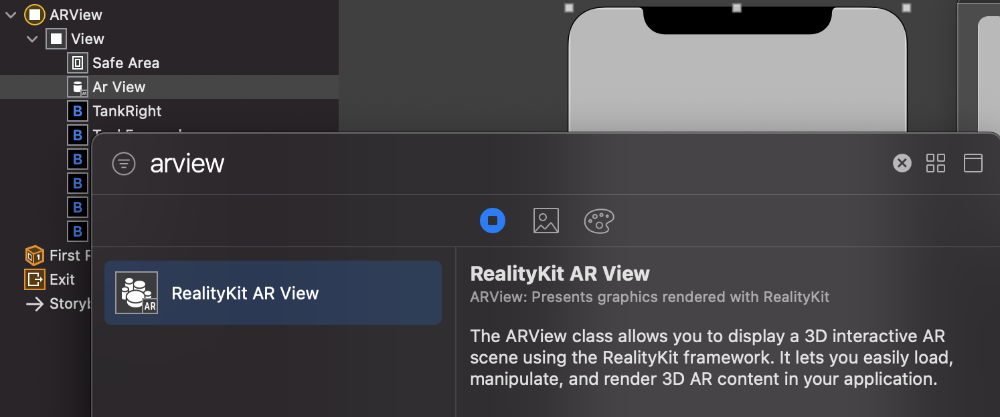
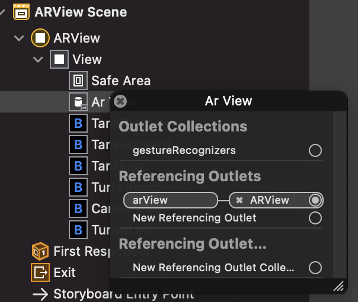


---


## 加入坦克控制按钮

通过添加若干button对象，并指定按钮按下的events触发函数，即在ViewController中生成很多xxxPressed的函数。

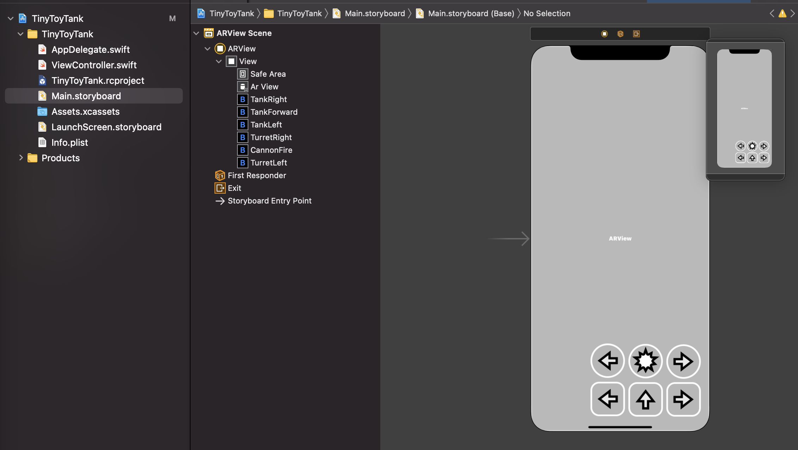

---

## 添加动画效果

可通过tankAnchor!.notifications获取坦克的可操作行为

坦克右转函数tankRightPressed(_:):
```swift
tankAnchor!.notifications.tankRight.post()
```
坦克前进和左转
```swift
tankAnchor!.notifications.tankForward.post()
tankAnchor!.notifications.tankLeft.post()
```

运行下...

---

## 炮台没动？

没关系不要急，思考下为什么不会动

- 原来炮台和坦克是两个独立的对象

设置坦克是炮台的parent，让炮台跟随坦克移动
```swift
tankAnchor!.turret?.setParent(
  tankAnchor!.tank, preservingWorldTransform: true)”
```

再次运行一下...


---

## 炮台的按钮操作
炮台右转
```swift
tankAnchor!.notifications.turretRight.post()
```
炮台左转
```swift
tankAnchor!.notifications.turretLeft.post()
```
开火
```swift
tankAnchor!.notifications.cannonFile.post()
```

---

## 防止多次动画效果的同时触发

在ViewController中设置控制的变量
```swift
var isActionPlaying: Bool = false
```

在每个xxxPressed函数中添加如下代码
```swift
if self.isActionPlaying { return }
else { self.isActionPlaying = true }
```

---

## reset isActionPlaying

在viewDidLoad函数中重置isActionPlaying

```swift
tankAnchor?.actions.actionComplete.onAction = { _ in
  self.isActionPlaying = false
}
```


