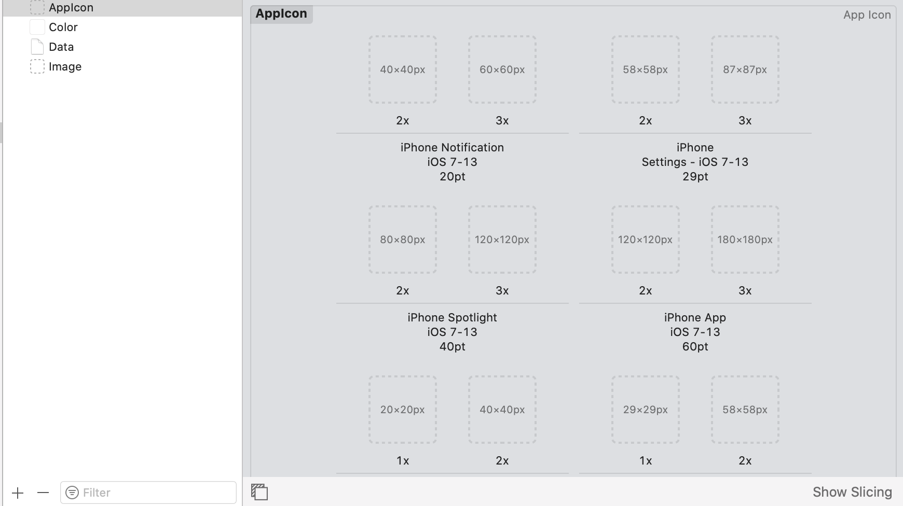
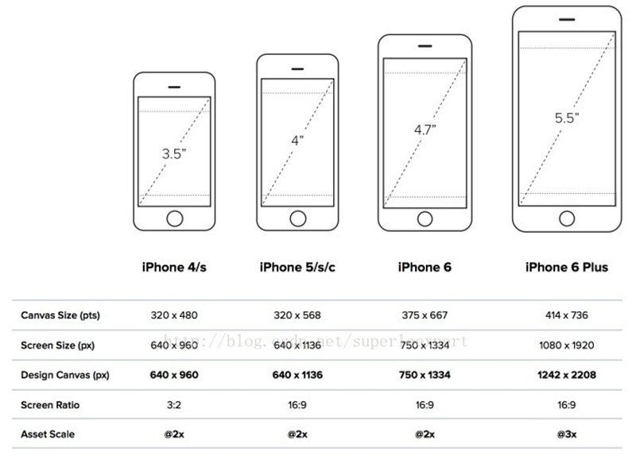
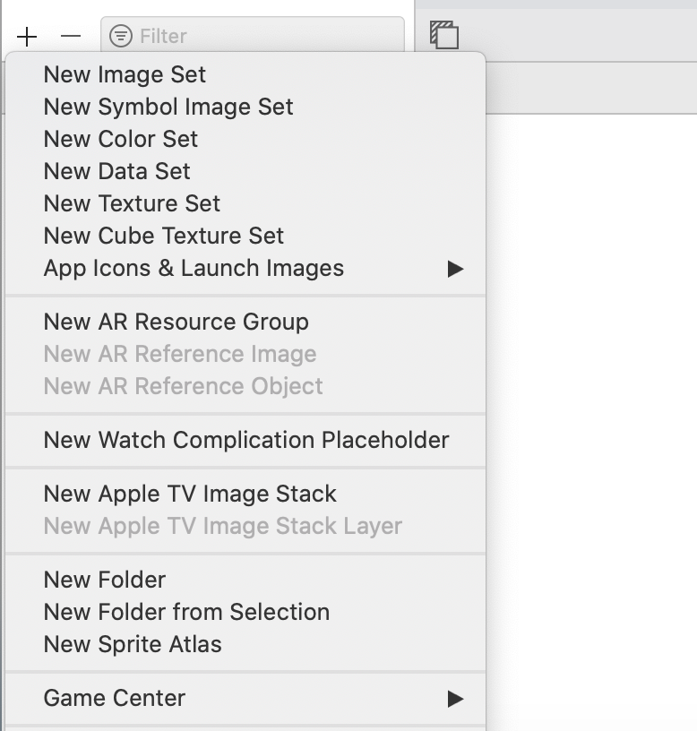
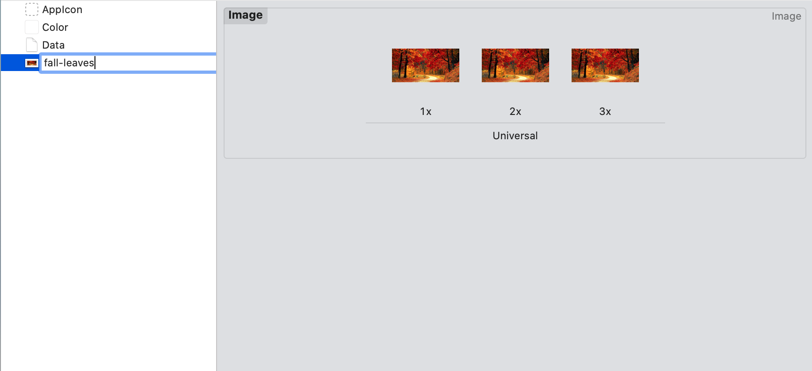
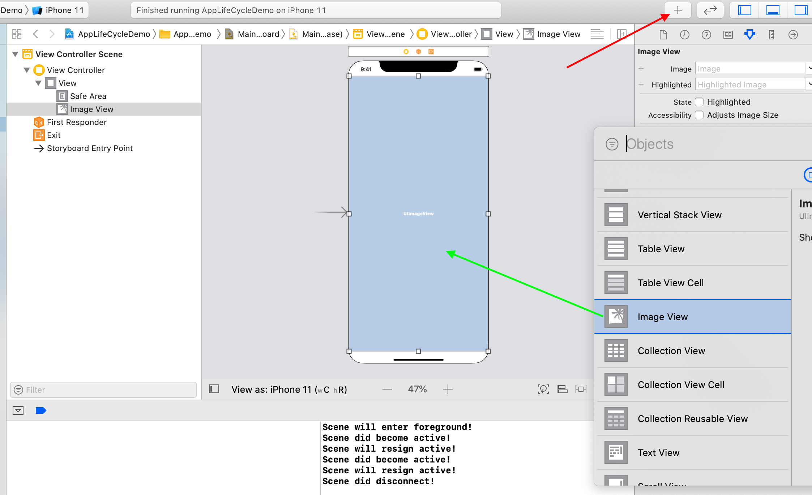
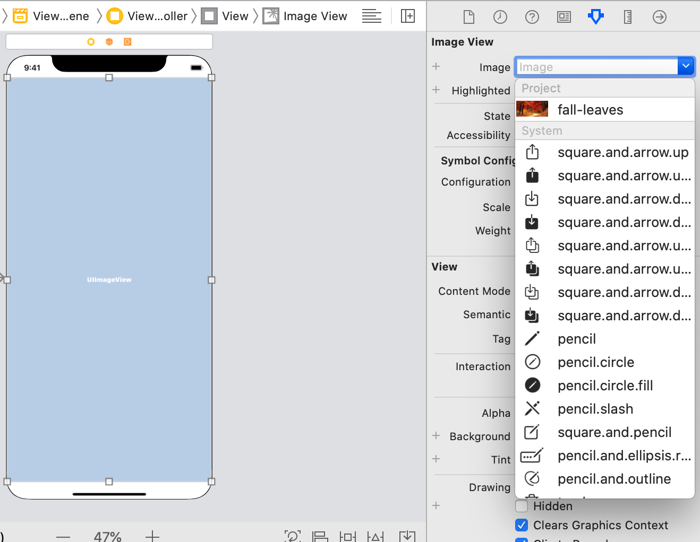
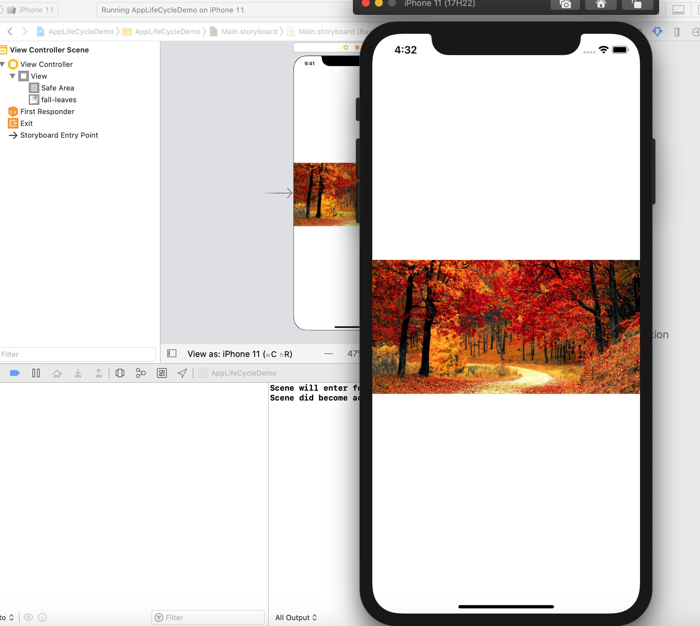
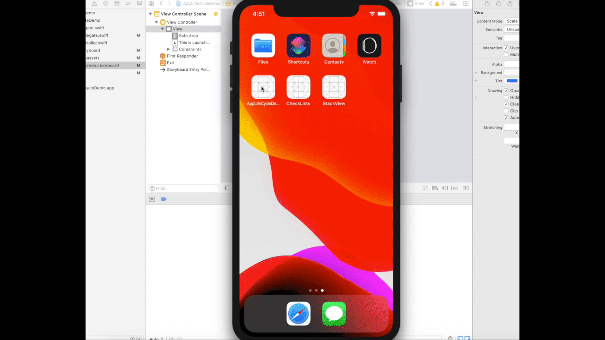
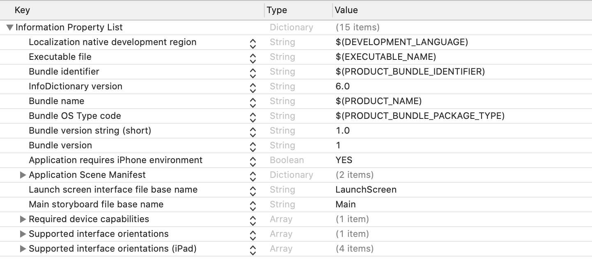

<style>
img {
  display: block;
  margin: 0 auto;
}
</style>

# 基于Swift语言的iOS应用开发


UIKit与MVC


---


# 正式介绍iOS应用开发


- 应用开发使用iOS开发工具包
- 开发工具包（SDK）包含开发、安装、运行和测试iOS操作系统之上的应用软件所需的工具和接口

  - 工具: Xcode集成开发环境、 模拟器和开发文档等
  - 接口:  供App调用的程序库和资源，称之为框架（Frameworks）

---


# 框架概览


---

# Frameworks


整个iOS系统的上百个Frameworks被划分为多层。

下层包含基本服务和技术。高层次的层建立在较低的层，并提供更复杂的服务和技术。

---


# 核心框架

初级阶段的开发所涉及iOS系统功能基本全部集中与**UIKit**和**Foundation**两个框架之上。

 

---

## UIKit 框架

- 其中UIKit 框架(UIKit.framework) 提供了开发图形化事件驱动iOS App的基础设施，包括

  - 基本应用管理/用户界面管理
  - 视图控制器和视图
  - 触摸和运动事件
  - 多任务、打印、通知等机制
  - 动画效果、内容分享等
  ……

---


## Foundation 框架

- Foundation framework (Foundation.framework) 提供了 Core Foundation框架中大部分功能特性的（Swift）封装
  - Collection data types (arrays, sets, and so on)
  - Bundles/String management
  - Date and time management
  - Preferences management
  - URL and stream manipulation
  - Threads and run loops
  - Regular expression matching
……

---


# UIKit App的MVC结构


<br><br><br><br><br><br><br>

> 注意：左边这张图跟当前Xcode最新版生产的模板工程不一样，现在有`SceneDelegate`

---

# 控制器与视图

- 两类关联
  - 把Button拖到changeLabel()函数上，让Button上发生的事件跟函数执行关联（一号关联）
  - 把Label拖动到代码中生成了一个变量myLabel，这个变量关联（二号关联）到这个Label


---

# 模型 (Model)

- 用于封装与应用程序的业务逻辑相关的数据以及对数据对处理方法。
  - 直接访问数据对权力：例如对数据库的访问。
  - 不依赖于View和Controller：不关心自己被如何展示和操作，只提供调用的接口(读写、功能方法)。


---

# 模型

``` swift
class ChecklistItem :NSObject, Codable{
    var title: String = ""                          // 应用数据
    var checked: Bool = false                       // 应用数据
    var dueDate = Date()                            // 应用数据
    var itemID = -1                                 // 应用数据
    init(_ title: String, _ checked: Bool) {
        self.title = title
        self.checked = checked
        self.itemID = Checklist.nextChecklistItemID()
    }
    func scheduleNotification() {                    // 功能方法
        if shouldRemind && dueDate > Date() {
            print("We should schedule a notification")
        }
    }
}
```


---

# UIKit App细节

- UIApplication
- AppDelegate
- UIWindow
- ...
   


---

# UIApplication

- 每一个iOS应用都拥有一个UIApplication类(或者其子类)的实例。当应用启动时，系统调用`UIApplicationMain(_:_:_:_:)`函数，这个函数创建应用对应的`UIApplication`的单例([Singleton](https://zh.wikipedia.org/wiki/%E5%8D%95%E4%BE%8B%E6%A8%A1%E5%BC%8F))对象。
- 作用
  - 处理用户事件：将到达的用户事件派发给合适的目标对象处理
  - 维护本应用的UIWindow对象列表：为了能够获取应用的所有UIView对象
  - 和`UIApplicationDelegate`对象一起处理程序的生命周期事件

https://developer.apple.com/documentation/uikit/uiapplication


---

# UIApplicationDelegate

在iOS12及之前的版本，我们使用UIApplicationDelegate的实例和UIApplication的实例一起完成一些工作，包括：
- 创建应用的rootViewController，初始化应用的场景
- 配置或者启动一些所需要的服务，例如Apple Push Notification service
- 响应应用的生命周期事件(主要)


<small>https://developer.apple.com/documentation/uikit/uiapplicationdelegate</small>

---

# App生命周期


https://developer.apple.com/documentation/uikit/app_and_environment/managing_your_app_s_life_cycle

---
# App生命周期


- Unattached: 应用尚未启动或者已经被系统终止。
- Foreground Inactive: 应用正在运行，但是没有接受到任何事件。(例如应用被电话打断)
- Foreground Active: 应用在正常运行。
- Background: 应用在后台运行，并且在执行代码。
- Suspended: 应用在后台挂起，但是没有执行代码。当系统缺少内存时，

---

# UIWindowSceneDelegate

在iOS13之后，`UIApplicationDelegate`的某些功能被`UIWindwoSceneDelegate`取代，其中最关键的部分是`UIWindwoSceneDelegate`将负责响应应用的生命周期变化的事件。
- `sceneDidDisconnect(_:)`: 场景与App断开连接
- `sceneDidBecomeActive(_:)`: 用户开始与场景交互
- `sceneWillResignActive(_:)`: 停止与场景交互(例如切换到另一个场景)
- `sceneWillEnterForeground(_:)`: 场景将进入前台
- `sceneDidEnterBackground(_:)`: 场景回到后台后调用


---

# Delegate(委托) 模式
注意到UIApplicationDelegate和UIWindowSceneDelegate都叫做Delegate。其实这是一种设计模式。

> 委托模式是软件设计模式中的基本技巧，在委托模式中，两个对象参与处理同一个请求，接受请求的对象委托另一个对象来处理。


UIApplicationDelegate实际上就是UIApplication委托开发者定制的行为，特别是`applicationDidFinishLoadingWithOptions`

**我们通过Swift语言的Protocol（协议）来定义委托对象的行为规约。**

---

# Swift Protocol

- 一个Protocol(协议)中描述了一些方法。类、结构体、枚举都可以接受(adopt)一个协议，一个实现了协议中所有方法的类型被称为确认(conform)了这个协议。
- 协议适用于想修改原有类型的方法或者扩展原有类型的方法，而通过继承开销太大，使用协议更加轻量级。


https://docs.swift.org/swift-book/LanguageGuide/Protocols.html

--- 


# Swift Protocol

- 为我们的控制器定制对文本输入的处理方法。
``` swift
extension AddListViewController: UITextFieldDelegate {
    func textField(_ textField: UITextField, shouldChangeCharactersIn range: NSRange, replacementString string: String) -> Bool {
        let oldText = textField.text!
        let stringRange = Range(range, in: oldText)!
        let newText = oldText.replacingCharacters(in: stringRange, with: string)
        
        if newText.isEmpty {
            doneButton.isEnabled = false
        } else {
            doneButton.isEnabled = true
        }
        return true
    }
    
    func textFieldShouldClear(_ textField: UITextField) -> Bool {
        doneButton.isEnabled = false
        return true
    }
}
```

--- 

# UIWindowSceneDelegate


---

# SwiftUI & MVVM

新一代架构


---

# 其他


- App icons (Assets.xcassets)
- Launch screen storyboard: 静态启动视图
- Main storyboard: 应用视图
- App Metadata (Info.plist)
- ViewController: 视图控制器


---

# Assets

Assets 提供了对不同种类的项目资源(图片、数据、颜色等)的管理和组织。



---


# Assets

在使用 Image Asset时，Xcode要求我们提供1x,2x,3x三种分辨率的图片，这是因为不同的iOS设备的屏幕尺寸和分辨率不同。



---


# 新建Asset

在Assets中新建Image Set




---

# Image Set

将准备好的不同分辨率的图片分别拖入到对应的框中，然后双击Image set重命名




---

# 添加ImageView

在Main.storyboard上添加ImageView



---

# 选择Image

选择image view的image为刚才添加的image assets



---

# ImageView

启动模拟器



---

# LaunchScreen Storyboard

Launch screen board是应用在启动期间展示的视图。




---

# Property list


In the macOS, iOS, NeXTSTEP, and GNUstep programming frameworks, property list files are files that store serialized objects. Property list files use the filename extension .plist, and thus are often referred to as p-list files.

Property list files are often used to store a user's settings. They are also used to store information about bundles and applications, a task served by the resource fork in the old Mac OS.

<div style="text-align: right;">- Wikipeida</div>

---

# Info.plist
Info.plist 是一个特殊的property list，其内部储存了应用运行所需要的配置信息。包括应用的元信息，以及对于用户隐私的使用声明。



其中涉及到[Bundle](https://developer.apple.com/documentation/foundation/bundle)这个概念


---


 
# Bundle

Bundle是Apple应用组织资源的一种方式，可以将Bundle想象成项目的目录(事实上就是一个目录)，它是一个将所有项目文件组织在一起的文件夹。当需要访问项目中的资源时，可以通过`Bundle`对象来访问

```swift
if let fileURL = Bundle.main.url(forResource: "some-file", withExtension: "txt") {
    // we found the file in our bundle!
}
```
https://developer.apple.com/documentation/foundation/bundle

---


# 作业