<style>
img {
  display: block;
  margin: 0 auto;
}
</style>

# 基于Swift语言的iOS应用开发


CoreML


---


# 机器学习与iOS的碰撞


- 以如何应用的好为切入点，将机器学习技术和产出融入iOS
  - iOS：计算能力有限，但应用需求广泛
  - 机器学习：从支撑开发需求的工具角度，了解机器学习技术，掌握机器学习产出的应用

- iOS针对机器学习技术的支撑
  - 内置模型
  - CoreML Framework
  - Create ML 和 Turi Create
  
---


# 什么是机器学习

- 1959年Arthur Samuel的定义: "Field of study that gives computers the ability to learn without being explicitly programmed."

- 传统软件: 基于逻辑的显式编程(explicit programming)
  - 程序员硬编码软件运行逻辑(if-then-else)
- 机器学习: 基于统计的隐式编程(implicit programming)
  - 程序员设计模型框架，优化器基于大量数据的观察“编写代码”
---

# 传统软件 v.s. 机器学习软件


传统软件特点
  - 逻辑演绎，数据规约强，程序员编程
  
机器学习软件特点
  - 统计归纳，数据开放，“优化”编程

---


# 深度学习

一句话解释：模型变深了！能力也更强了


---

# Core ML Framework

Core ML是Apple提供的用以集成机器学习模型到app的框架。Core ML对模型进行了统一的抽象，支撑模型的
  - 训练，迁移学习(fine-tune models)
  - 推理(inference)/预测(prediction)

一切都是在app所运行的设备上进行的


---
# 带Core ML的MVC结构理解 

iOS中的图像分类样例工程：健康食物分类


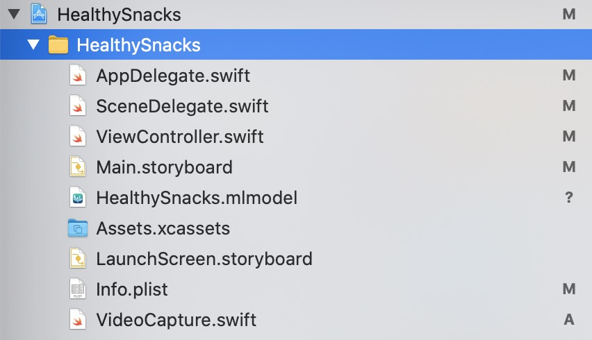
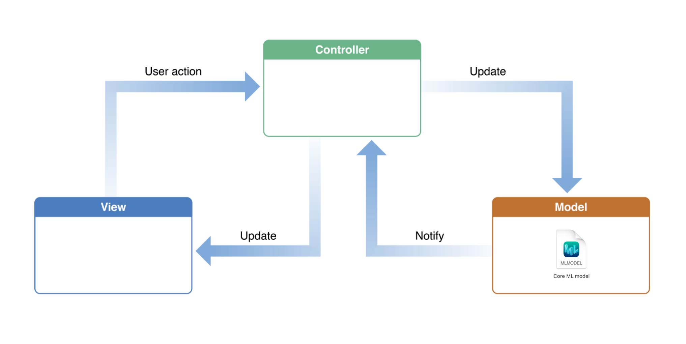


---

# Create ML Framework

Apple提供的可用以创建/生成Core ML模型的机器学习工具框架
- 图像
- 文本
- 音频，表格
- 通用分类/回归


---

# Create ML Framework

iOS开发过程中获取机器学习模型的途径：
 - 官网下载现成的Core ML模型 (10种图像任务，1文本任务)
 - 第三方机器学习框架训练模型，转换为Core ML模型
 - 利用Create ML训练模型

---

# 官网模型列举

景深预测、手写识别、动物识别、文本预测


---

# Create ML特性
- WWDC 2018
  - 支持Swift编程
  - 用 Playground训练和生成模型
  - 在Mac OS完成所有流程
- WWDC 2019
  - 无需编程
  - Create ML App on Mac
  
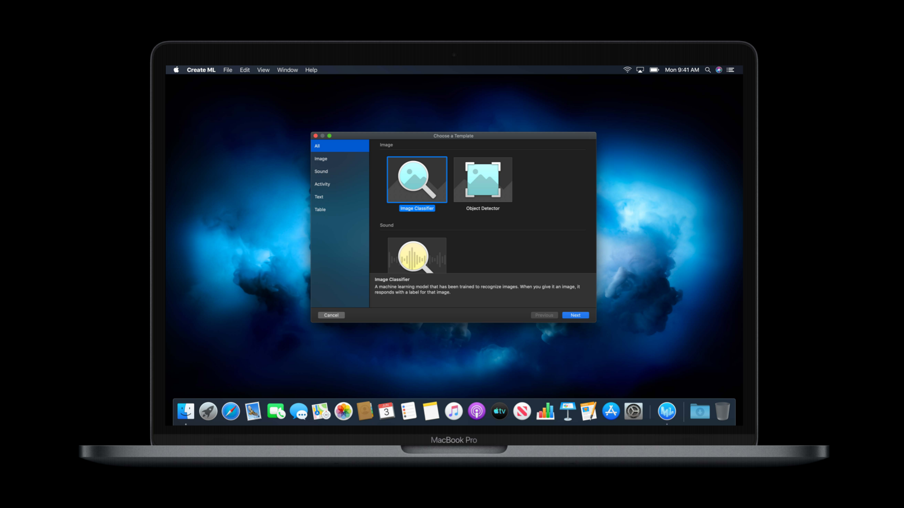

---

# Create ML App使用

- Create ML工作流程
  - 指定数据源(训练/验证/测试)
  - 训练并生成模型
  - 验证和测试
  - 保存模型
- WWDC 2018：在Playground中通过Swift编程
- WWDC 2019：通过Create ML App"点击就送"
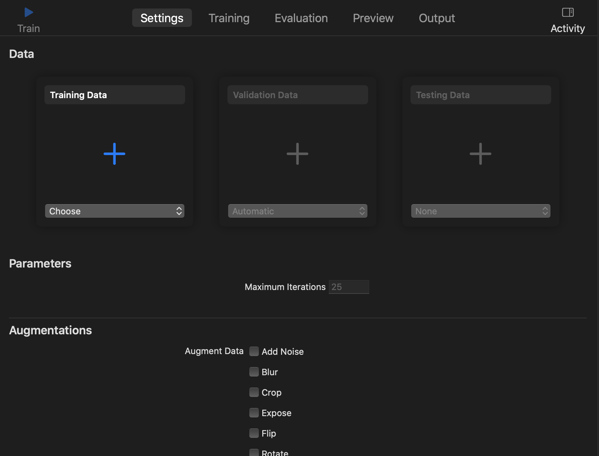


---

# Create ML应用场景
- 支持图像、语音、活动、文本、表格5种类型的任务
  - 图像：图像分类、目标识别。利用迁移学习和深度学习技术训练自定义任务、内部集成了数据增强功能
  - 文本：文本分类、单词标注。用于后去长句分析，情感分析等
  - 表格: 表格分类、回归、推荐
  - 活动：运动类型分类等。如Apple Watch中的应用


---

# iOS机器学习支撑架构


--- 

# 机器学习知识概览

相关要素
- 任务：监督学习(回归，分类)，无监督学习(聚类)
- 数据：训练数据，验证数据，测试数据
- 数据标签：针对每个数据特征/类别的标注(通常和任务挂钩)
- 模型：线性分类器，逻辑回归，神经网络，决策树...
- 评价指标：MAE, MSE, Precision, Recall, F1-score, AUC, ...

---

# 机器学习知识概览

机器学习workflow
- 特征工程
- 模型选择
  - 模型训练，模型验证
- 模型部署
- 运维监控


---

# 机器学习任务

- 监督学习：通过给定有标签的样本训练模型的过程，模型任务通常为预测标签
  - 回归：标签是连续值
  - 分类：标签是离散值

- 无监督学习
  - 聚类

- *迁移学习：利用已训练好的模型(预训练模型)当作数据的特征提取器，面对新数据进行快速的模型构建


---

# 迁移学习workflow


---


# 移动设备上的机器学习

移动设备算力有限，在移动设备上进行完整的机器学习流程是不可行的

为什么不行？训练时反向传播(backward)开销巨大，目前只支持推理(inference)


---

# 应用开发者关注的角度

以应用实践为中心
- 面向应用需求解决任务，借助Swift技术框架提供的API
- 使用预训练模型: 官方提供的Core ML模型，其他框架训练好的模型等
- 迁移学习: 通过Create ML在预训练模型的基础上针对指定数据进行模型训练

如果关注算法本身，请移步Pytorch/TensorFlow，这是传送门


---

# 在iOS中实现二分类图像识别

任务：给定图像数据(食物)，构建机器学习模型判定食物是否为健康食物
- 二分类任务：构建模型，输入一张食物图片，输出判定健康食物/非健康食物
- UI设计：VideoCapture
- Core ML &  Vision Framework
- 预训练模型：Core ML模型(https://github.com/threadLord/ML_CoreML/blob/master/02-image-classification/starter/HealthySnacks.mlmodel)

---

# 预训练模型
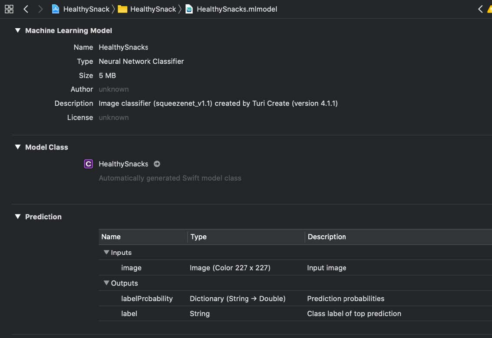

基于SqueezeNet的迁移学习模型
- 输入图像尺寸227*227 
- SqueezeNet作为特征提取器，针对输入图像提取模型理解的特征
- 迁移学习通过训练最后一层的参数完成健康食物判定
- 输出为每个类别的概率值

---

# 通过Create ML框架训练模型
训练方式
- Create ML: 在Playground中通过Swift编程
- Create ML App

---

# 准备数据集
数据集：20种不同的零食，每种零食有350张图片
- 训练集：250张
- 验证集：50张
- 测试集：50张

在Create ML中，数据集被组织成⽂件夹的形式，每个类别⽤⼀个⼦⽂件夹。
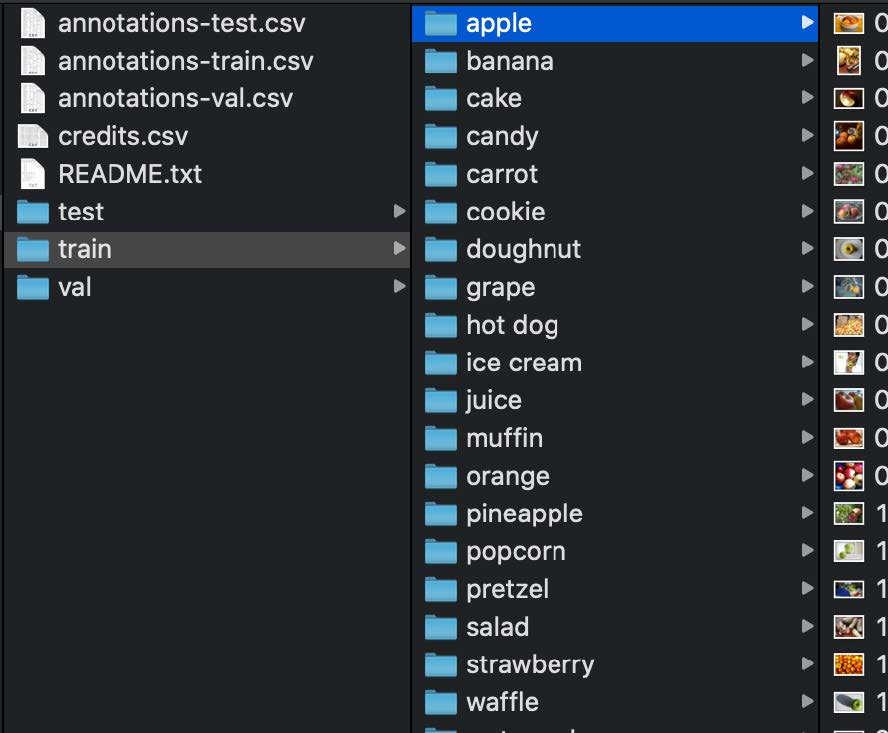


---
# 准备数据集
需将数据集从20类别的多分类数据集转化为二分类数据集(healthy/unhealthy)

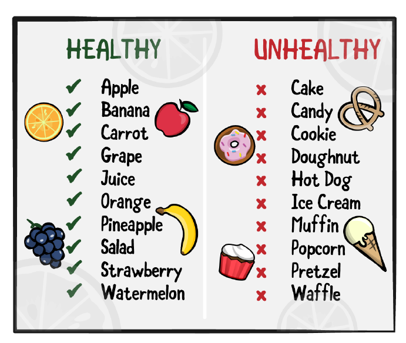


---

# Create ML

创建Playground，键入以下代码构建可视化机器学习图像分类器生成器

```swift
import CreateMLUI
let builder = MLImageClassifierBuilder()
builder.showInLiveView()
```
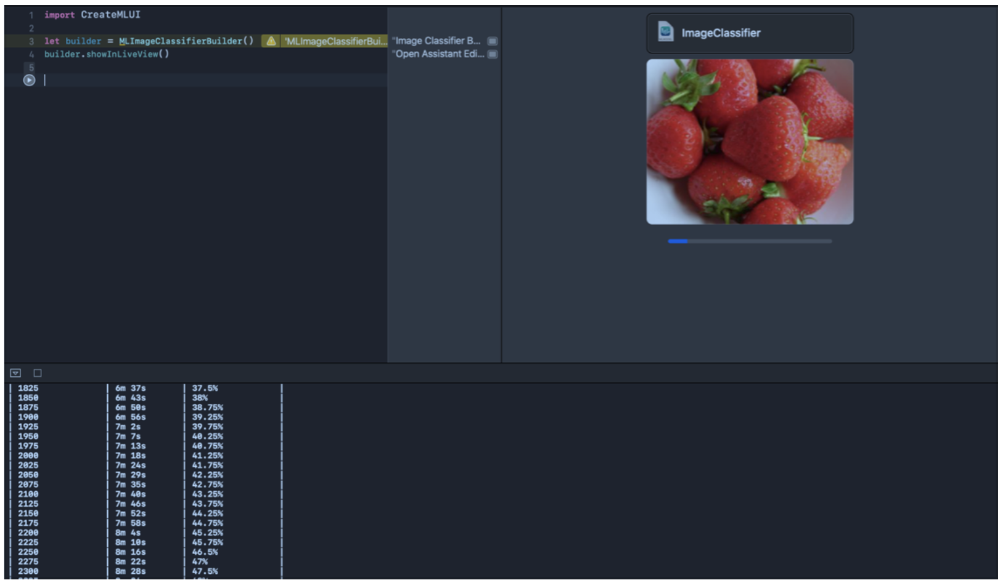

---

# 

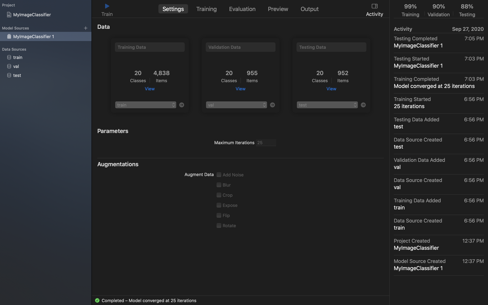

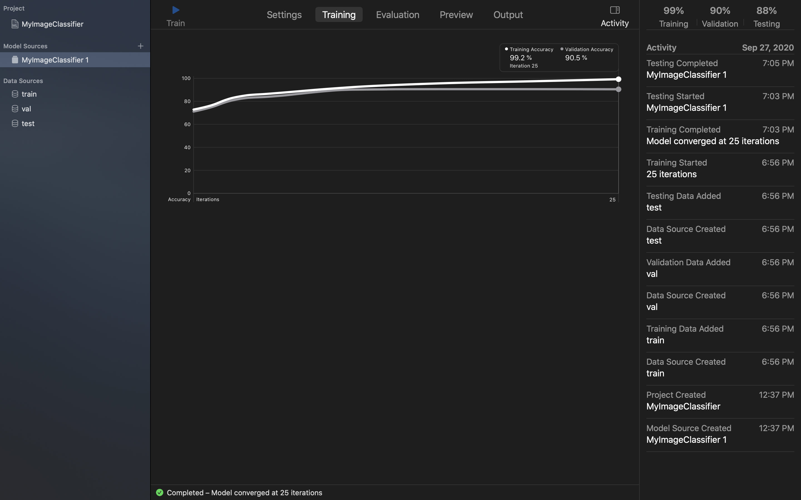

---

# 
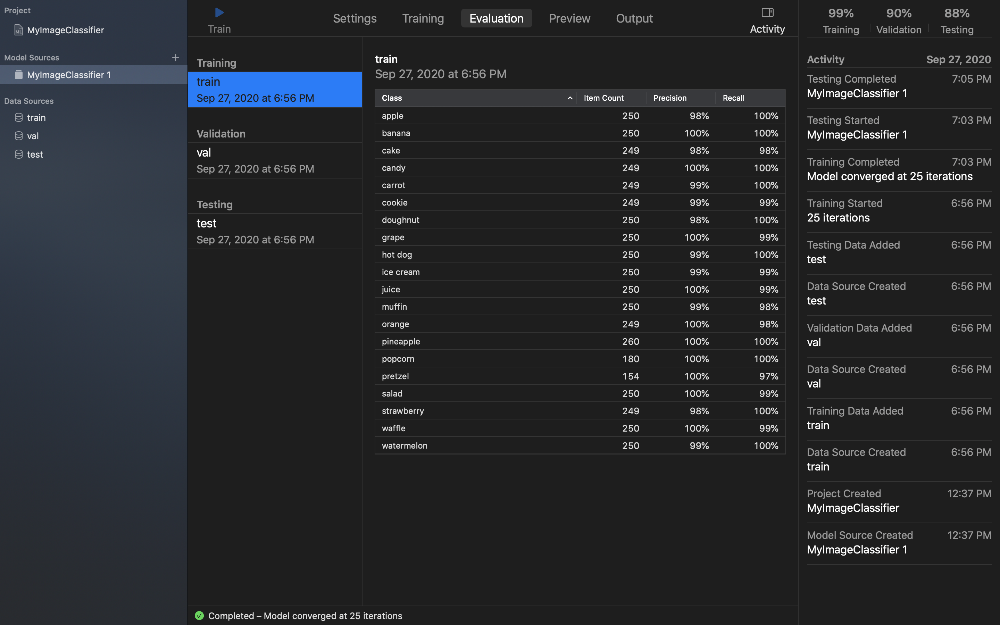
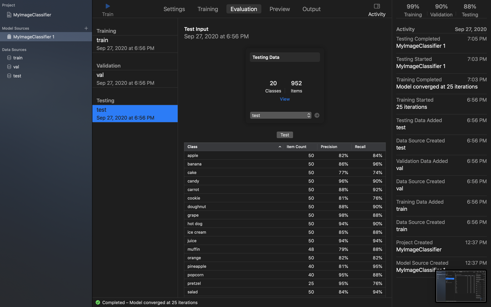

---

# 核心代码
将分类功能封装为一个分类器类，提供classify方法供ViewController用
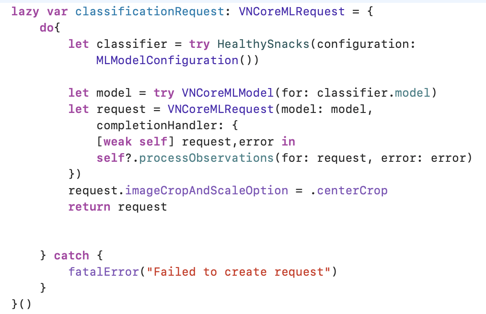

---
# classify方法
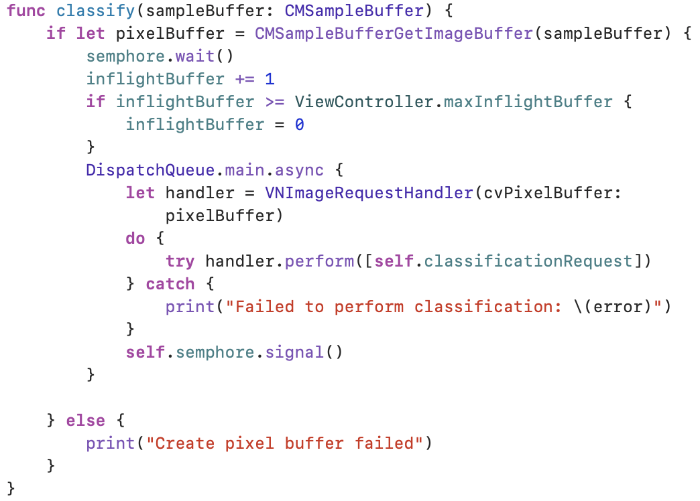


---

# 作业

利用多分类食物数据集完成健康食物识别的二分类任务App
- 请训练自己的模型
- 数据集和样例工程
https://1drv.ms/u/s!Anr26WqGCJOLyDhx9FYZypjBZgXk?e=yXMegg