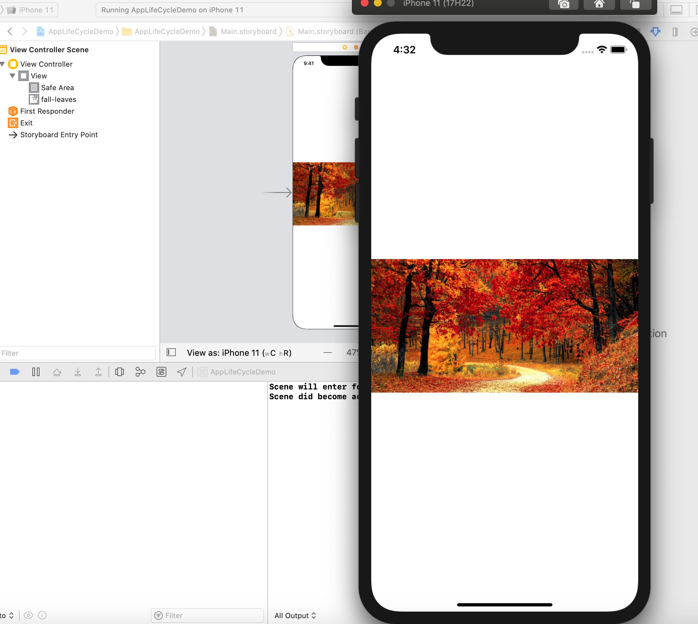

<style>
img {
  display: block;
  margin: 0 auto;
}
</style>

# iOS智能应用开发


视图

---


# 概念

- **窗口**和**视图**是在iOS设备**屏幕**上用以展示App内容的部件
  - 屏幕是iOS设备所具有的显示装置
  - 窗口提供了一个基本的视图的容器，窗口本身并不具有可视内容
  - 视图占据窗口的部分区域用以显示交互界面内容

---

# 窗口

- 每个iOS应用都需要至少一个窗口
- 窗口用以显示应用的可视界面内容
- 窗口对象是UIWindow类型的一个实例
- 窗口负责将系统中发生的touch事件传递到你的视图和其他应用对象以供处理
- 如果发生设备朝向（orientation）变化事件，窗口对象和应用的视图控制器对象对进行协作


---

# 创建窗口

使用StoryBoard则系统会自动创建和管理窗口对象，或者

可通过编程方式手工创建和管理窗口

```swift
class AppDelegate: UIResponder, UIApplicationDelegate {

    var window: UIWindow?

    func application(_ application: UIApplication, didFinishLaunchingWithOptions launchOptions: [UIApplicationLaunchOptionsKey: Any]?) -> Bool {
        // Override point for customization after application launch.
        self.window = UIWindow(frame: UIScreen.main.bounds)
        return true
    }
```

[Windows and Screens](https://developer.apple.com/documentation/uikit/windows_and_screens)


---


## 视图

- 应用中所需要显示的可视内容一般通过视图对象定义
- 每个视图对象都是 `UIView` 的子类
- 一个视图对象定义了在一个矩形区域范围内的可视内容和这些内容在屏幕上的绘制过程，并负责处理该矩形区域内发生的用户交互（触碰）事件


---

## UIKit

- 系统中UIKit和其他一些框架提供了预先定义好的视图和控件以供你的应用所使用
  + 预定义的视图和控件包括简单的按钮、文本标签和复杂的表格视图（Table View）、选取器（Picker View）、滚动视图（Scroll View）等
- 如果预定义的这些视图并不能满足你的要求，也可以自己定义个性化视图和控件，包括对视图绘制和事件处理的定制


---

# UIView
- 屏幕区域管理者
视图是构建应用程序用户界面的基础模块，`UIView`类定义了各类视图通用的行为，一个视图对象会渲染它拥有的矩形区域并处理在这个区域中产生的互动。

- 构建视图的基础类
通过实例化`UIView`类，可以将其控制的区域设置为固定的背景颜色。也可以通过他的子类来创建标签、图像、按钮等给类控件。

https://developer.apple.com/documentation/uikit/uiview


---
# Text Views
在UIView的子类中，有一类专门用来展示和编辑文本信息，称之为Text Views，包括
- UILabel
- UITextField
- UITextView
  
https://developer.apple.com/documentation/uikit/views_and_controls

---

# UILabel
`UILabel` 是用于展示一行或者多行文本信息的视图，`UILabel`既可以通过预设的文字属性展示普通的`String`，也可以展示拥有字体等信息的`NSAttributedString`对象。


---

# UITextField
`UITextField`是用于在界面上展示和编辑文本区域的视图。一般使用`UITextField`来收集用户的文本输入，可以将输入限定为指定的类型，例如普通文本，电子邮件和数字等。`UITextField`使用代理的方式来处理输入过程中的关键事件。我们可以指定`UITextField`对象所使用的代理类，从而自定义输入过程中关键事件的处理方法。


---

# UITextFieldDelegate


---

# UITextView

相比于`UITextField`， `UITextView`实现可滚动的多行文本区域，提供了滚动输入的功能，更适合于输入较长的文本。


---

# Content Views

用于展示文本之外的内容的视图，主要有：

- UIActivityIndicatorView
- UIImageView
- UIPickerView
- UIProgressView

https://developer.apple.com/documentation/uikit/views_and_controls

---

# UIActivityIndicatorView

`UIActivityIndicatorView`展示一个任务正在进行之中，在任务开始时使用`startAnimating`，任务结束后使用`stopAnimating`


---

# UIImageView
`UIImageView`用于展示单张图片或者一系列图片的视图。



---


# UIPickerView
`UIPickerView`用于让用户进行多个值的选择的视图。


---

# UIProgressView

`UIProgressView`用于展示任务运行进度的视图。


---


# Controls
Controls（控件）是收集用户的输入并且和用户进行互动的特殊视图。

- UIButton
- UIDatePicker
- UIPageControl
- UISegmentedControl
- UISlider
- UIStepper
- UISwitch
  
---

# UIButton
`UIButton`用于响应用户行为的控件。


---

# UIDatePicker

`UIDatePicker`用于选取日期的控件。


---


# UISlider
`UISlider`是在一个连续的范围内选取一个值的控件。


---


# Container Views

容器视图用来组织和展示大量的数据

- Collection Views
- Table Views
- UIStackView
- UIScrollView

https://developer.apple.com/documentation/uikit/views_and_controls

---

# Collection Views


https://developer.apple.com/documentation/uikit/views_and_controls

---

# Table Views


https://developer.apple.com/documentation/uikit/views_and_controls

---


# Stack Views


https://developer.apple.com/documentation/uikit/views_and_controls

---


## Human Interface Guidelines

 
https://developer.apple.com/design/human-interface-guidelines/ios


---

## 视图层次


---

# subView 和 superView

一个视图可以嵌套在另一个视图中，提供了一种方便的组织内容的方式。通过嵌入视图产生了父-子视图的关系。被嵌入的视图称为superview，而嵌入在superview内部的视图称为subview。

superview可以有任意数量的subview，而一个subview只对应一个superview。


---

# `frame` and `bounds` and `center`


每个视图的几何信息由`frame`和`bounds`两个属性定义。`frame`定义了view在它的superview所确定的坐标系中的位置和大小。而`bounds`定义了在view自身的坐标系中，它的位置和大小。`center`是superview中的一个点，确定了view的中心。


---

# `frame`/`bounds`/`center`

```
 Frame
     origin = (40, 60) // That is, x=40 and y=60
     width = 80
     height = 130
 
 Bounds 
     origin = (0, 0)
     width = 80
     height = 130
```

---

# `CGRect`

`CGRect`是一个确定了位置和大小的矩形范围。在默认坐标系中，`CGRect`的`origin`是它的左下角的坐标，确定了`origin`和`size`，就可以确定一个`CGRect`。但是在iOS中，坐标系通常是反转的，因此`origin`是左上角的坐标。

``` swift
init(origin: CGPoint, size: CGSize)
//Creates a rectangle with the specified origin and size.
```


https://developer.apple.com/documentation/coregraphics/cgrect

---


## 使用Interface Builder构造复杂视图

 

&nbsp;&nbsp;&nbsp;&nbsp;&nbsp;&nbsp;&nbsp;&nbsp;&nbsp;&nbsp;&nbsp;&nbsp;&nbsp;&nbsp;&nbsp;&nbsp;&nbsp;&nbsp;&nbsp;&nbsp;&nbsp;&nbsp;&nbsp;&nbsp;&nbsp;&nbsp;&nbsp;&nbsp;&nbsp;[Create an interface using Interface Builder](https://help.apple.com/xcode/mac/11.4/#/dev31645f17f)


---

## 编程管理视图

``` swift
class ViewController: UIViewController {
    override func loadView() {
        super.loadView()
        let myView = UIView(frame: CGRect(x: 100, y: 100, width: 100, height: 100))
        myView.backgroundColor = UIColor.green
        self.view.addSubview(myView)
    }
}
```

``` swift
    override func loadView() {
        super.loadView()
        let myView = UIView(frame: CGRect(x: 100, y: 100, width: 100, height: 100))
        myView.backgroundColor = UIColor.green
        self.view = myView
    }
```
---

# 编写代码管理视图层次

``` swift
    override func loadView() {
        super.loadView()
        let myView = UIView(frame: CGRect(x: 100, y: 100, width: 100, height: 100))
        myView.backgroundColor = UIColor.green
        let myLabel = UILabel(frame: CGRect(x: 50, y: 50, width: 50, height: 50))
        myLabel.backgroundColor = UIColor.red
        myView.addSubview(myLabel)
        let myButton = UIButton(frame: CGRect(x: 10, y: 10, width: 30, height: 30))
        myButton.backgroundColor = UIColor.white
        myLabel.addSubview(myButton)
        self.view = myView
    }
```

---

# 编程实现自定义视图

``` swift
import UIKit

class MyView: UIView {
    override func draw(_ rect: CGRect) {
        if let context = UIGraphicsGetCurrentContext() {
            let myFrame = self.bounds
            context.setLineWidth(10.0)
            myFrame.insetBy(dx: 15, dy: 15)
            UIColor.blue.set()
            UIRectFrame(myFrame)
        }
    }
}
```

---

# 例子:自定义带标题的ImageView

``` swift
import Foundation
import UIKit

class CaptionableImageView: UIView {
    var label: UILabel!
    var imageView: UIImageView!

    var caption: String? {
        get { return label?.text }
        set { label.text = newValue }
    }

    var image: UIImage? {
        get { return imageView.image }
        set { imageView.image = newValue }
    }

    required init(coder aDecoder: NSCoder) {
        super.init(coder: aDecoder)!
        initSubviews()
    }

```

---

``` swift

    override init(frame: CGRect) {
        super.init(frame: frame)
        initSubviews()
    }

    func initSubviews() {
        // sets the image's frame to fill our view
        imageView = UIImageView(frame: bounds)
        imageView.contentMode = UIView.ContentMode.scaleAspectFill
        imageView.clipsToBounds = true
        addSubview(imageView)

        // caption has translucent grey background 30 points high and span across bottom of view
        let captionBackgroundView = UIView(frame: CGRect(x: 0, y: bounds.height - 30, width: bounds.width, height: 30))
        captionBackgroundView.backgroundColor = UIColor(white: 0.1, alpha: 0.8)
        addSubview(captionBackgroundView)

        label = UILabel(frame: captionBackgroundView.bounds.insetBy(dx: 10, dy: 5))
        label.textColor = UIColor(white: 0.9, alpha: 1.0)
        captionBackgroundView.addSubview(label)
    }
}
```

--- 
# 使用这个`CaptionableImageView`
``` swift
import UIKit

class ViewController: UIViewController {
    
    
    override func viewDidLoad() {
        super.viewDidLoad()
        // Do any additional setup after loading the view.
        let imageView = CaptionableImageView(frame: CGRect(x: 0, y: 40, width: view.bounds.width, height: 400))
        imageView.image = UIImage(named: "fall-leaves")
        imageView.caption = "fall leaves"
        view.addSubview(imageView)
        
    }

}
```


---


## 自动布局


&nbsp;&nbsp;&nbsp;&nbsp;&nbsp;&nbsp;&nbsp;&nbsp;&nbsp;&nbsp;&nbsp;&nbsp;&nbsp;&nbsp;&nbsp;&nbsp;&nbsp;&nbsp;&nbsp;[Auto Layout and Layout Constraints](https://help.apple.com/xcode/mac/11.4/#/dev1f19e69d2) &nbsp;&nbsp;[Auto Layout Guide](https://developer.apple.com/library/archive/documentation/UserExperience/Conceptual/AutolayoutPG/index.html)

---
## 自动布局
在应用开发过程中，一个如何让应用在不同的设备、不同尺寸的屏幕上上都具有很好的显示效果是一个挑战。一种有效的解决方案是使用自动布局(Auto Layout)，我们将会介绍什么是约束，以及如何应用约束。


---

## 举个例子

我们首先在View Controller中添加一个按钮，并将其放置在视图的中心，但是不为该按钮添加任何约束。


---

## 问题

我们运行模拟器，在纵向视图中，按钮确实处于屏幕中心，但是在横向视图中，按钮不见了。


---

## 约束

在不添加任何约束时，按钮仍然位于其被创建时根据竖排方向的同一个X/Y位置。如果希望按钮始终处于屏幕中间，需要进行Align约束。在Align菜单中添加约束，让Button处于水平中心和垂直中心。


---

## 效果
现在在任何方向和不同尺寸的屏幕上，按钮都处于屏幕的中心。


---

## Stack View
管理多个对象的约束可能有些枯燥，尤其是这些对象的大小和内容类似时，Interface Builder 提供了一种更加智能的办法，此时无需大量创建单个约束，你可以通过堆栈视图来自动管理其子视图的约束。在视图层级中添加三个Stack View，分别为一个垂直的Stack View和两个水平的Stack View。并按照图中的方式来组织视图层级。


---


## 自适应布局：更加智能的视图布局管理
- 自适应布局
iOS设备拥有非常多的屏幕大小种类，而且具有不同的特性(圆角、刘海、直角)。在一个iOS应用中，你可以让界面元素根据不同的设备和旋转方向自动的排布，设置自适应布局是十分必要的。


---
## Size Class
Size Class是根据内容区域大小而划分出的特点。系统定义了两种Size Class，包括regular(代表较为宽阔的空间）和 compact(代表较为紧凑的空间)，分别用来描述一个视图的高和宽。


---
## 自适应布局: 举个例子
首先我们设计一个适用于竖屏状态下的天气展示视图，应用在竖屏状态下是正常的：


---
## 自适应布局: 举个例子
但是将其切换为横屏，可以发现布局乱了:


---
## 自适应布局：举个例子
我们选择Interface Builder菜单下方的Vary for traits，表示根据不同的屏幕尺寸种类进行分别的设计，例如这里根据竖屏和横屏时宽度分别是Compact Width和Regular Width进行设计


---
## 自适应布局：举个例子
设计完成后，点击菜单中的Done for Traits，表明完成了这种屏幕类型下的设计


---
## 运行测试
在模拟器中运行测试可以看到预期的效果
