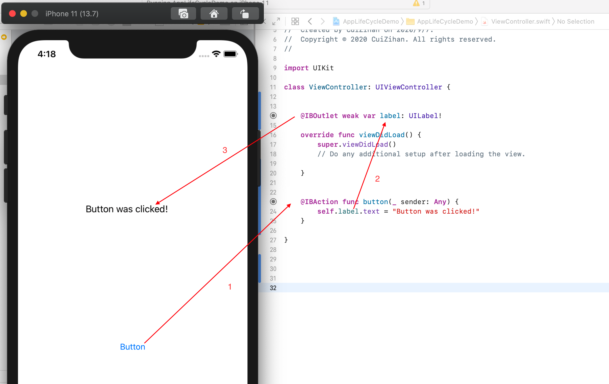
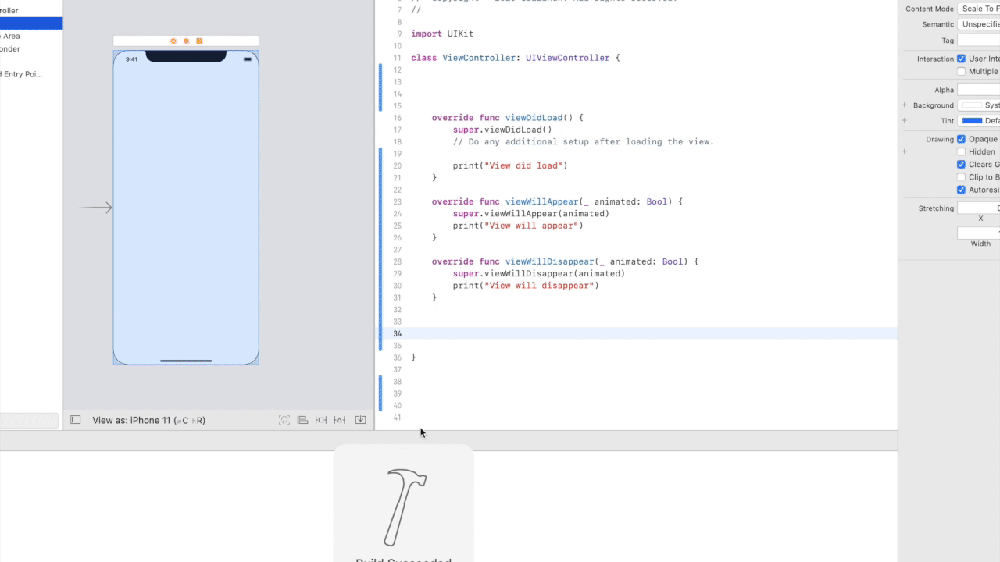

<style>
img {
  display: block;
  margin: 0 auto;
}
</style>

# iOS智能应用开发


视图控制器


---

# 视图控制器
- 视图控制器被用来管理UIKit应用的界面。一个视图控制器只管理一个根视图(root view)，根视图可以包含任意数目的子视图。
- 用户和应用的互动事件会被视图控制器处理，视图控制器将会把这些事件根据需要交给特定的对象处理。
- 每个应用至少有一个充满主窗口的视图控制器，如果应用有大量需要展示的内容，可以考虑使用多控制器的设计来管理不同部分的内容。


---

# 视图管理

回想一下讲视图的概念时，我们说到视图是显示在Window (`UIWindow`)中的，而这个显示视图内容到Window的过程就是视图控制器完成的。

每个Window有一个根视图控制器来管理内容的绘制过程。

https://developer.apple.com/documentation/uikit/view_controllers/managing_content_in_your_app_s_windows


---

# Window-Sence-ViewController


---

# Assign a Root View Controller to Each Window

如果不使用storyboard，而采用更底层的方式，手动设置应用window的rootViewController

```swift
func application(_ application: UIApplication, didFinishLaunchingWithOptions launchOptions: [UIApplicationLaunchOptionsKey: Any]?) -> Bool {
   window = UIWindow(frame: UIScreen.main.bounds)
   window?.rootViewController = RootViewController()
   window?.makeKeyAndVisible()
   return true
}
```


---

# 控制器职责

在MVC(model-view-controller)设计模式中，控制器将负责展示信息的视图对象和负责进行数据存储的模型对象连结起来。注意，一个ViewController管理一个视图层级，并保持这个视图层级的信息实时被更新。每一个UIKit的应用都十分依赖视图控制器，如果有需要，开发者应该经常定义自己的视图控制器，以定制控制器的行为，扩展控制器的能力。

---

# 内容管理(内容控制器)
大部分由开发者自己定义的控制器属于内容控制器，这类控制器拥有被管理的所有视图对象，并且需要处理用户和这些对象的交互。使用内容控制器来展示应用的内容，并且管理数据的流通(将数据展示在视图上 / 从视图获得输入的数据)。


---

# 内容管理(内容控制器)

- 一般过程：交互事件触发控制器方法调用；方法执行过程中从数据对象获得数据；再通过视图对象引用（Outlet）操纵视图内容。



---

# 容器控制器

和内容控制器不同，容器控制器负责将来自其他视图控制器的内容并入到自己的视图层级中。一个典型的例子是导航栏控制器。此类控制器将会在以后详细介绍


---

# 在视图控制器中添加视图

视图控制器包含了可以从视图属性(.view)访问的内容视图，这个特殊的属性作为它的视图层级中的根视图(rootView)。可以通过代码的方式将自定义的视图添加到根视图中，当然更简单的方式是在stroyboard中进行拖拽添加。


---

# 处理视图相关的通知

当视图的可见性发生变化时(例如打开应用到视图加载完毕展示在屏幕上)，视图控制器将会调用特定的事件处理函数，从而可以对这些变化作出回应。例如在视图即将出现在屏幕上时，调用`viewWillAppear`来准备视图内容，在视图从屏幕上要是时，调用`viewWillDisappear`来保存相关数据。


https://developer.apple.com/documentation/uikit/uiviewcontroller


---

# 视图控制器的生命周期


---

# 处理视图相关的通知


---

# Handling View Rotations


https://developer.apple.com/documentation/uikit/uiviewcontroller


---

# 储存重要视图对象的引用

在运行时，应用有时需要在代码中访问一些重要的视图对象以读写数据，例如有时需要获取一个文本输入框内的文字内容，又或者需要修改一个图片视图所展示的图片。这种情况，需要在视图控制器中存储这些视图对象的引用。我们使用outlets来创建这些引用。


---

# Outlet


Outlet(直译为出口)，是视图控制器中由IBOutlet关键字标记的特殊属性。这个关键字告诉Xcode，这个属性和storyboard中的某个view是相关的。下面的代码展示了两个Outlet的例子，添加weak关键字可以防止视图控制器获取该视图的另一个强引用。

```swift 
@IBOutlet weak var imageView : UIImageView?
@IBOutlet weak var button : UIButton?
```

---

# `@IBOutlet`

- Swift Attribute：Swift语言提供了两种属性： 
  - 作用在声明上的
  - 作用在类型上的

通过`@`加属性名的方式可以指定属性。有些属性需要提供参数。


https://docs.swift.org/swift-book/ReferenceManual/Attributes.html


---

# Swift常用属性
- available: 用于检查运行的平台是否满足程序所需


<!-- ---

# Swift常用属性
- dynamicCallable: 将这个属性作用在类、结构、枚举或者协议，代表这个类型的实例可以被调用，加了该属性的类型必须实现`dynamicallyCall(withArguments:)` 或者 `dynamicallyCall(withKeywordArguments:)`方法

 -->

---

# Swift常用属性
- main: 该属性作用在结构、类、枚举类型的声明中，用来指明程序的入口。该类型必须实现`main()`方法


---

# 处理视图和控件事件
控件使用target-action的设计模式来报告用户的操作。有一些视图也会报告用户的操作或者调用委托的方法。

- 当视图中某个按钮被按动，视图对象会获取该事件并报送给某个相关联的委托对象（delegate）或目标对象（target），一般而言，这个对象就是某个视图控制器对象
- 视图本身并不知晓这个事件将会引发的结果，按钮按动的含义和相应的反应是调用该视图控制器的某个方法（`IBAction`）
- 在获得这个事件发生的通知后，控制器可以执行更新数据或改变视图属性等操作，甚至将另一个视图控制器对应的视图内容展示在屏幕上

---

# Action
为了响应用户和控件的互动，需要定义一个具有以下特征的action方法。在你的方法定义中，你可以将UIControl替换为更加具体的子类。

```swift
@IBAction func doSomething()
@IBAction func doSomething(sender: UIControl)
@IBAction func doSomething(sender: UIControl, forEvent event: UIEvent)
```

---


## Target-Action


https://developer.apple.com/library/content/documentation/General/Conceptual/Devpedia-CocoaApp/TargetAction.html

---

## IBOutlet和IBAction

 
- 打开storyboard，并在辅助编辑器中打开controller文件
- 将storyboard中的view control-drag到controller类中
- 选择添加Outlet/Action，以及名称。

[Connect objects to code](http://help.apple.com/xcode/mac/11.4/#/devc06f7ee11)


---

# 每个场景由独立的控制器管理

对于每一个独立的页面，都需要定义一个视图控制器来表达这个页面的内容，并且管理和这个页面相关的视图。

https://developer.apple.com/documentation/uikit/view_controllers/managing_content_in_your_app_s_windows


---

# 场景切换

```swift
 @IBAction func showSecondViewController() {
        let storyboard = UIStoryboard(name: "Main", bundle: nil)
        let secondVC = storyboard.instantiateViewController(identifier: "SecondViewController")

        show(secondVC, sender: self)
    }
```

---

# 场景切换

```swift
@IBAction func presentSecondViewController() {
        let storyboard = UIStoryboard(name: "Main", bundle: nil)
        let secondVC = storyboard.instantiateViewController(identifier: "SecondViewController")
        
        secondVC.modalPresentationStyle = .fullScreen
        secondVC.modalTransitionStyle = .crossDissolve
        
        present(secondVC, animated: true, completion: nil)
    }
```


---
# 或者用Segue（过渡）
在多个视图进行切换时，iOS提出了Segue的概念。Segue的直译是从一个状态进行移动。在这里，我们将从一个ViewController切换到另一个ViewController的过程称为Segue。苹果的官方将其称之为过渡。


---
# 何时使用
过渡通常在用户轻点某个按钮或者表格单元时开始，在加载新视图的控制器时结束。在Interface Builder中定义过渡的方法和创建控件和Action的连结类似。方法都是在起始点和结束点，点按并从一个场景拖移到另一个场景，此外还可以通过编程的方式来触发过渡。

---
# 举个例子
我们将通过一个来自苹果官方的信号灯的例子，展示如何使用Segue在不同的View Controller之间切换。首先我们创建一个项目。
环境：
- Xcode 12
- iOS 13.6
  
---

# 添加新的Controller


---
# 创建Segue
我们首先在第一个View Controller中添加一个按钮，然后创建由这个按钮触发的Segue。可以看出添加一个Segue很简单，只要从button开始，Ctrl+Drag到新的View Controller就可以。


---
# Segue的种类
我们发现在创建Segue时，出现了一些选项让我们选择，包括：
- Show
- Show Detail
- Present Modally
- Present as Popover
如果不添加Navigation Controller，那么它们的效果没有区别。

---
# 测试
我们分别为两个View Controller设置不同的背景颜色，然后运行测试。

在iOS13及以上的版本中，如果没有用Navigation Controller，那么无论选择哪种Segue，新的场景都会以一种卡片的方式，从下而上，堆叠到原有的场景中。

---

# 添加新场景
和之前一样，我们添加更多的场景


---

# 测试：


我们创建了一个简短的过渡序列。但是此时还无法在黄色视图直接回到红色视图。而必须先关闭黄色视图来到绿色视图，然后再关闭绿色视图，才能回到红色视图。


---
# 回退Segue
为了让用户可以返回之前的视图控制器，需要创建称为“unwind segue”的对象。过渡是转换到另一个场景，而回退是顺从当前场景转换，以返回前一个显示的场景。

---
# 添加Unwind Segue的方法
在ViewController.swift中，将下面的方法添加到ViewController的类方法中：
``` swift
@IBAction func unwindToRed(unwindSegue: UIStoryboardSegue) {
     
}
```

---
# 解释
你可以随意命名该方法，但是方法的签名是固定的。它必须接受UIStoryboardSegue作为唯一参数。
回退过渡通过将UIStoryboardSegue作为参数，告知Interface Builder回退过渡的有效目标。我们的方法目前不包含任何代码，但是可以用于信息的传递，我们将在之后讲解如何用segue进行controller之间的信息传递。

---

# 添加Uniwind Segue


我们在黄色视图上添加一个按钮并命名为Dismiss。Ctrl+Drag它至上方的Exit选项。然后选择目标，在例子中，只有一个选项：unwindToRedWithUnwindSegue，它匹配的是你放置在 ViewController 定义中的方法签名。继续，将其选中。

---

# 测试

现在，通过Dismiss，我们可以直接回到红色视图了。

---
# 使用Segue传递信息
在App使用多MVC的App中我们经常遇到这种场景，当我们从一个View Controller过渡到另一个View Controller时，需要将信息传递到新的视图控制器。例如在“通讯录”中轻点姓名时，需要将关于该联系人的详细信息先传递到“信息”的View Controller，然后才能显示。


---
# 举个例子
- 为绿色视图定制控制器类
选择File-New-File，新建Cocoa Touch Class，选择以UIViewController为基类。


---
# VC类型
将绿色视图的控制器类设置为我们新建的GreenViewController


---

# 视图设置

为红色视图添加textField，为绿色视图添加label。


---

# Segue Identifier

因为一个ViewControlller可能有不止一个segue，我们需要用identifier区分不同的segue。为红色到绿色的segue添加identifier。


---
#  prepare segue

修改红色视图控制器类的prepare方法
``` swift
override func prepare(for segue: UIStoryboardSegue, sender: Any?) {
        if segue.identifier == "redToGreen" {
            let greenViewController = segue.destination as! GreenViewController
            greenViewController.info = "Information from red:(\(textField.text!))"
        }
    }
```
``` swift
class GreenViewController: UIViewController {
    @IBOutlet weak var label: UILabel!
    var info:String = ""
    override func viewDidLoad() {
        super.viewDidLoad()
        label.text = info
    }
}
```

---

# 测试
我们发现，在红色视图textField中填入的信息被转移到了绿色视图中。


---

# 在程序中使用Segue
有时我们希望可以自动的从一个ViewController过渡到另一个ViewController，这时可以使用performSegue函数，来自动的进行过渡。

---
# 在程序中使用Segue
为红色视图的控制器添加以下方法，并在viewDidLoad中调用
``` swift
func automaticSegue() {
        let queue = DispatchQueue.init(label: "my-queue")
        queue.async {
            for i in 1...3 {
                DispatchQueue.main.async {
                    self.label.text = "\(4-i)"
                }
                sleep(1)
            }
            DispatchQueue.main.async {
                self.performSegue(withIdentifier: "redToGreen", sender: self)
            }
        }   
    }
```

---
# 在程序中使用Segue
automaticSegue中使用了一些并发的知识，我们会在之后讲到。可以看到，在经过倒计时之后，实现了自动的Segue
