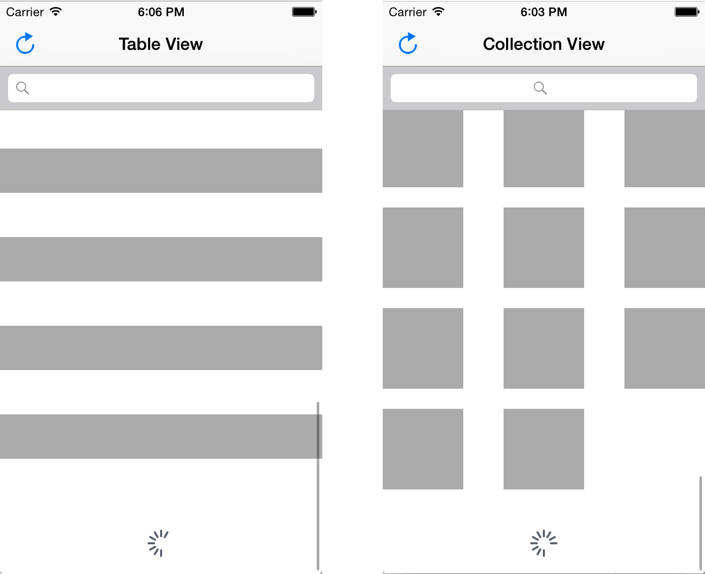
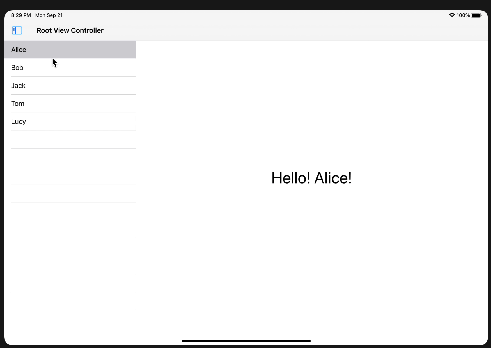
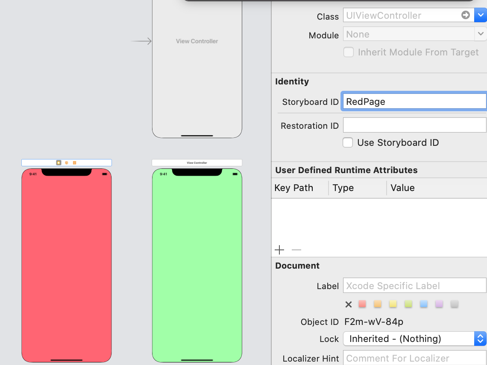

<style>
img {
  display: block;
  margin: 0 auto;
}
</style>

# 基于Swift语言的iOS应用开发


高级视图与控制器

---

# Table View
表格视图(Table View)展现了可以被分成节(section)和组(group）的单列可滚动多行视图。表格视图的每一行都展示了一个应用信息单元。而分节的机制可以让你将相关的几行信息组合在一起。例如在通讯录应用中，按照联系人姓名的首字母将联系人划分为不同的节。
iOS提供了三种风格的表格视图: 普通表格(Plain)，分组表格(Grouped)，内嵌分组表格(Inset groupded)


---

# Table View
直觉上来说表格是多行多列的结构，但是在iOS中，表格被限定为是单列的。iOS使用Collection视图来表示多行多列的结构。



---

# Plain风格
在普通表格中，表格的一行可以被分为标签区域(labeled section)和可选的索引区域(index section)。表格的标题可以出现在表格的第一行之前，表格的脚注可以出现在表格最后一行之后。


---


# Grouped风格
在分组风格的表格中，表格的行被分成若干组，每一组都有一个标题和脚注，这种风格的表格总是包含至少一个组，并且每一组至少有一行，一个分组风格的表格不包括索引。


---

# Inset grouped风格


在内嵌分组表格中，行被分组展示，并且每一组由一个圆角矩形的区域包裹(如图例的右半部分所示)。内嵌分组表格要求表格至少有一组，每组至少有一行。内嵌分组表格适用于具有较大宽度的设备。


--- 

# Table View的组成
Table View正常工作需要以下组件协同
- 表格单元(Cells): 一个单元可以提供一行数据的展示，你可以使用UIKit提供的默认表格单元类型`UITabelViewCell`，也可以根据需求定制自己的表格单元类型。 
- 表格视图控制器(Table view controller):我们通常使用一个`UITabelViewController`对象来对表格视图进行管理，你可以根据需求定制自己的表格视图控制器。 

- 表格数据源(Table data source object): 我们必须有实现了`UITabelViewDataSource`协议的对象为表格提供数据。


---
# Table View的组成

- 代理对象： 需要有实现了`UITabelViewDelegate`协议的对象来管理表格以及处理和用户的交互，包括在表格中增删行等操作。

---

# 在Storyboard中创建

因为表格视图通常是需要占据整个屏幕，所以我们很少将一个TabelView加入到一个已有的视图上，而是直接在storyboard中新建一个TabelViewController

---


---

# 表格单元的风格
之前介绍过，一个表格单元(Table Cell)会展示表格中一行的内容，不同的种类的内容需要不同的展示方式。iOS提供了四种种不同的表格单元风格，分别是Basic(基础风格), Subtitle(子标题风格), Right Detail(右侧详细), Left Detail(左侧详细),用于帮助我们展示不同的数据。

---

# Basic (Default). 

基础风格也是默认的表格单元风格。基础风格中，一行从左向右分别是可选的图片、左对齐的标题。适用于显示不需要补充内容的信息。更多相关信息，可以参考`UITabelViewCell`中的常量`UITabelViewCellStyleDefault`。


---

# Subtitle. 

相比于基础风格，子标题风格在主标题的下方多了一行子标题，这个风格适用于表格每一行看起来很相近的情况，因为子标题可以帮助使用者很好的区分不同的行。 更多相关信息，可以参考`UITabelViewCell`中的常量`UITabelViewCellStyleSubtitle`。


---

# Right Detail (Value 1). 
右侧详细风格由一个左对齐的标题和一个处于同一行右对齐的子标题构成。更多相关信息，可以参考`UITabelViewCell`中的常量`UITableViewCellStyleValue1`


---

# Left Detail (Value 2). 

左侧详细风格由一个右对齐的标题和一个处于同一行的左对齐子标题构成，更多相关信息，可以参考`UITabelViewCell`中的常量`UITableViewCellStyleValue2`。


---
# 静态的TabelView Cell
如果我们事先确定表格中有多少单元，并且表格中的单元数目不随着应用的运行而变化，那么可以使用静态的表格单元。


---
# 静态TableView的Cell设计
- 创建Tabel View Controller Scene
删除storyboard中原有的ViewControllerScene，添加TabelViewControllerScene，并将其设置为initial view controller

https://developer.apple.com/documentation/uikit/views_and_controls/table_views/configuring_the_cells_for_your_table

---

# 静态TableView的Cell设计
- 创建Tabel View Controller类
File->New->File，然后选择Cocoa Touch Class模版，选择基类为UITabelViewController

https://developer.apple.com/documentation/uikit/views_and_controls/table_views/configuring_the_cells_for_your_table

---

# 静态TableView的Cell设计
- 绑定Controller和View


https://developer.apple.com/documentation/uikit/views_and_controls/table_views/configuring_the_cells_for_your_table

---

# 静态TableView的Cell设计
- 运行测试
你会发现，页面上是一个空的表格，但是你可以尝试滑动它。接下来，我们为表格添加一些静态内容。

https://developer.apple.com/documentation/uikit/views_and_controls/table_views/configuring_the_cells_for_your_table

---

# 静态TableView的Cell设计
- 设置内容为静态
在Interface Builder中，选择TabelView，在它的属性检查器中修改内容为static cell，然后我们会发现，TabelView的子视图中多了一个TabelView Section对象，我们可以通过在TabelView的属性检查器中设置Section的数目来控制静态内容有多少个Section。

https://developer.apple.com/documentation/uikit/views_and_controls/table_views/configuring_the_cells_for_your_table

---

# 静态TableView的Cell设计
- 添加内容
在每个Table View Cell中添加一些内容，注意要修改你的Controller类中的两个函数，让它们分别返回你设定的section数目，以及对应section的行数(暂时无需知道为什么)。


https://developer.apple.com/documentation/uikit/views_and_controls/table_views/configuring_the_cells_for_your_table

---

# 静态TableView的Cell设计
- 最终效果
运行一下，可以看到你的表格中多了一些内容。

https://developer.apple.com/documentation/uikit/views_and_controls/table_views/configuring_the_cells_for_your_table

---
# 动态TabelView的Cell的原型设计
对于需要展示的、大批量的、具有相同结构的数据，可以通过动态TabelView的Cell的原型设计来实现。设计Cell的原型其实就是设计一个展示单条数据的模板。

---
# 动态TableView的Cell原型设计
- 设置内容为动态原型
在我们添加了TabelViewController之后，将内容设置为动态原型:


https://developer.apple.com/documentation/uikit/views_and_controls/table_views/configuring_the_cells_for_your_table

---

# 动态TableView的Cell原型设计
- 代码修改
在storyboard中修改section为2，并修改Controller中的几个函数：
``` swift
    override func numberOfSections(in tableView: UITableView) -> Int {
        // #warning Incomplete implementation, return the number of sections
        return 2
    }

    override func tableView(_ tableView: UITableView, numberOfRowsInSection section: Int) -> Int {
        // #warning Incomplete implementation, return the number of rows
        return 3
    }
    
    override func tableView(_ tableView: UITableView, cellForRowAt indexPath: IndexPath) -> UITableViewCell {
        let cell = UITableViewCell(style: .default, reuseIdentifier: nil)
        cell.textLabel?.text = "Cell \(indexPath.item) in Section \(indexPath.section)"
        return cell
    }
```


https://developer.apple.com/documentation/uikit/views_and_controls/table_views/configuring_the_cells_for_your_table

---

# 动态TableView的Cell原型设计
- 运行结果


---

# 如何给表格填充数据
回顾之前给动态原型表格填充数据时，我们实现了三个函数

``` swift
    override func numberOfSections(in tableView: UITableView) -> Int{...}
    override func tableView(_ tableView: UITableView, numberOfRowsInSection section: Int) -> Int{...}
    override func tableView(_ tableView: UITableView, cellForRowAt indexPath: IndexPath) -> UITableViewCell{...} 
```
他们分别返回表格有多少个Section，每个Section有多少个Row，以及由IndexPath所指定位置的Cell对象。这三个方法都是UITableViewDataSource的方法。一般而言我们都在TableViewController中实现datasource。

---

# 如何给表格填充数据


表格视图时应用界面中数据驱动的部分。一般通过Data source对象向应用提供数据和展示数据的视图。在表格视图中，Data source是实现了UITableViewDataSource协议的对象。表格视图会将收到的视图展示在屏幕上，并且和Data source协同工作，确保数据被即时更新展示。


https://developer.apple.com/documentation/uikit/views_and_controls/table_views/filling_a_table_with_data

---

# 节(Sections)和行(Rows)

表格视图将你的数据组织成若干个节(section)和行(row)。行展示一个单独的数据条目，节是对行进行分组。节并不是必要的，但是对行进行分节是组织相关数据的一种好方式，例如在通讯录应用中，我们通过联系人的姓名首字母将许多联系人条目组织成若干节。


---

# 提供Section和Row的数目

我们再来细看一下在表格中展示数据的方法，在表格视图出现在屏幕上之前，表格视图会向data source请求需要展示的数据的行数和节数，我们使用如下两个方法提供这些信息。
```swift
func numberOfSections(in tableView: UITableView) -> Int  // Optional 
func tableView(_ tableView: UITableView, numberOfRowsInSection section: Int) -> Int
```

---

# 配置Cell
在表格视图出现在屏幕上之前，它会向data source对象询问出现在可视区域的行所对应的cell的信息。我们通过如下的方法返回一个cell实例，比起每次都创建新的cell对象来说，使用dequeueReusableCell方法可以复用已有的cell对象，然后我们根据indexPath指定的section和row，来设置cell对象的各类属性。注意这个方法应该迅速返回，一些耗时的操作不应该放在这里。
```swift
override func tableView(_ tableView: UITableView,
                        cellForRowAt indexPath: IndexPath) -> UITableViewCell {
   // Ask for a cell of the appropriate type.
   let cell = tableView.dequeueReusableCell(withIdentifier: "basicStyleCell", for: indexPath)
        
   cell.textLabel!.text = "Row \(indexPath.row)"
   return cell
}
``` 

---

# 定制化的Cell

如果提供的几种Cell的风格不能满足需求，例如希望在cell中展示更多的数据，或者添加一些控件，可以直接将希望添加的view拖入cell，然后为这些view添加约束，约束的边界应该是cell所在的区域。


https://developer.apple.com/documentation/uikit/views_and_controls/table_views/configuring_the_cells_for_your_table


---

# 为定制的Cell定义类型


对于定制化的cell，需要为其定一个UITableViewCell的子类，并和cell绑定，将新加入的view以outlets的形式添加到你的子类中，这样就可以访问/修改这些view。

```swift
class FoodCell: UITableViewCell {
    @IBOutlet var name : UILabel?
    @IBOutlet var plantDescription : UILabel?
    @IBOutlet var picture : UIImageView?
}
```

---

# 填充数据
```swift
override func tableView(_ tableView: UITableView, 
             cellForRowAt indexPath: IndexPath) -> UITableViewCell {

   // Reuse or create a cell of the appropriate type.
   let cell = tableView.dequeueReusableCell(withIdentifier: "foodCellType", 
                         for: indexPath) as! FoodCell

   // Fetch the data for the row.
   let theFood = foods[indexPath.row]
        
   // Configure the cell’s contents with data from the fetched object.
   cell.name?.text = theFood.name
   cell.plantDescription?.text = theFood.description
   cell.picture?.image = theFood.picture
        
   return cell
}
```

---
# 回顾Segue
在上一章，我们学习了如何使用Segue在多个View Controller之间进行切换，但是只使用Segue无法构造出更加精细、更加强大的多视图应用。通常，我们使用容器控制器来组织多视图的应用。

大部分的复杂的应用需要展示的内容无法放在单个屏幕中，因此需要在多个屏幕的内容之间进行导航，为了让视图控制器之间的导航变得简单，UIKit提供了实现了几种常见导航模型的容器控制器。


---

# 选择适合的导航模型

容器控制器是一种管理其他视图控制器的、特殊的视图控制器。它将其他展示内容的视图控制器作为它的子视图控制器进行管理。容器控制器的工作是将子视图控制器的根视图(root view)放置到自己的视图上。


容器控制器每次也许只会展示一个子视图，或者同时展示多个子视图。容器控制器会控制子视图从屏幕上消失或者出现。

https://developer.apple.com/documentation/uikit/view_controllers/managing_content_in_your_app_s_windows

---

# 几种容器控制器

- UINavigationController
- UISplitViewController
- UITabBarController 
- UIPageViewController
  


---

# UINavigationController


`UINavigationController` 
在导航界面中控制着一堆子视图控制器。在展示新的界面时，它会将一个新的子视图控制器推到已有的子视图控制器之上。在返回旧的界面时，会将最顶上的子视图控制器推出。


---


# UINavigationController

在实现上，导航控制器通过将它的子视图控制器组织称一个有序的序列来进行管理，这个序列被称之为导航栈(navigation stack)。栈底的控制器是导航的起点，栈顶的控制器是目前所显示的视图的控制器。
进入新的视图和回到旧的视图实际上是在对栈进行Push和Pop两种操作。


https://developer.apple.com/documentation/uikit/uinavigationcontroller


---
# 举个例子
在上一章Segue中，我们完成了一个简单的交通信号灯的例子，我们将展示如何将红、绿、黄三个视图嵌入到导航控制器中。在storyboard中选中Root ViewController，然后在Xcode的菜单中，选择Editor->Embeded in->Navigation Controller


---
# 举个例子
然后无需做任何事，运行模拟器，你会发现每一个视图都有了导航栏。

通过顶部的导航栏，我们可以回到上一个页面。

---
# 导航栏定制
Navigation Controller的View包括一个导航栏，一个可选的工具栏，和用于展示子视图的区域。

在我们的交通灯应用中，只有光秃秃的导航栏，不过我们可以对导航栏进行定制。

---
# 修改导航栏标题

只需要在导航栏中间双击就可以修改导航栏的标题，标题修改之后，返回按钮显示的文字也会从“back”变成上一视图的标题。

---
# 为导航栏添加组件
我们可以在导航栏的左右两侧添加一些自定义功能的按纽。

我们Bar Button Item到导航栏到右侧，设置Style为Edit，就添加了导航栏右侧Button Item。注意，左侧的Button Item默认是返回上一视图，除非你在其他的部分添加了返回上一视图的逻辑，否则最好不要更改左侧的BUtton Item。

---
# 绑定事件
导航栏的Button Item和普通的按钮没有区别，都可以通过Ctrl+Drag的方式来添加事件。我们为它绑定一个之前在ColorPicker的例子中使用的选择颜色的方法
``` swift
@IBAction func editColor(_ sender: Any) {
        let picker = UIColorPickerViewController()
        // Setting the Initial Color of the Picker
        picker.selectedColor = self.view.backgroundColor!
        // Setting Delegate
        picker.delegate = self
        // Presenting the Color Picker
        self.present(picker, animated: true, completion: nil)
    }
```

---
# 效果


---
# UISplitViewController

`UISplitViewController`
管理了两个并排放置的子视图控制器。在空间不足时，将通过导航界面来显示这两个子视图。这种类型的界面也被称之为Primary-Detail界面。


---
# UISplitViewController
在iOS14 之前，UISplitViewController只支持展示两列内容。在iOS14以及之后，我们通过init(style:)方法，并传入 UISplitViewController.Style.doubleColumn或者 UISplitViewController.Style.tripleColumn来控制显示两列或者三列内容。


https://developer.apple.com/documentation/uikit/uisplitviewcontroller

---
# 使用UISplitViewController
我们在storyboard中可以使用UISplitViewController


---
# 分析
可以看到我们的storyboard中出现了四个视图，而不是单纯的一个，分别是：
- Split View Controller
- Navigation Controller
- View Controller
- Table View Controller

---
# 分析
它们的职责分别是；
- Split View Controller: 管理每一个子视图控制器
- Navigation Controller: 作为master view的导航控制器，也就是左列的视图的导航控制器。
- View Controller: 展示细节
- Tabel View Controller: 作为master view的根视图控制器，展示可以供选择的detail。


---
# 简单测试
我们为View Controller和Tabel View Controller添加方法
``` swift
// Tabel View Controller
    var names = ["Alice", "Bob", "Jack", "Tom", "Lucy"]
    override func tableView(_ tableView: UITableView, cellForRowAt indexPath: IndexPath) -> UITableViewCell {
        let cell = tableView.dequeueReusableCell(withIdentifier: "masterTabelCell", for: indexPath)

        // Configure the cell...
        let index = indexPath.row
        cell.textLabel?.text = names[index]
        return cell
    }
    
    override func tableView(_ tableView: UITableView, didSelectRowAt indexPath: IndexPath) {
        let index = indexPath.row
        delegate?.selectName(name: names[index])
    }
```
---
# 简单测试
在TabelViewController中，我们有一个names数组，会根据这个数组设置每个cell的标题。当cell被点击是，调用它的代理的selectName方法，这个方法由ViewController实现，会将姓名展示在Detail页面上。

``` swift
extension ViewController: CellSelectDelegate {
    func selectName(name: String) {
        label.text = "Hello! \(name)!"
    }
    
}
```

---
# 在Scene Delegate中，完成代理的绑定

``` swift
 guard let _ = (scene as? UIWindowScene) else { return }
        
        guard let splitViewController = window?.rootViewController as? UISplitViewController else {fatalError() }
        guard let leftNavViewController = splitViewController.viewControllers.first as? UINavigationController else {fatalError() }
        guard let master = leftNavViewController.viewControllers.first as? TableViewController else {fatalError() }
        guard let rightNavViewController = splitViewController.viewControllers.last as? UINavigationController else {fatalError() }
        guard let detail = rightNavViewController.viewControllers.first as? ViewController else {fatalError()}
        
        master.delegate = detail
```

---



---

# UITabBarController

`UITabBarController` 在底部的标签条上展示一行按钮，选中一个按钮就会展示一个和该按钮相关联的一个子视图。


--- 

# UITabBarController

标签条上的每一个按钮都和一个特定的自定义的视图控制器相关联，当用户点按一个按钮式，UITabBarController会用与其关联的视图控制器的根视图来代替之前的视图。（用户的点按总是会展示视图控制器的根视图）
https://developer.apple.com/documentation/uikit/uitabbarcontroller

---

# 举个例子
我们还是使用交通灯灯例子，这次选择嵌入到Tab Bar Controller中，此外删除掉所有Show和Dismiss的按钮


---
# 举个例子
我们可以看到红绿黄三个视图都被嵌入到了Tab Bar Controller中，我们还可以修改每个Tab Item的标题和图片


---
# 测试


---
# UIPageViewController

`UIPageViewController` 管理着一系列有序的子视图控制器，用户在这些视图控制器之间通过点击和滑动来进行导航。


---

# 举个例子
在一个新的项目中，将storyboard中ViewController删除掉，添加一个PageViewController并将其作为Initial View Controller。然后添加几个View Controller作为页面。


---
# 举个例子
设置几个page的storyboard id


---
# 举个例子
在PageViewController中添加如下的方法,用于获取每个PageViewController的引用。
``` swift
    lazy var orderedViewControllers: [UIViewController] = {
        return [self.newColoredViewController(color: "Green"),
                self.newColoredViewController(color: "Red"),
                self.newColoredViewController(color: "Blue")]
    }()
    
    func newColoredViewController(color: String) -> UIViewController {
        return UIStoryboard(name: "Main", bundle: nil) .
            instantiateViewController(withIdentifier: "\(color)Page")
    }
```

---
# 举个例子
加载第一个视图
``` swift
    override func viewDidLoad() {
        super.viewDidLoad()
        
        dataSource = self
        
        if let firstViewController = orderedViewControllers.first {
            setViewControllers([firstViewController],
                               direction: .forward,
                               animated: true,
                               completion: nil)
        }
    }
```

---
# 举个例子
实现DataSource协议
``` swift
extension ViewController: UIPageViewControllerDataSource {
    func pageViewController(_ pageViewController: UIPageViewController, viewControllerBefore viewController: UIViewController) -> UIViewController? {
        guard let viewControllerIndex = orderedViewControllers.firstIndex(of: viewController) else {
                   return nil
               }
               
               let previousIndex = viewControllerIndex - 1
               
               guard previousIndex >= 0 else {
                   return nil
               }
               
               guard orderedViewControllers.count > previousIndex else {
                   return nil
               }
               
               return orderedViewControllers[previousIndex]
    }
}
```

---
# 举个例子
实现DataSource协议
``` swift
func pageViewController(_ pageViewController: UIPageViewController, viewControllerAfter viewController: UIViewController) -> UIViewController? {
        guard let viewControllerIndex = orderedViewControllers.firstIndex(of: viewController)else {
            return nil
        }
        
        let nextIndex = viewControllerIndex + 1
        let orderedViewControllersCount = orderedViewControllers.count

        guard orderedViewControllersCount != nextIndex else {
            return nil
        }
        
        guard orderedViewControllersCount > nextIndex else {
            return nil
        }
        
        return orderedViewControllers[nextIndex]
```

---
# 结果


---
# 更改切换效果
我们可以将切换效果更改为滚动


---
# 结果


---
# 添加指示点

在DataSource中添加以下两个方法
``` swift
    func presentationCount(for pageViewController: UIPageViewController) -> Int {
        return orderedViewControllers.count
    }
    
    func presentationIndex(for pageViewController: UIPageViewController) -> Int {
        guard let firstViewController = viewControllers?.first,
            let firstViewControllerIndex = orderedViewControllers.firstIndex(of:firstViewController) else {
                return 0
        }
        
        return firstViewControllerIndex
    }

```
---
# 结果
