<style>
img {
  display: block;
  margin: 0 auto;
}
</style>

# 基于Swift语言的iOS应用开发


并发编程

---


## 程序性能

- 早期计算机中CPU的时钟频率决定其性能指标，但最大时钟频率存在物理原则上的限制
- 多核架构的CPU成为当前提高性能的主要技术手段
- 应用应尽量有效使用计算核以提高其性能和效率


---

## 并发编程

- “并发”是同一时间执行多个任务的概念
- 单CPU被分时共享实现“伪并发”
- 多CPU或单CPU多核可实现“真并发”

---

## 进程

- 进程是指在系统中正在运行的一个应用程序
  - 每个进程之间是独立的
  - 每个进程都是运行在其专用且受保护的内存空间内
  - 每个进程下至少有一条线程，可以有多条线程


---

## 线程

- 线程是是进程的基本执行单元，一个进程（程序）的所有代码都必须在线程中执行
  - 线程是进程中的一个实体，是被系统独立调度和分派的基本单位
  - 一个线程同一时间只能执行一个机器指令
  - 线程自己不拥有系统资源，但是它可以与同属一个进程的其他线程共享进程所拥有的全部资源

如果存在多个核（core）则多个线程可以同时执行，从而减少一个任务的总执行时间


---

## iOS并发编程机制

- Pthread／Thread
- Dispatch Queue
- Operation Queue


--- 

## Pthread

POSIX线程（POSIX threads），简称Pthreads，是线程的POSIX标准。该标准定义了创建和操纵线程的一整套API。在类Unix操作系统（Unix、Linux、Mac OS X等）中，都使用Pthreads作为操作系统的线程。

``` c
#import <pthread.h>
pthread_t thread;
//创建一个线程并自动执行
pthread_create(&thread, NULL, start, NULL);
void *start(void *data) {
    NSLog(@"%@", [NSThread currentThread]);
    return NULL;
}
```
---

## NSThread/Thread

Pthread的面向对象封装。可以直接操控线程对象，直观和方便。但是生命周期需要手动管理。


<small>https://developer.apple.com/documentation/foundation/thread</small>


---

## Swift Thread

``` swift
let thread = Thread.init(target: self, selector: Selector("run"), object: nil)
thread.name = "Thread A"
thread.start()

func run() {
        let thread = NSThread.currentThread()
        print("run--\(thread.name)-\(thread)")
}
```

---

## 问题

- 活跃线程的数量可能会呈指数级增长，因为应用代码和底层框架代码都可能在不断创建新的线程 
  - 例如，应用代码根据当前CPU核数（8）创建8个线程，但这些代码会调用系统框架代码，这些代码又创建了若干线程（而应用并不知道） 
  - 局部的优化不等于全局优化

[The Move Away from Threads](https://developer.apple.com/library/content/documentation/General/Conceptual/ConcurrencyProgrammingGuide/ConcurrencyandApplicationDesign/ConcurrencyandApplicationDesign.html)

---


## Grand Central Dispatch

- Grand Central Dispatch (GCD) 是 Apple 开发的一个多核编程的解决方法,该方法在 Mac OS X 10.6 雪豹中首次推出，并随后被引入到了 iOS4.0 中
- GCD让程序创建的线程进行排队，根据可用的处理资源，安排他们在任何可用的处理器核心上执行任务
- GCD中的FIFO队列称为dispatch queue，它可以保证先进来的任务先得到执行

---

## 优势

- GCD会自动利用更多的CPU内核（比如双核、四核）
- GCD会自动管理线程的生命周期（创建线程、调度任务、销毁线程）
- 程序员只需要告诉GCD想要执行什么任务，不需要编写任何线程管理代码

---

## 正确的设计方法

Dispatch Queue & Operation Queues


- 任务：执行什么操作
- 队列：用来存放任务
  

---


## 任务

[Blocks](https://developer.apple.com/library/content/documentation/Cocoa/Conceptual/ProgrammingWithObjectiveC/WorkingwithBlocks/WorkingwithBlocks.html) (Objectigve-C) & [Closures](https://developer.apple.com/library/content/documentation/Swift/Conceptual/Swift_Programming_Language/Closures.html) (Swift)


---

## Closure

Closures are self-contained blocks of functionality that can be passed around and used in your code. Closures in Swift are similar to blocks in C and Objective-C and to lambdas in other programming languages.

---

## 任务执行方式

- 任务有两种执行方式： 同步执行和异步执行。 同步（sync）和异步（async）的主要区别在于会不会阻塞当前线程，直到任务执行完毕。
  - 如果是 同步（sync）操作，它会阻塞当前线程并等待 Block 中的任务执行完毕，然后当前线程才会继续往下运行。
  - 如果是 异步（async）操作，当前线程会直接往下执行，它不会阻塞当前线程。

---

## 队列

- 队列存放任务，分为串行队列和并行队列
  - 放到串行队列的任务，GCD 会 FIFO（先进先出） 地取出来一个，执行一个，然后取下一个，这样一个一个的执行。
  - 放到并行队列的任务，GCD 也会 FIFO的取出来，但不同的是，它取出来一个就会放到别的线程，然后再取出来一个又放到另一个的线程。这样由于取的动作很快，忽略不计，看起来，所有的任务都是一起执行的。不过需要注意，GCD 会根据系统资源控制并行的数量，所以如果任务很多，它并不会让所有任务同时执行。


---

## GCD 队列


---


## 优势

- GCD会自动利用更多的CPU内核（比如双核、四核）
- GCD会自动管理线程的生命周期（创建线程、调度任务、销毁线程）
- 程序员只需要告诉GCD想要执行什么任务，不需要编写任何线程管理代码

---
# Dispatch Queues
Dispatch Queues 是基于C语言提供的并发机制设计的，用于执行自定义任务的方法。Dispatch Queue总是FIFO(First-In-First-Out)的，有两种执行任务的方式: 顺序的或者是并发的
- 顺序的： Dispatch Queue一次只执行一个任务，知道它结束，才去除下一个任务继续执行。
- 并发的： Dispatch Queue尽可能多的同时执行很多任务，而不必等待已经开始的任务结束。

---
# Dispatch Queues


---

# Operation Queues
Operation Queue是Dispatch Queue的进一步抽象封装。不同之处是Dispatch Queue总是FIFO的，而Operation Queue会考虑其他的因素来调整任务的执行顺序。
首要考虑的因素是某个任务是否依赖其他任务。

---


# Talk is cheap

首先我们来看如何创建一个简单的DispatchQueue，并添加一个任务
``` swift
 func simpleQueues() {
        let queue = DispatchQueue(label: "com.appcoda.myqueue")
        queue.async {
            for i in 0..<10 {
                print("🔴", i)
            }
        }
        for i in 100..<110 {
            print("Ⓜ️", i)
        }
    }
```

https://github.com/idupclub/GCDDemo

---
# 结果
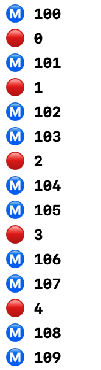

在代码中，首先创建一个DispatchQueue，在创建DispatchQueue时，需要提供一个label。注意，label用来区分不同的DispatchQueue，为了让你的Queue独一无二，不和其他应用的Queue混淆，使用倒置的域名是一种好方法。

我们通过queue.async来启动一个任务，这里使用尾随闭包的写法。最终在结果中我们看到，queue启动的异步任务和主线程的输出混在一起，这说明它们并发执行。

---
# Quality of Service(QoS)
在创建Queue时可以指定它的Quality Of Service(QoS)，系统将根据QoS来合理安排任务的执行顺序。例如QoS为userInteractive的任务往往有更高的优先级，因为它们和UI界面有关，所以需要被快速执行。而QoS为backgroud的任务具有较低的优先级，而且可能会被分配到能耗低的CPU核上执行以节省能量。


---
# 六个QoS级别

- userInteractive: 用于处理和用户互动有关的任务，例如动画、事件处理
- userInitiated: 用于处理可能会妨碍用户使用App的任务
- default： 默认的QoS
- utility：用于处理用户并不是非常关心的任务
- background： 用于处理后台任务
- unspecified： 未指定QoS

---
# 创建带有QoS的Dispatch Queue

``` swift
func queuesWithQoS() {
    let queue1 = DispatchQueue(label: "com.appcoda.queue1", qos: DispatchQoS.userInteractive)
    // let queue1 = DispatchQueue(label: "com.appcoda.queue1", qos: DispatchQoS.background)
    // let queue2 = DispatchQueue(label: "com.appcoda.queue2", qos: DispatchQoS.userInitiated)
    let queue2 = DispatchQueue(label: "com.appcoda.queue2", qos: DispatchQoS.background)
    
    queue1.async {
        for i in 0..<10 {
            print("🔴", i)
        }
    }
    
    queue2.async {
        for i in 100..<110 {
            print("🔵", i)
        }
    }   
}
```

---
# 结果

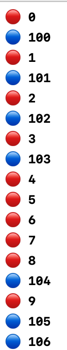

打印红色小球的Queue的QoS为userInteractive,而打印蓝色小球的Queue的QoS为background。虽然每次执行时具体的执行顺序是不确定的，但是总的来说，userInteractive的Queue的任务被更快的执行完成。

---

# 并发任务
在创建Dispatch Queue时，还可以设置它的属性，包括可选的`concurrent`和`initiallyIncative`。如果不加上concurrent属性，那么Dispatch Queue是顺序的执行任务，每次只执行一个，而加上之后，就可以并发执行任务。 `initiallyInactive`用于指定Queue被创建时是否是活跃的。
``` swift
func concurrentQueues() {
    let anotherQueue = DispatchQueue(label: "com.appcoda.anotherQueue",attributes: [.concurrent])
    anotherQueue.async {
        for i in 0..<10 {
            print("🔴", i)
        }
    }
    anotherQueue.async {
        for i in 100..<110 {
            print("🔵", i)
        }
    }
}
```

---
# 比较是否有concurrent属性

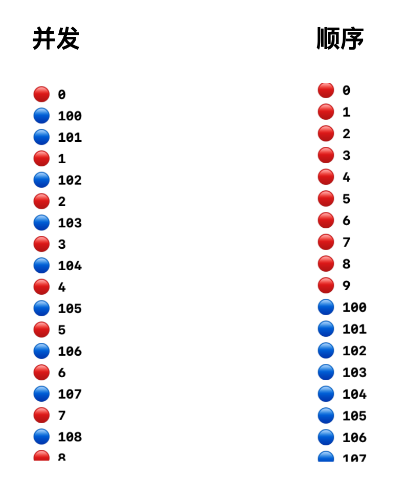


---

# Operation Queue

- [OperationQueue](https://developer.apple.com/documentation/foundation/operationqueue)是对GCD队列模型的一个抽象
  - 相比GCD，OperationQueue实现为更方便实用的一组API
- OperationQueue定义了两种类型的队列: 主队列和定制队列.
  - 主队列（main queue）运作在主线程，定制队列（custom queues）在后台（非主线程）处理
- 在队列中处理的任务抽象为[Operation](https://developer.apple.com/documentation/foundation/operation)	

https://developer.apple.com/documentation/foundation/operationqueue

---

# Operation

Operation是对单个任务所相关的代码和数据的抽象表示。尽管它是抽象类，但是它的默认实现包含了有关任务安全执行的重要逻辑，由于关于任务被如何执行的逻辑已经被实现，所以使用者只需要关注如何来定制你的任务。当任务被定制之后，operation只能够执行一次。

https://developer.apple.com/documentation/foundation/operation

---
# Operation 实现
由于Operation是抽象类，所以我们不直接使用它，而是使用它的子类，系统为我们提供了它的默认实现，包括
- NSInvocationOperation
- BlockOperation

NSInvocationOperation更偏向于Objective-C风格，而BlockOperation是Swift风格。

---
# Operation和GCD
我们之前介绍了GCD，而Operation和Operation Queue是建立在GCD的基础上的进一步抽象。苹果推荐我们使用更高层的抽象，应为更高层的抽象屏蔽了更多细节，并且提供了新的特性。Operation提供了依赖机制，可以定义不同的任务之间的依赖关系，从而让一个任务可以等待他所依赖的任务完成后再执行。


---
# Operation状态
一个Operation的生命周期由一个状态机表示，在生命周期的不同时间，operation可能处于以下的几种状态。

- isReady: 当一个operation被实例化后，它处于isReady状态。
- isExecuting： 当一个operation被`start`方法激发之后，它转换到isExecuting状态。
- isFinished: 当一个operation的任务执行结束之后，它进入到isFinished状态。
- isCancelled：当operation在进行中，而使用者调用了它的cancel方法，它将会转移到isCancelled状态。
---
# Block Operation
Block Operation 允许你一次性并发地执行一个或者多个block。在下面当代码中，我们通过`start`异步地执行了Block中当代码，但是我们直接在主线程中执行，所以会阻塞主线程。
``` swift
let operation = BlockOperation{
    for i in 1...10 {
        print("Hello \(i)")
        print(Thread.isMainThread) // Output: true
    }
}

operation.start()
```

---
# Block Operation
接下来的代码展示了如何在一个Block Operation中加入多个block。
``` swift
let operation = BlockOperation()
operation.addExecutionBlock {
    for i in 1...10 {
        print("From block 1:\(i)")
    }
}
operation.addExecutionBlock {
    for i in 1...10 {
        print("From block 2:\(i)")
    }
}
operation.start()
print("Finished")
```
---
# Block Operation
从结果中可以看到，Operation内部的多个block是并发执行的，但是`start`方法本身不是异步的。
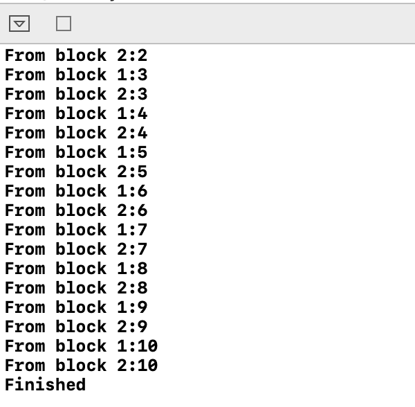

---
# Block Operation
我们可以为一个Operation添加completion block.

``` swift
let operation = BlockOperation()
operation.completionBlock = {
    print("All blocks finished")
}
operation.addExecutionBlock {
    for i in 1...10 {
        print("From block 1:\(i)")
    }
}
operation.addExecutionBlock {
    for i in 1...10 {
        print("From block 2:\(i)")
    }
}
operation.start()
```

---
# Block Operaion
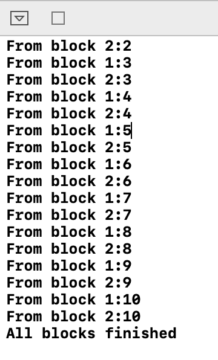
当所有的并发任务被执行完成之后，就会调用completion block。

---
# NSInvocation Operation
NSInvocationOperation类通过selector来为operation添加任务，在objective C中，我们使用NSInvocationOperation，但是它在Swift中是不可用的。


---
# Operation Queues
之前我们说过，Operation Queues是对GCD对高级抽象，通过使用Operation Queueu，你可以看到Operation的真正能力。你无需手动通过start来启动一个Operation，而是将Operation交付给Operaion Queue来执行。


---
# Add Operations
``` swift
let operationQueue = OperationQueue()

let blockOperation1 = BlockOperation {
    for i in 1...5 {
        print("Hello 👠\(i)")
    }
}

let blockOperation2 = BlockOperation {
    for i in 1...5 {
        print("Hello 🧤 \(i)")
    }
}

operationQueue.addOperation(blockOperation1)
operationQueue.addOperation(blockOperation2)
```

---
# Add Operations
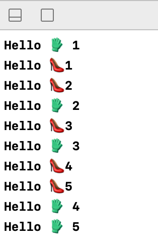

我们创建了两个operaion，并且将它们添加到了operation queue中。Operation queue在同一个后台线程中启动它们。我们不需要显示的调用operation的start方法，而且它们是并发执行的。


---
# Add Operations
Operation Queue默认的行为是并发的，如果我们希望它具有串行队列的行为，可以通过设置它的maxConcurrentOperationCount=1

``` swift
operationQueue.maxConcurrentOperationCount = 1
operationQueue.addOperation(blockOperation1)
operationQueue.addOperation(blockOperation2)
```
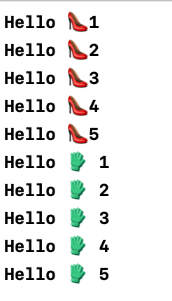

---
# Operations Dependencies
有的时候一个任务会依赖其他任务的进行，比如一个解析JSON数据的任务必须等到一个从Web Server获取JSON数据的任务执行完毕后，才能开始进行。手动维护这种先后关系比较繁琐，Operation提供了简单的依赖机制，可以为一个任务添加依赖。

``` swift
blockOperation1.addDependency(blockOperation2)
operationQueue.addOperation(blockOperation1)
operationQueue.addOperation(blockOperation2)
```
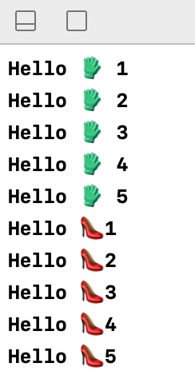

---
# Operation Dependencies

如果我们不小心构成了循环依赖会怎么样？
``` swift
blockOperation1.addDependency(blockOperation2)
blockOperation2.addDependency(blockOperation1)
operationQueue.addOperation(blockOperation1)
operationQueue.addOperation(blockOperation2)
```
很遗憾，这两个operation永远都会处在等待的状态，Swift并没有对依赖中是否存在环进行检测，所以在使用依赖时要小心。

---
# 举个例子
我们来看上一章通过Dispatch Queue实现的能够并发的加载图片的例子应该如何用Operation Queue来实现。


---
# 修改代码
``` swift
let operationQueue = OperationQueue()
var operations:[BlockOperation] = []
for i in 0..<imageViews!.count {
    let operation = BlockOperation{
        do {
            let data = try Data(contentsOf: URL(string: self.images[i])!)
            if let image = UIImage(data: data) {
                DispatchQueue.main.async {
                    self.imageViews![i]?.image = image
                }
            }
        }catch {print(error.localizedDescription)}
    }
    operations.append(operation)
}
for i in 0..<operations.count {
    operationQueue.addOperation(operations[i])
}
```
---
# 解释
我们创建了一个OperationQueue，然后为每张图片的加载和显示都创建一个BlockOperation，最后将operation逐个加入OperationQueue，就可以并发的进行图片加载。对比Dispatch的实现，可以看出OperationQueue有以下的优势：
- 不需要关心OperationQueue的名称，在创建Dispatch Queue时，为了区分，必须为它设置一个独一无二的Label
- 更加简洁，我们只是将operation加入到队列中，不需要显示调用async或者sync来执行它，它会被队列自动的执行

---
# 效果

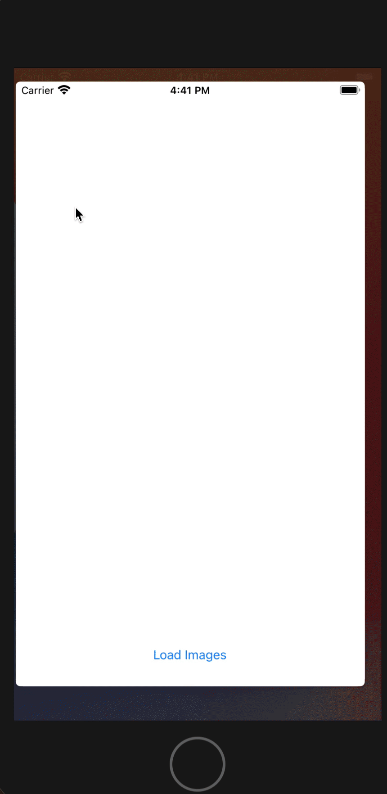

---

# 添加依赖
我们可以为每个operation添加依赖，控制图片加载的顺序，例如我们从按照从上到下，从左到右的顺序加载图片：
``` swift
        operations[2].addDependency(operations[1])
        operations[3].addDependency(operations[2])
        operations[4].addDependency(operations[3])
        operations[5].addDependency(operations[4])
        
        
        for i in 0..<operations.count {
            operationQueue.addOperation(operations[i])
        }
```
---
# 效果


---

# 总结
- 并发编程可以有效提高App的运行性能，保证App实时响应用户的操作。
- GCD适合处理并行开发中的简单小任务
- Operation适合封装模块化的任务，支持多任务之间的相互依赖
- GCD的优点在于简单快捷，Operation的优点在于功能丰富，抽象程度高
- 要小心地处理并发编程中可能出现的问题，比如循环依赖等。

---


<style>
img {
  display: block;
  margin: 0 auto;
}
</style>

# 基于Swift语言的iOS应用开发


网络通信

---


# iOS App通信任务

iOS应用开发过程中我们一般都是在应用层执行一下通信任务：

- 访问Web服务
- 访问FTP
- P2P通信
- Socket通信
- 流数据

---

# Web


---


# FTP


---

# P2P


---

# 网络通信难点

网络协议虽然已经很复杂，但iOS为网络通信提供了易用的编程接口，简单网络访问容易实现

然而，写好网络通信代码不易，因为需要适应不断变化的网络性能状态、断线、连接失败和其它由于互联网（特别是移动互联网）带来的问题


---

# 实际的设计问题

网络通信会耗费用户时间和金钱，所以需要考虑好如何有效利用能源和带宽优化这些开销

- 批处理传输，尽可能空闲
- 下载最小的必须资源，并在本地缓存

---

# 实际设计问题

在移动设备上进行网络通信随时可能会遇到网络状态变化，所以更要优雅地处理各类网络问题

- 考虑网络可用问题
- 考虑网速
- 在多种情况下测试


---


# WKWebView
在iOS8.0之前，如果向展示Web页面，开发者只能使用UIWebView。由于UIWebView过于笨重，而且有内存泄漏的问题，因此在使用UIWebView时，会拖慢设备的运行速度。当iOS8加入了WebKit之后，开发者可以使用WKWebView来代替UIWebView。WKWebView是WebKit框架中最重要的部分。

https://developer.apple.com/documentation/webkit/viewing_desktop_or_mobile_web_content_using_a_web_view

---
# WKWebView

WebKit是Safari浏览器的视图布局和内容渲染引擎。它可以解析并渲染HTML，可以加载并展示图片，也可以执行JavaScript脚本。WKWebView和UIWebView在某些方面很相似，但是它更加强大。


---
# WKWebView  vs UIWebView
- UIWebView是UIKit的一部分而WKWebView是WebKit的一部分。
- 相比于UIWebView，WKWebView加载和展示页面的速度更快，并且更加节省内存。
- WKWebView的JavaScript引擎版本更新，执行效率更高

---
## WKWebView 实践: 创建一个webview
在你的新项目中，加入以下的代码
``` swift
class ViewController: UIViewController {
    let webView = WKWebView()
    override func viewDidLoad() {
        super.viewDidLoad()
        // Do any additional setup after loading the view.
        self.view = webView
    }
}
```
这段代码将你的ViewController的view设置为webView，如果你现在运行程序，屏幕上仍然是一片空白，因为我们没有加载内容。

---
## WKWebView实践：加载一个页面
为ViewController添加以下的方法，并在viewDidLoad函数中进行调用。
``` swift
func loadURL() {
        if let url = URL(string: "https://www.apple.cn") {
            let request = URLRequest(url: url)
            webView.load(request)
        }
    }
```
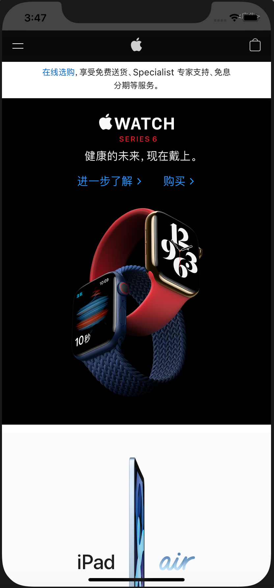

---
## WKWebView实践： 加载本地内容
WKWebView不仅可以加载URL，也可以通过`loadFileURL`加载本地的HTML文件里内容，你需要提供给这个方法提供一个指向你的Buddle中的html文件的url。例如，你想加载你的buddle中一个叫"test.html"的文件，你可以使用以下的代码：
``` swift
func loadLocalContent() {
        if let url = Bundle.main.url(forResource: "test", withExtension: "html") {
            webView.loadFileURL(url, allowingReadAccessTo: url.deletingLastPathComponent())
        }
    }
```
`deletingLastPathComponent`告诉WebKit，可以使用和html同一路径下的文件，来帮助展示html，例如相关的css文件等

---
## WKWebView实践： 加载本地内容
test.html的内容如下
``` html
<html>
<body>
<h1>Hello, WebKit</h1>
</body>
</html>
```

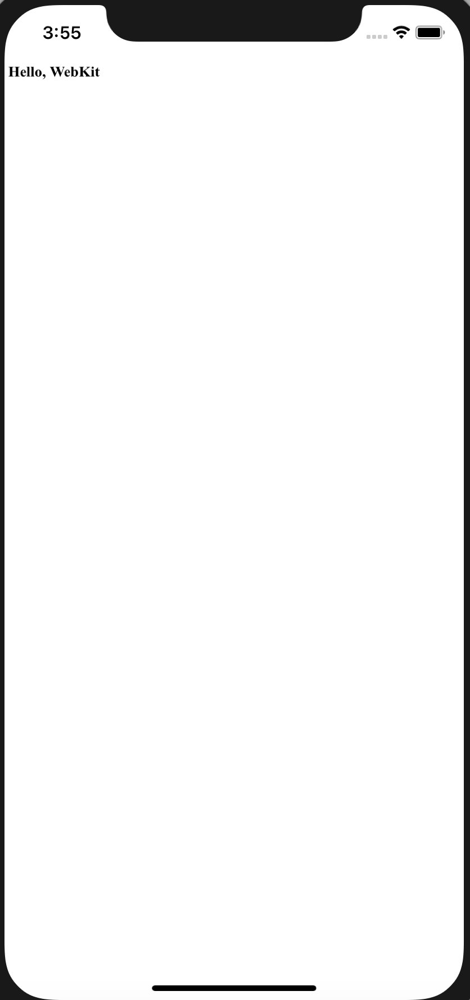

---
## WKWebView实践: 加载HTML片段
你也可以直接在代码中使用使用html片段，并将它直接传递给WKWebView
``` swift
func loadHTMLFragment() {
        let content = """
            <html>
            <body>
            <h1>Hello, WebKit!</h1>
            </body>
            </html>
        """
        
        webView.loadHTMLString(content, baseURL: nil)
    }
```

---
## WKWebView实践： 访问控制
WKWebView默认是允许对所有网站对访问，但是你可以通过实现WKNavigationDelegate代理，来阻塞对于某些页面对访问：
首先，让ViewController实现WKNavigationDelegate
``` swift
class ViewController: UIViewController, WKNavigationDelegate {
```

然后设置代理
``` swift
webView.navigationDelegate = self
```

---
## WKWebView实践：添加访问控制
添加访问控制的方法。

``` swift
func webView(_ webView: WKWebView, decidePolicyFor navigationAction: WKNavigationAction, decisionHandler: @escaping (WKNavigationActionPolicy) -> Void) {
        if let host = navigationAction.request.url?.host {
            print(host)
            if host == "www.baidu.com" {
                decisionHandler(.allow)
                return
            }
        }

        decisionHandler(.cancel)
    }
```
此时，我们只能访问 www.baidu.com.

---
## WKWebView实践：在外部浏览器打开
有时我们希望对于特定的链接，我们在外部的浏览器打开，那么修改上面的方法
``` swift
func webView(_ webView: WKWebView, decidePolicyFor navigationAction: WKNavigationAction, decisionHandler: @escaping (WKNavigationActionPolicy) -> Void) {
        if let url = navigationAction.request.url {
            print(url.host)
            if url.host == "www.baidu.com" {
                UIApplication.shared.open(url)
                decisionHandler(.cancel)
                return
            }
        }

        decisionHandler(.allow)
    }
```
---
## 效果


---
## WKWebView实践：展示页面打开进度
打开一个网页可能需要消耗一些时间，我们可以用KVO的方式来监控网页打开的进度
``` swift
webView.addObserver(self, forKeyPath: #keyPath(WKWebView.estimatedProgress), options: .new, context: nil)
```

``` swift
override func observeValue(forKeyPath keyPath: String?, of object: Any?, change: [NSKeyValueChangeKey : Any]?, context: UnsafeMutableRawPointer?) {
    if keyPath == "estimatedProgress" {
        print(Float(webView.estimatedProgress))
    }
}
```

---
## WKWebView实践：展示页面打开进度


有了页面打开的进度，我们可以用一个progress bar或者是其他方式向用户进行展示。

---

## WKWebView实践： 开发一个简单的WebBrowser
新建项目，然后在storyboard中进行UI设计，我们大致将用户界面分为三部分，上部分是输入链接并进行访问的导航栏，同时包含一个progress view，可以向用户展示页面加载的进度，中部是展示Web页面的WKWebView，下部是控制页面前进后退的控制栏

---
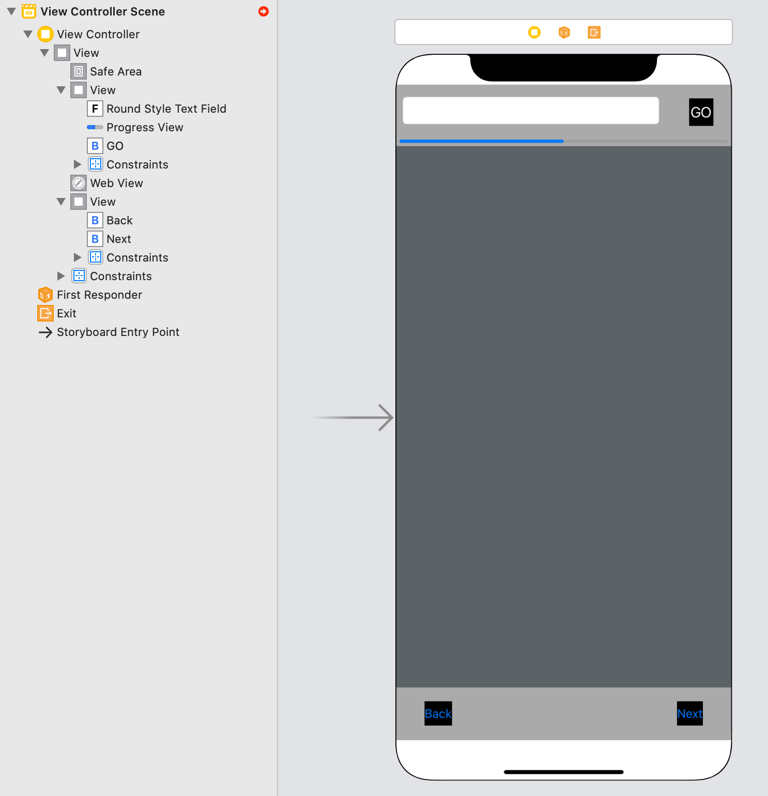


---
## WKWebView实践： 开发一个简单的WebBrowser
创建关键view的outlet
``` swift
    @IBOutlet weak var urlTextField: UITextField!
    @IBOutlet weak var pageLoadProgress: UIProgressView!
    @IBOutlet weak var goButton: UIButton!
    @IBOutlet weak var webView: WKWebView!
    @IBOutlet weak var backButton: UIButton!
    @IBOutlet weak var nextButton: UIButton!
```

---
## 运行一下
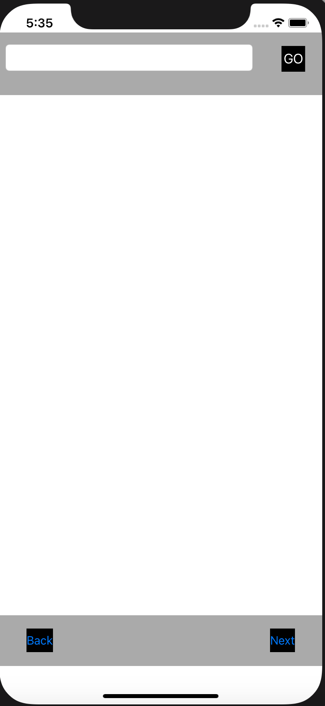
这里我们在`viewDidLoad`中将progress的isHidden设置为了true，因为在没有页面加载时，不应该显示一个进度条
``` swift
self.pageLoadProgress.isHidden = true
```

---
## 为Go Button添加行为
Go 按钮的主要行为是将textField的内容取出来当作一个url，然后让webview去加载这个url的内容
``` swift
@IBAction func loadURL(_ sender: Any) {
        var text = self.urlTextField.text!
        if !text.starts(with: "https://") {
            text = "https://" + text
        }
        
        if let url = URL(string: text) {
            let urlRequest = URLRequest(url: url)
            self.webView.load(urlRequest)
        }
    }
```

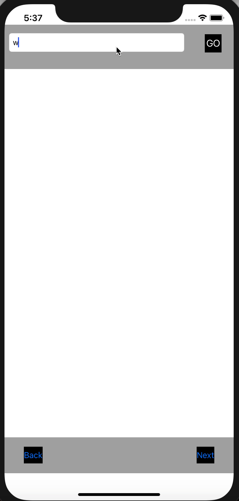

---
## 加上进度条的展示
``` swift
    override func viewDidLoad() {
        super.viewDidLoad()
        // Do any additional setup after loading the view.
        ...
        webView.addObserver(self, forKeyPath: #keyPath(WKWebView.estimatedProgress), options: .new, context: nil)
    }

    override func observeValue(forKeyPath keyPath: String?, of object: Any?, change: [NSKeyValueChangeKey : Any]?, context: UnsafeMutableRawPointer?) {
        if keyPath == "estimatedProgress" {
            self.pageLoadProgress.isHidden = false
            self.pageLoadProgress.progress = Float(webView.estimatedProgress)
            if self.pageLoadProgress.progress == 1.0 {
                self.pageLoadProgress.isHidden = true
            }
        }
    }
```

---
## 测试一下

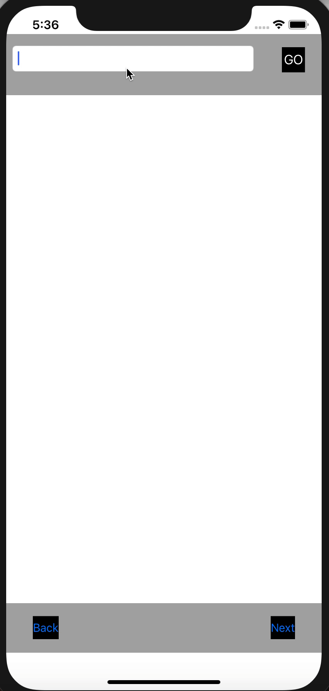

---
## 为back和next添加对应动作
WkWebView提供的方法可以让我们很轻松就可以在访问过的多个页面之间切换
``` swift
    //Mark: Go previous page of Webview
    @IBAction func btnBackAction(_ sender: UIButton) {
        webView.goBack()
    }
    
    //Mark: Go next page of Webview
    @IBAction func btnNextAction(_ sender: Any) {
        webView.goForward()
    }
```

---
## 最终结果


---

# URL Loading System
iOS提供了通过标准的Internet协议和URLs进行通信和互动的方式。URL Loading System提供了通过标准的Https协议对由URL标识的资源的访问能力。这个过程应该是异步的(asynchronous)，所以当应用在处理到来的数据和可能的错误时，应用仍然是可以响应用户的互动的。

https://developer.apple.com/documentation/foundation/url_loading_system


---
## URL Loading System
开发者使用`URLSession`实例去创建一个或者多个`URLSessionTask`实例，通过使用`URLSessionTask`，可以拉取数据、下载文件或者上传数据或者文件。使用`URLSessionConfiguration`来配置一个session.`URLSessionConfiguration`指定如何使用缓存和Cookies。

---
## URL Session
URLSession是用来处理HTTP和HTTPS请求的类。


---


## URL Session
你可以重复使用一个session来创建多个任务。例如，一个Web浏览器也许对于普通浏览和无痕浏览分别使用一个session来处理，并且指定无痕浏览对应的session不使用缓存。


---

## URLSessionTask
`URLSessionTask`是对代表了任务的一个抽象类。一般来说，我们会处理以下类型的任务
- 将数据拉取到内存(fetch data)
- 下载文件(file downloading)
- 数据上传(data uploading)
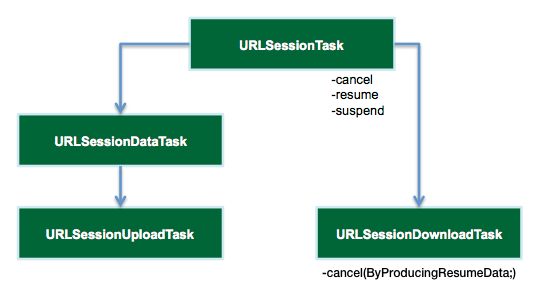

---
## URLSessionTask
- URLSessionDataTask: 将数据拉取到内存对应的是URLSessionTask，我们使用这个任务来发送GET请求，将服务器的数据拉取到内存。
- URLSessionUploadTask： 使用URLSessionUploadTask将文件从硬盘通过PUT或者POST方法上传到服务器
- URLSessionDownloadTask： 使用URLSessionDownloadTask从远端的服务器下载文件到一个临时位置。

---
## URLSessionTask
你可以挂起、重做或者取消URLSessionTask
- 在任务结束之后，通过调用completion handler来返回结果

- 在创建Session时，通过设置它的代理，通过代理中的自定义方法来返回结果。
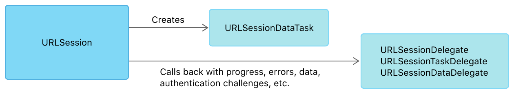

---


## 举个例子：Fetching Data

我们通过一个例子展示从一个URL Session直接创建一个data task来完成将数据拉取到内存的操作。首先我们设计应用的UI界面，包括一个URL输入狂，一个按钮，一个展示结果的textview
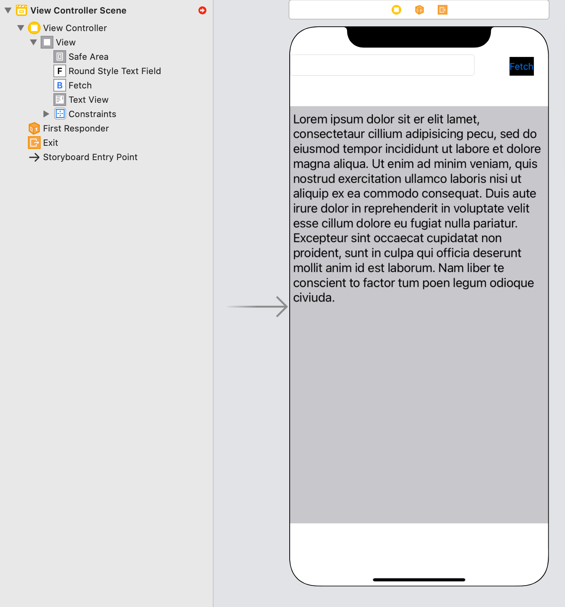

---
## 举个例子：Fetching Data
创建Outlet
``` swift
    @IBOutlet weak var urlInput: UITextField!
    @IBOutlet weak var fetchButton: UIButton!
    @IBOutlet weak var contentView: UITextView!
```

---
## 举个例子：Fetching Data
添加Action，这里我们通过Completion Handler来获得结果

``` swift
@IBAction func fetchData(_ sender: Any) {
        let url = URL(string: urlInput.text!)!
        let task = URLSession.shared.dataTask(with: url, completionHandler: {
            data, response, error in
            if let error = error {
                print("\(error.localizedDescription)")
                return
            }
            
            guard let httpResponse = response as? HTTPURLResponse,
                  (200...299).contains(httpResponse.statusCode) else {
                print("server error")
                return
            }
            
            if let mimeType = httpResponse.mimeType, mimeType == "text/html",
                        let data = data,
                        let string = String(data: data, encoding: .utf8) {
                        DispatchQueue.main.async {
                            self.contentView.text = string
                        }
                    }
        }
        )
        
        task.resume()
    }
```
---
## 举个例子：Fetching Data
我们也可以通过代理的方式来返回结果，效果和Completion Handler是一样的

``` swift
class ViewController: UIViewController, URLSessionTaskDelegate {
```
实例化Session，并设置代理
``` swift
    private lazy var session: URLSession = {
        let configuration = URLSessionConfiguration.default
        configuration.waitsForConnectivity = true
        return URLSession(configuration: configuration,
                          delegate: self, delegateQueue: nil)
    }()
```

---
## 举个例子：Fetching Data

实现代理方法
``` swift
extension ViewController {
    func urlSession(_ session: URLSession, dataTask: URLSessionDataTask, didReceive response: URLResponse,
                    completionHandler: @escaping (URLSession.ResponseDisposition) -> Void) {
        guard let response = response as? HTTPURLResponse,
            (200...299).contains(response.statusCode),
            let mimeType = response.mimeType,
            mimeType == "text/html" else {
            completionHandler(.cancel)
            return
        }
        completionHandler(.allow)
    }
}
```
---
## 举个例子：Fetching Data

实现代理方法
``` swift
extension ViewController {
    func urlSession(_ session: URLSession, dataTask: URLSessionDataTask, didReceive data: Data) {
        self.receivedData.append(data)
    }
    
    func urlSession(_ session: URLSession, task: URLSessionTask, didCompleteWithError error: Error?) {
        DispatchQueue.main.async {
            if let error = error {
                print("\(error.localizedDescription)")
            } else{
                let string = String(data: receivedData, encoding: .utf8) {
                self.contentView.text = string
            }
        }
    }
}
```


---
## 效果
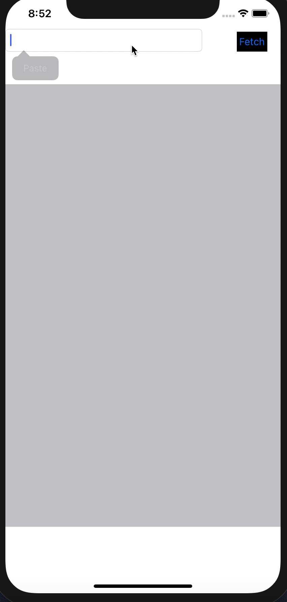

---
## 举个例子：Uploading Data
许多应用会向服务器上传数据，包括一些文件(图片、文档)或者是JSON格式的结构化数据。对于这中任务，我们使用`URLSessionUploadTask`来完成。我们通过一个例子展示如何向服务器发送JSON格式的数据。


---
## 举个例子：Uploading Data
我们先用python搭建一个简单的服务器，它只是将收到的数据打印出来
``` python
import json
from flask import Flask, request
app = Flask(__name__)
@app.route('/api/v1/receive', methods=['POST'])
def receive_data():
    print("Receive data:")
    print(json.loads(request.data))
    return json.dumps({'success': True}), 200, {'ContentType': 'application/json'}


if __name__ == '__main__':
    app.run(host='0.0.0.0', port=8001)
```

---
## 举个例子：Uploading Data

准备好需要上传的JSON格式数据
``` swift
struct Student: Codable {
        let studentID: String
        let name: String
        let gender: Bool
    }
    
    func prepareJSONData()->Data {
        let student = Student(studentID: "ABC123123123", name: "Jack", gender: true)
        
        guard let uploadData = try? JSONEncoder().encode(student) else {
            return Data()
        }
        
        return uploadData
    }
```

---
## 配置上传请求
我们需要创建一个URLRequest，并设置它的一些属性
``` swift
        let url = URL(string: "http://localhost:8001/api/v1/receive")!
        var request = URLRequest(url: url)
        request.httpMethod = "POST"
        request.setValue("application/json", forHTTPHeaderField: "Content-Type")
```

---
## 进行上传
最后，我们进行上传
``` swift
        let uploadData = prepareJSONData()
        let task = URLSession.shared.uploadTask(with: request, from: uploadData) { data, response, error in
            if let error = error {
                print ("error: \(error)")
                return
            }
            guard let response = response as? HTTPURLResponse,
                (200...299).contains(response.statusCode) else {
                print ("server error")
                return
            }
            if let mimeType = response.mimeType,
                mimeType == "application/json",
                let data = data,
                let dataString = String(data: data, encoding: .utf8) {
                print ("got data: \(dataString)")
            }
        }
        task.resume()
```
---
## 修改Info.plist
由于我们使用的是http，必须修改Info.plist，否则会被认为是不安全的链接。
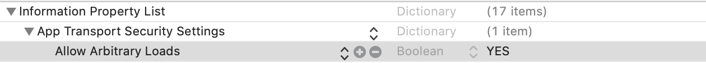

---

## 结果

运行程序后，可以在server的输出中看到我们上传的数据
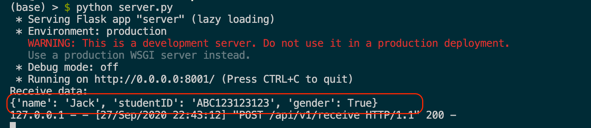

---
## 举个例子： 从网站下载文件
我们可以使用URLSessionDownloadTask将网络上的文件直接下载到iOS本地的文件系统，例如图片或者文档。如果我们不关心下载的进度，那么可以简单地用completion handler来进行下载。
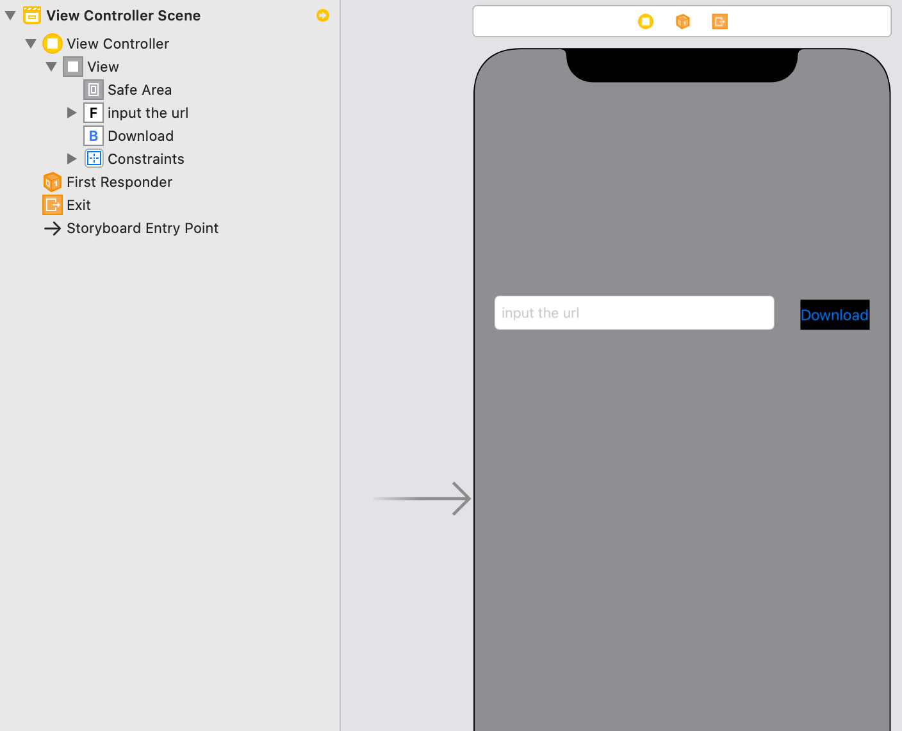

---
## 举个例子： 从网站下载文件
使用Completion Handler
``` swift
class ViewController: UIViewController {

    @IBOutlet weak var inputURL: UITextField!
    override func viewDidLoad() {
        super.viewDidLoad()
        // Do any additional setup after loading the view.
    }

    @IBAction func download(_ sender: Any) {
        guard let url = URL(string: inputURL.text!) else {return }
        
        let urlSession = URLSession(configuration: .default, delegate: self, delegateQueue: OperationQueue())
                
        let downloadTask = urlSession.downloadTask(with: url)
                downloadTask.resume()
    }
}

extension ViewController:  URLSessionDownloadDelegate {
    func urlSession(_ session: URLSession, downloadTask: URLSessionDownloadTask, didFinishDownloadingTo location: URL) {
        print("downloadLocation:", location)
    }
}
    }
```

---
## 效果
我们观察打印出的目录，可以发现下载的临时文件会被自动清理。这是因为我们将其下载到了临时位置tmp中，接下来我们应该将下载内容移动到cache中
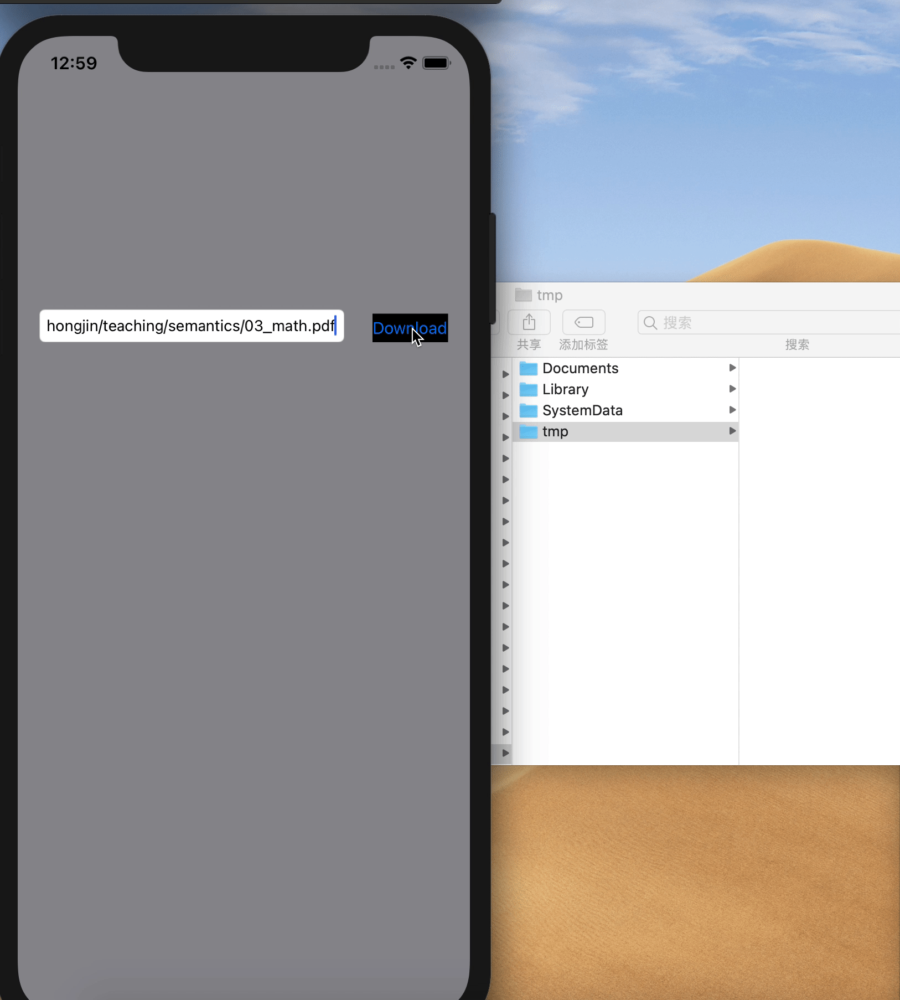

---
## 移动下载文件
``` swift
extension ViewController:  URLSessionDownloadDelegate {
    func urlSession(_ session: URLSession, downloadTask: URLSessionDownloadTask, didFinishDownloadingTo location: URL) {
        print("downloadLocation:", location)
        guard let url = downloadTask.originalRequest?.url else { return }
                let documentsPath = FileManager.default.urls(for: .cachesDirectory, in: .userDomainMask)[0]
                let destinationURL = documentsPath.appendingPathComponent(url.lastPathComponent)
                // delete original copy
                try? FileManager.default.removeItem(at: destinationURL)
                // copy from temp to Document
                do {
                    try FileManager.default.copyItem(at: location, to: destinationURL)
                    self.pdfURL = destinationURL
                } catch let error {
                    print("Copy Error: \(error.localizedDescription)")
                }
    }
}
```

---
## 效果
我们可以发现文件被储存到了caches目录中。


---
## 展示PDF
我们还可以打开刚刚下载的PDF文件
``` swift
        if let fileURL = self.pdfURL {
            DispatchQueue.main.async {
                let pdfViewController = PDFViewController()
                pdfViewController.pdfURL = fileURL
                self.present(pdfViewController, animated: false, completion: nil)
            }
        }
```

---
## 效果


