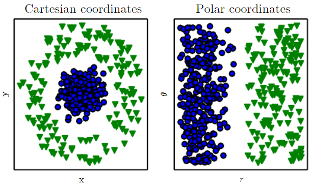
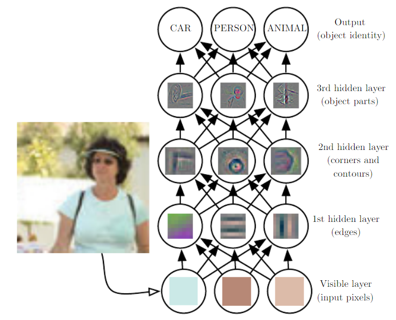
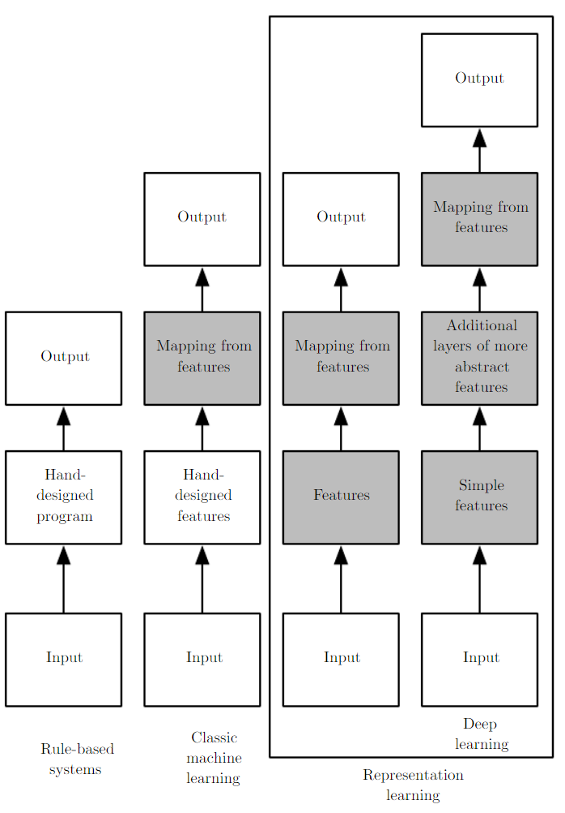

<style>
img {
  display: block;
  margin: 0 auto;
}
</style>

# 基于Swift语言的iOS应用开发


 深度学习模型开发基础

---

## 本节概要
- 快速了解机器学习的基础知识
- 快速了解深度学习的基本知识
- 案例：利用PyTorch训练图像分类CNN模型，并转换成Core ML模型

---

## 深度学习

- 目标问题
    - 人理解困难的问题：一堆数据特征、数学向规则
    - 人容易理解但难总结的问题：图像、语音
- 深度学习
    - 通过构建层次化的理解过程，让计算机能够从简单的概念中逐步产生复杂的概念


---

## 对问题的认知

- 易构成形式化规则的问题
    - 国际象棋 (IBM深蓝)：棋盘大小、下棋基本规则
    - 泰坦尼克遇难人员预测 (Kaggle经典问题)：船票等级、性别、年龄
- 可直观理解、但难形式化的问题
    - 阅读理解：在早晨刮胡子的Fred是不是个人？
        - 通过形式化语言硬编码知识：此路不通
        - 传统机器学习：根据人提取的特征表示进行分类和回归
        - 深度学习：基于最原始的数据直接进行表示学习
---    

## 表示学习



- 从原空间学习到表示空间的映射的过程
  - Factors of variations：可用来解释被观测数据的概念、抽象、显式特征等
    - 笛卡尔坐标系->极坐标系
    - 汽车：形状、轮胎、颜色、年代、用途...    

---

## 深度学习


- 层次化的表示学习
    - 从原始的像素输入出发，基于最终任务，逐步提取简单特征、整合复杂特征的过程
        - 像素点->边->角、轮廓->目标物结构->目标的识别  
---

## 总览图



--- 

## 数学基础

- 线性代数
- 概率、统计
- 数值计算
- 机器学习基础

---

## 线性代数

  数学对象：标量、向量、矩阵、张量

- 标量 (Scalars)：1，2，3.5，4.93834534....
- 向量 (Vectors)：$\vec{x}=[x_1,x_2,\dots,x_n]$
- 矩阵 (Matrices): $\begin{bmatrix} 0 & -1 \\ 1 & 0 \end{bmatrix}$
- 张量 (Tensors): 高维矩阵

计算：外积、内积(element-wise product)、p-norm

---

## 概率、统计

不确定性(Uncertainty)和随机性(Stochasticity)是机器学习始终要面对的问题：在非确定的环境下进行推理和决策
- 不确定性来源
  - 系统固有的随机性：随机发牌
  - 不完整的数据观测：三门问题
  - 非精确建模：缺乏完整信息、信息模糊化

离散、连续

---

## 随机变量，概率分布


**随机变量**是一种可随机取得多个不同取值的实值函数
举个栗子：
    随机变量X：抛一个均匀的硬币
    - X(抛一个均匀的硬币得到正面朝上)=1
    - X(抛一个均匀的硬币得到反面朝上)=0
P(X=1)=1/2； P(X=0)=1/2

**概率分布**描绘了一个/多个随机变量获得每个可能的取值的可能性(离散/连续)
$P(\mathbf{x}=x)$

---

## 边缘概率，条件概率

联合概率分布：$x$和$y$同时发生的概率
  
$P(\mathbf{x}=x, \mathbf{y}=y)$

边缘概率分布：只考虑$x$发生的概率
    
  $\forall x\in \mathbf{x}$, $P(\mathbf{x}=x)=\sum_yP(\mathbf{x}=x,\mathbf{y}=y)$

条件概率分布：当$\mathbf{y}=y$发生时$\mathbf{x}$的概率

$P(\mathbf{x}=x\mid\mathbf{y}=y)=\frac{P(\mathbf{x}=x, \mathbf{y}=y)}{P(\mathbf{x}=x)}$

---

## 深度神经网络

- 典型深度神经网络：面向图像分类任务的深度神经网络
    - 基本结构：全连接、卷积、池化、softmax
    - 网络参数学习方法：梯度下降


---

## 全连接网络示例图


---

## 深度全连接网络(Deep Neural Network)


深度全连接网络(DNN)又称多层感知机 (Multilayer Perceptrons)，其目标是估计某个未知的目标函数$f^*$，例如：
针对一个分类器，$y=f^*(\bm x)$构建了一个输入$\bm x$到分类类别$y$的映射，那么一个DNN则可表示为$y=f(\bm{x};\bm{\theta})$，通过学习得到$\mathbf{\theta}$的一组取值使得$f$是$f^*$的最佳估计。

$f(\bm{x})=f^{(3)}(f^{(2)}(f^{(1)}(\bm{x})))$

---

## DNN拆解：单层全连接网络


针对输入$\bm x$，输出向量$\bm y$，其中每个$y$都有如下描述
选择线性模型，其中参数$\bm{\theta}$包含$\bm{w}$和$b$
    $f(\bm{x};\bm w,b)=\bm x^\top\bm w + b$

通过引入非线性函数(nonlinear function)可增加模型非线性的能力，在DNN中，也称之为激活函数
    $f(\bm{x};\bm w,b)=g(\bm x^\top\bm w + b$)
常用非线性函数: Sigmoid, ReLU, tanh, LeakyReLU...

---

## 非线性函数示例


---

## DNN输出

一般地，针对二分类问题而言，DNN的输出见如下定义
    $f(\bm{x};\bm w,b)=\sigma(\bm x^\top\bm h + b$)
其中，$z=\bm x^\top\bm h + b$是DNN的原始输出，是非归一化(unnormalized)的表示，随后通过sigmoid函数赋予概率含义

对于多分类问题而言，则用softmax函数赋予所有$z_i$概率含义
$\text{softmax}(\bm z)_i=\frac{\exp(z_i)}{\sum_j\exp(z_j)}$
其中，$\exp(x)=e^x$

---

## 如何学习参数$\bm \theta$


学习目标: 设计一种可用来度量基于$\bm \theta$的DNN预测结果和真实结果差距的度量，差距越小，DNN越接近需估计的函数$f^*$
$J(\bm \theta)=\frac{1}{n}\sum_{\bm x\in \mathcal{X}}(f^*(\bm x)-f(\bm x;\bm\theta))^2$

学习方法：梯度下降

---


---

## 卷积神经网络CNN

- 卷积操作
- 池化操作

---

## 卷积(Convolution)和互相关(Cross-correlation)
传统卷积：信号系统中考虑之前时刻的信号经过一些过程后对现在时刻系统输出的影响。
互相关：深度学习领域的“卷积”，考虑两个函数之间基于空间位置的相关性


---

## 深度学习的卷积

互相关函数$S$
$S(i,j)=(K*I)(i,j)=\sum_m\sum_nI(i+m,j+n)K(m,n)$


---

## 卷积示例 2


---

## CNN组装结构


---

## VGG16


---

## VGG系列


---

## ResNet


---

## ResNet系列


---

## 下面进入动手时刻

任务目标：利用PyTorch训练一个图像分类的模型，保存成Core ML模型

Pipeline：
-  在Pytorch中训练模型
-  将Pytorch模型转换成onnx格式的模型
-  将onnx格式的模型转换成mlmodel格式的模型

---

## 数据集选取

CIFAR10


---

## 数据集加载

通过```torchvision```,轻松载入CIFAR10数据集
```py
import torch
import torchvision
import torchvision.transforms as transforms
```
---

## 数据集加载
```py
transform = transforms.Compose(
    [transforms.ToTensor(),
     transforms.Normalize((0.5, 0.5, 0.5), (0.5, 0.5, 0.5))])
trainset = torchvision.datasets.CIFAR10(root='./data', train=True,
                                        download=True, transform=transform)
trainloader = torch.utils.data.DataLoader(trainset, batch_size=4,
                                          shuffle=True, num_workers=2)
testset = torchvision.datasets.CIFAR10(root='./data', train=False,
                                       download=True, transform=transform)
testloader = torch.utils.data.DataLoader(testset, batch_size=4,
                                         shuffle=False, num_workers=2)
classes = ('plane', 'car', 'bird', 'cat',
           'deer', 'dog', 'frog', 'horse', 'ship', 'truck')
```

---

## 数据集可视化
```py
import matplotlib.pyplot as plt
import numpy as np
# functions to show an image
def imshow(img):
    img = img / 2 + 0.5     # unnormalize
    npimg = img.numpy()
    plt.imshow(np.transpose(npimg, (1, 2, 0)))
    plt.show()
# get some random training images
dataiter = iter(trainloader)
images, labels = dataiter.next()
# show images
imshow(torchvision.utils.make_grid(images))
# print labels
print(' '.join('%5s' % classes[labels[j]] for j in range(4)))
```

---

## 可视化输出结果
```
cat truck  deer   cat
```


---

定义一个简单网络

```py
import torch.nn as nn
import torch.nn.functional as F

class Net(nn.Module):
    def __init__(self):
        super(Net, self).__init__()
        self.conv1 = nn.Conv2d(3, 6, 5)
        self.pool = nn.MaxPool2d(2, 2)
        self.conv2 = nn.Conv2d(6, 16, 5)
        self.fc1 = nn.Linear(16 * 5 * 5, 120)
        self.fc2 = nn.Linear(120, 84)
        self.fc3 = nn.Linear(84, 10)

    def forward(self, x):
        x = self.pool(F.relu(self.conv1(x)))
        x = self.pool(F.relu(self.conv2(x)))
        x = x.view(-1, 16 * 5 * 5)
        x = F.relu(self.fc1(x))
        x = F.relu(self.fc2(x))
        x = self.fc3(x)
        return x
net = Net()
```
---

设定损失函数和优化器

```py
import torch.optim as optim

criterion = nn.CrossEntropyLoss()
optimizer = optim.SGD(net.parameters(), lr=0.001, momentum=0.9)
```

---
训练网络
```py
for epoch in range(2):  # loop over the dataset multiple times
    running_loss = 0.0
    for i, data in enumerate(trainloader, 0):
        # get the inputs; data is a list of [inputs, labels]
        inputs, labels = data
        # zero the parameter gradients
        optimizer.zero_grad()
        # forward + backward + optimize
        outputs = net(inputs)
        loss = criterion(outputs, labels)
        loss.backward()
        optimizer.step()
        # print statistics
        running_loss += loss.item()
        if i % 2000 == 1999:    # print every 2000 mini-batches
            print('[%d, %5d] loss: %.3f' %
                  (epoch + 1, i + 1, running_loss / 2000))
            running_loss = 0.0
print('Finished Training')
```


---

## 保存网络和加载网络
保存网络
```py
PATH = './cifar_net.pth'
torch.save(net.state_dict(), PATH)
```
加载网络
```py
net = Net()
net.load_state_dict(torch.load(PATH))
```
---

##

试一下
```py
dataiter = iter(testloader)
images, labels = dataiter.next()
outputs = net(images)

_, predicted = torch.max(outputs, 1)

print('Predicted: ', ' '.join('%5s' % classes[predicted[j]]
                              for j in range(4)))
```
输出
```terminal
Predicted:    cat   car   car plane
```

---
## 测试集准确率
```py
correct = 0
total = 0
with torch.no_grad():
    for data in testloader:
        images, labels = data
        outputs = net(images)
        _, predicted = torch.max(outputs.data, 1)
        total += labels.size(0)
        correct += (predicted == labels).sum().item()

print('Accuracy of the network on the 10000 test images: %d %%' % (
    100 * correct / total))
```
---
## 转换onnx格式
```py
dummy_input = torch.rand(1,3,32,32)
input_names = ['image']
output_names = ['classLabelProbs']
torch.onnx.export(model,
dummy_input,
'my_net.onnx',
verbose=True,
input_names = input_names,
output_names = output_names)
```
---

## onnx to mlmodel

```pip```安装```onnx_coreml```

```py
from onnx_coreml import convert
class_labels = ['air plane', 'automobile', 'bird', 'cat', 'deer', 'dog',
'frog','horse','ship','truck']
model = convert(model='my_net.onnx',
minimum_ios_deployment_target='13',image_input_names=['image'],
mode='classifier',
predicted_feature_name='classLabel',
class_labels=class_labels)
```
⽤Xcode打开模型⽂件，便可看到模型相关的信息。