<style>
img {
  display: block;
  margin: 0 auto;
}
</style>

# 基于Swift语言的iOS应用开发


 卷积神经网络进阶应用

---

## 本节概要
- 卷积神经网络进阶
    - 目标检测 (Object Detection)
    - 语义分割 (Semantic Segmentation)

---

## 回顾卷积神经网络
基于最原始的数据直接进行表示学习

---

## 经典VGG16结构
    


---

## 卷积神经网络的特征提取


- 层次化的表示学习
    - 从原始的像素输入出发，基于最终任务，逐步提取简单特征、整合复杂特征的过程
        - 像素点->边->角、轮廓->目标物结构->目标的识别  

---

## 卷积神经网络基准应用

图像分类任务：
- 将一张图片当做一个整体
- 对输入图像的潜在要求：只存在一个主体

能否同时识别出猫和狗，并定位出相应位置
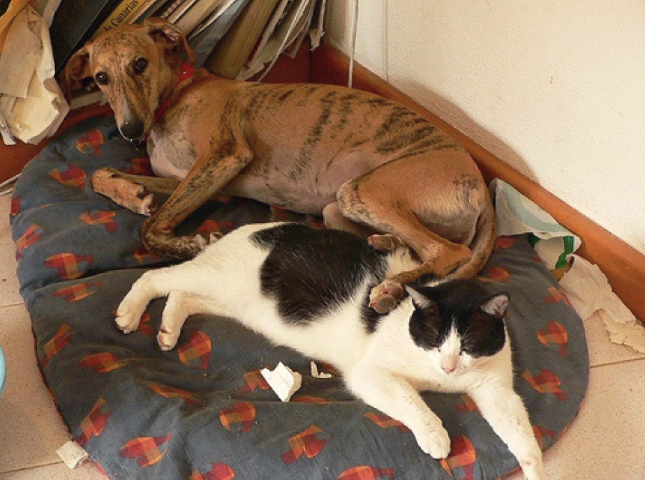

---

## 目标检测理想效果

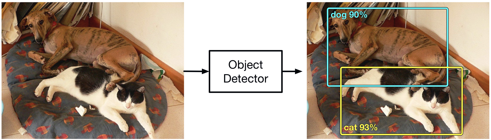

---

## 目标检测框的基本表示方式
1. 对角线顶点式、2. 中心+边长式
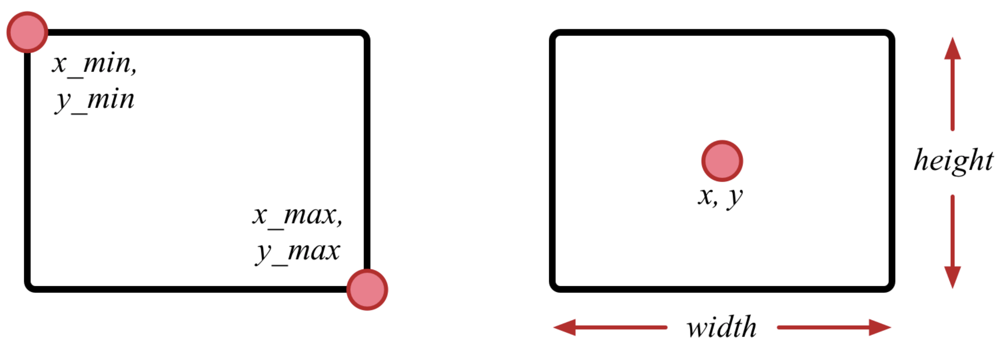

---

## 如何构建用于目标检测的网络

- 图像分类：特征提取+分类
- 目标检测：特征提取+定位目标检测框？

那么，可否共用特征提取？可否在用于图像分类网络的基础之上定位边框？

---

## 基于MobileNet的目标检测模型

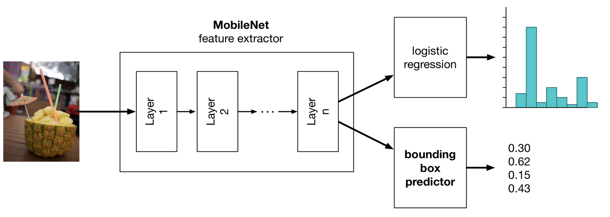

---

## 基于MobileNet的目标检测模型

- Feature Extractor: 公用
- 两个任务
    - 图像分类：逻辑回归模型
    - 边框定位：线性回归（其实远比这个复杂）

- 学习模型参数的方式
    - 多任务同时训练
    - 迁移学习

---


## 动手实操

任务：给定的用于图像分类任务的MobileNet预训练模型，通过迁移学习的方式，完成目标检测模型的学习

- 环境：Keras
- 模型：MobileNet

---

## 预训练模型网络结构

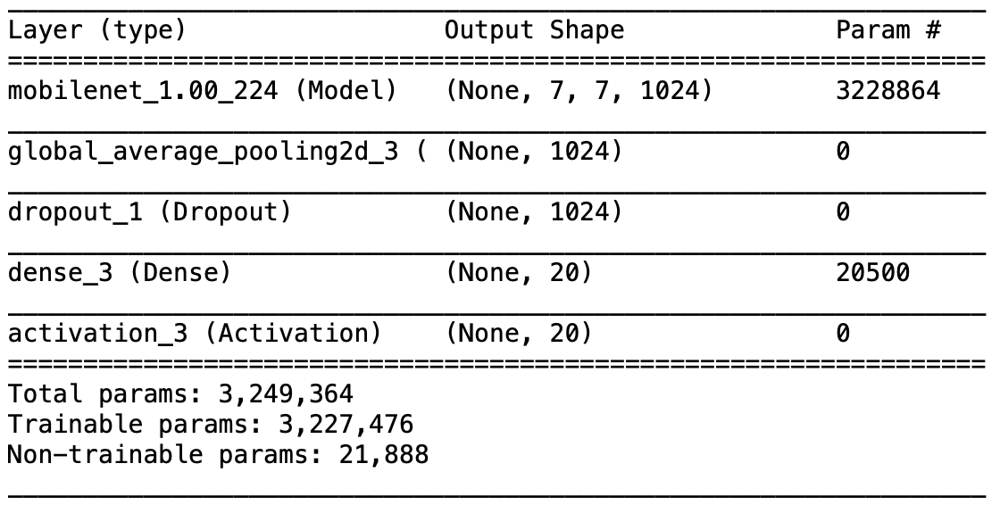

---

## 构建边框定位模型
```py
num_classes = 20
# The MobileNet feature extractor is the first "layer".
base_model = classifier_model.layers[0]
# Add a global average pooling layer after MobileNet.
pool = GlobalAveragePooling2D()(base_model.outputs[0])
# Reconstruct the classifier layers.
clf = Dropout(0.7)(pool)
clf = Dense(num_classes, kernel_regularizer=regularizers.l2(0.01), name="dense_class")(clf)
clf = Activation("softmax", name="class_prediction")(clf)
# Add new layers for the bounding box predictor.
bbox = Conv2D(512, 3, padding="same")(base_model.outputs[0])
bbox = BatchNormalization()(bbox)
bbox = Activation("relu")(bbox)
bbox = GlobalAveragePooling2D()(bbox)
bbox = Dense(4, name="bbox_prediction")(bbox)
# Create the new model.
model = Model(inputs=base_model.inputs, outputs=[clf, bbox])
```

---

## 边框定位模型设计

固定Feature Extractor参数
```py
for layer in base_model.layers:
    layer.trainable = False
```

提取Feature Extractor结果

```py
layer_dict = {layer.name:i for i, layer in enumerate(model.layers)}
# Get the weights from the checkpoint model.
weights, biases = classifier_model.layers[-2].get_weights()
# Put them into the new model.
model.layers[layer_dict["dense_class"]].set_weights([weights, biases])
```

---

## 模型效果图

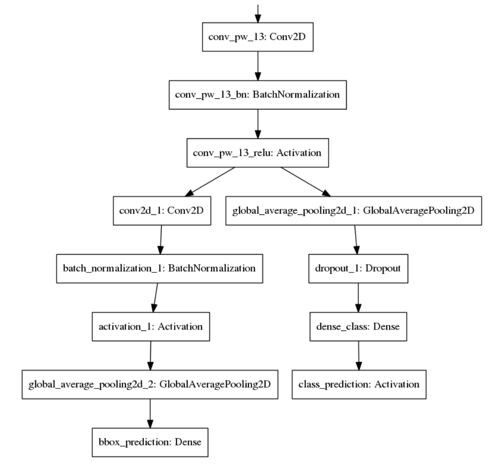


---

## 损失函数、优化器及评价指标

损失函数
- 图像识别：交叉熵 (cross entropy)
- 边框定位：MSE (mean square error)

```py
mse_loss = sum( (truth - prediction)**2 ) / (4*batch_size)
```

```py
model.compile(loss=["sparse_categorical_crossentropy", "mse"],
              loss_weights=[1.0, 10.0],
              optimizer=optimizers.Adam(lr=1e-3),
              metrics={ "class_prediction": "accuracy", , 
                        "bbox_prediction": MeanIOU().mean_iou })})
```

---

## 损失函数、优化器及评价指标
```py
model.compile(loss=["sparse_categorical_crossentropy", "mse"],
              loss_weights=[1.0, 10.0],
              optimizer=optimizers.Adam(lr=1e-3),
              metrics={ "class_prediction": "accuracy", , 
                        "bbox_prediction": MeanIOU().mean_iou })})
```
总体的loss和带权重的loss

```py
    loss = crossentropy_loss + mse_loss + L2_penalties
    loss = 1.0*crossentropy_loss + 10.0*mse_loss + 0.01*L2_penalties
```

---

## 损失函数、优化器及评价指标


优化器：Adam
评价指标：mean IOU
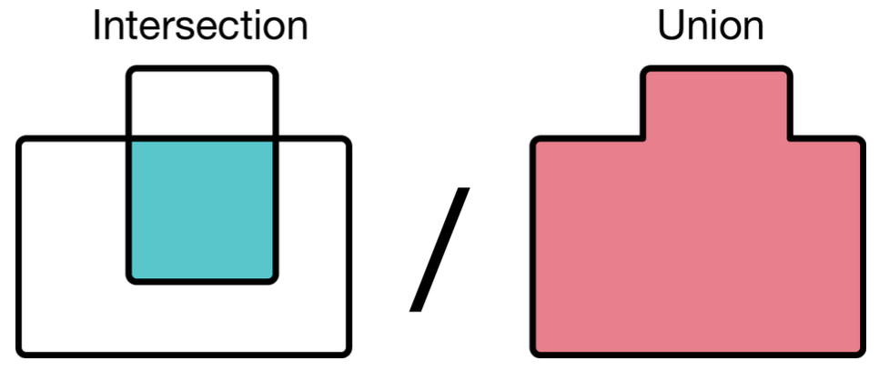

---

试试吧！

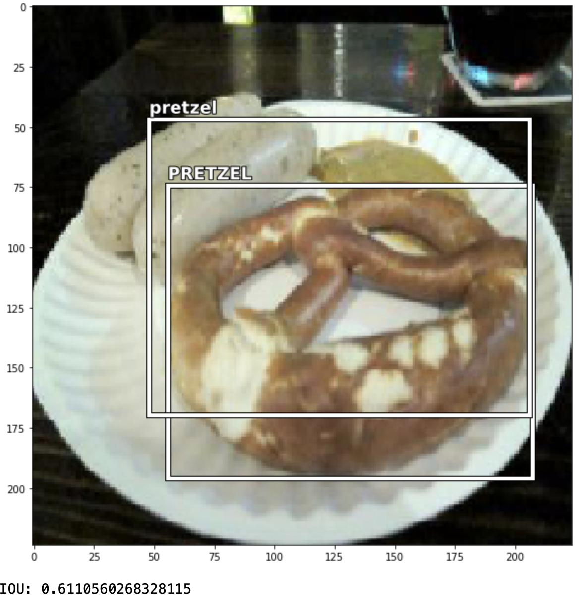

---

## 将Keras模型转换为coreml模型
- Keras模型格式: HDF5
- CoreML模型格式: mlmodel

安装转换工具
```py
   pip install -U coremltools
```
import
```py
import coremltools
```

---

## 转换模型

```py
coreml_model = coremltools.converters.keras.convert(
    best_model,
    input_names="image",
    image_input_names="image",
    output_names="labelProbability",
    predicted_feature_name="label",
    red_bias=-1,
    green_bias=-1,
    blue_bias=-1,
    image_scale=2/255.0,
    class_labels=labels)
```
```py
coreml_model.save("MultiSnacks.mlmodel")
```

---

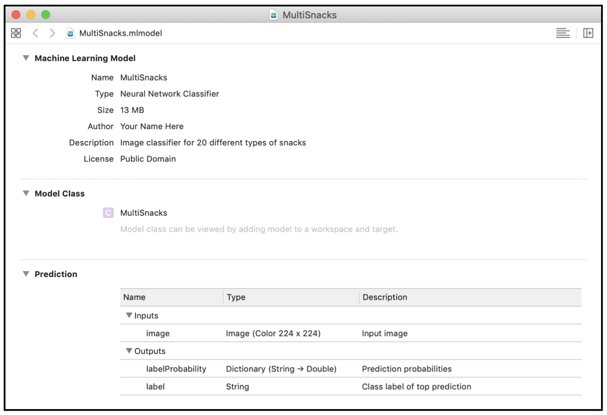

---

## 语义分割

像素级分类：更为细粒度的图像分类+目标检测
TinyYOLO架构


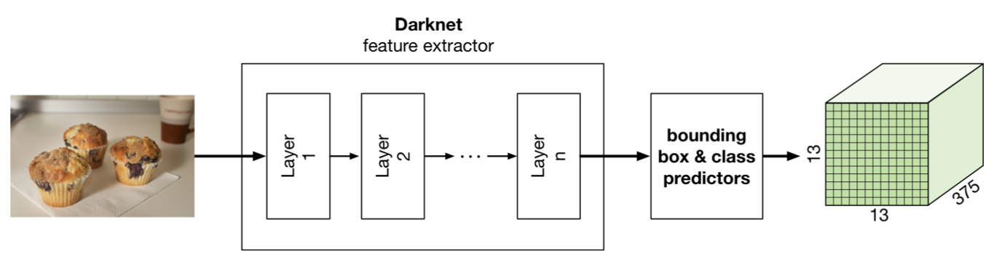

---

## TinyYOLO输出

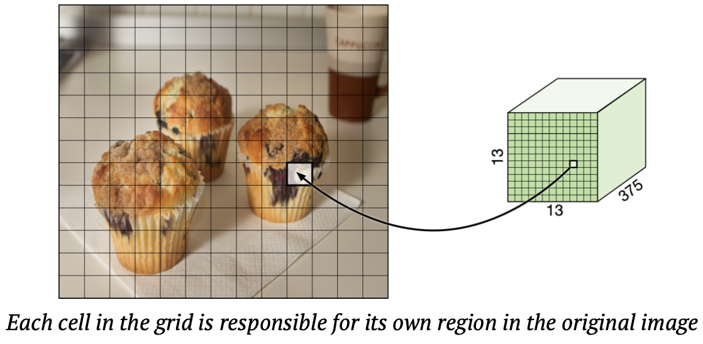

---

## 真正的像素级分类

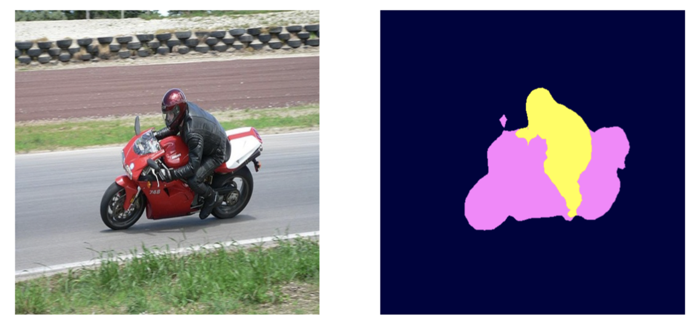

---

## 全卷积神经网络 (Fully Convolutional)
缩小：VGG16结构
放大：按照放大的需求做双线性插值

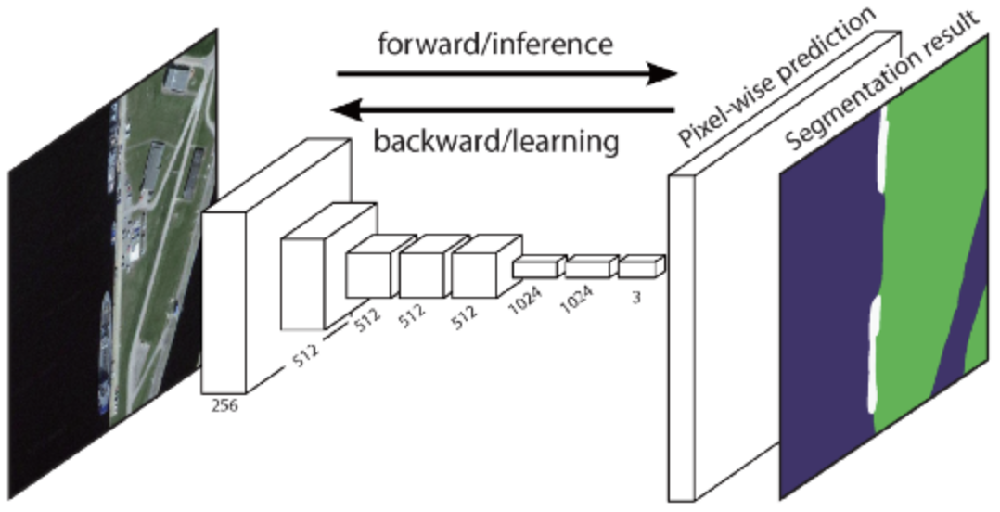

---


## 全卷积神经网络 (Deconvolution Network)

缩小：VGG16结构， 放大：VGG16结构 (反过来了！)


---

## 如何放大？

反卷积 (Deconvolution)


---

## 反卷积示例


---

## DeepLab V3+ for iOS

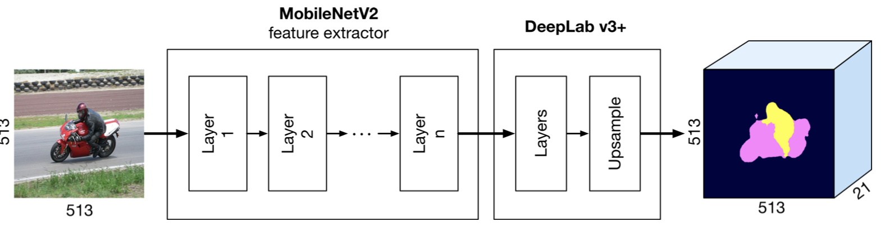

---

## 语义分割动手实操

转换模型

```py
import tfcoreml as tf_converter
input_path = 'deeplabv3_mnv2_pascal_trainval/frozen_inference_graph.pb'
output_path = 'DeepLab.mlmodel'

input_tensor = 'ImageTensor:0'
input_name = 'ImageTensor__0'
output_tensor = 'ResizeBilinear_3:0'

tf_converter.convert(tf_model_path=input_path,
                     mlmodel_path=output_path,
                     output_feature_names=[output_tensor],
                     input_name_shape_dict={input_tensor : [1, 513, 513, 3]},
                     image_input_names=input_name)
```

---

## 转换后模型

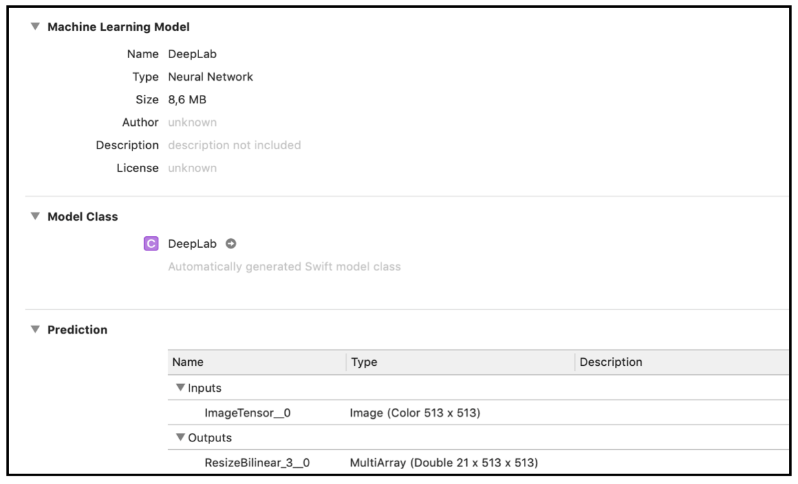

---

## 进阶任务

任务：给定全卷积神经网络DeepLab，设计一个app，包含两个camera/photo library按钮，允许用户分别选择前景和背景图像。选定后，将前景图发送给DeepLab，生成预测的蒙板

---

## 

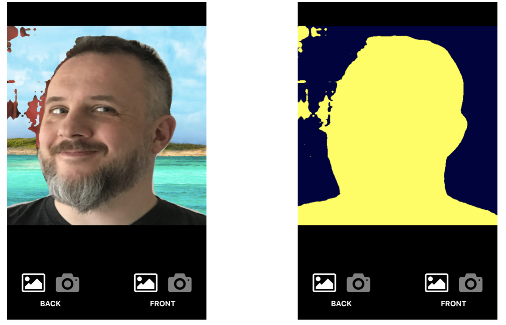